在软件开发领域，随着面向对象思想的深入人心，各种各样的面向对象的编程语言被创造出来，例如 C++、Java、Python 等。而在实践过程中，逐渐形成了形式多样的 design-patterns，这些 design-patterns 描述了对象如何构造、对象如何创建、对象与对象之间如何配合，从而提高了代码的可重用性。

<!-- more -->

> 1995 年，艾瑞克·伽马（ErichGamma）、理査德·海尔姆（Richard Helm）、拉尔夫·约翰森（Ralph Johnson）、约翰·威利斯迪斯（John Vlissides）等 4 位作者合作出版了《design-patterns：可复用面向对象软件的基础》（Design Patterns: Elements of Reusable Object-Oriented Software）一书，共收录了 23 个 design-patterns，这是 design-patterns 领域里程碑的事件，导致了软件 design-patterns 的突破。

## 创建型模式

### 单例模式

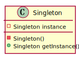

#### 懒汉式

类加载时没有生成单例，只有当第一次获取单例时才去创建这个单例。

```java
// 单线程模式
public class Singleton {
    private static Singleton instance;
    private Singleton (){}
    public static Singleton getInstance() {
    	if (instance == null) {
        	instance = new Singleton();
    	}
    	return instance;
    }
}

// 多线程模式（整体锁定）
public class Singleton {
    private static Singleton instance;
    private Singleton (){}
    public static synchronized Singleton getInstance() {
    	if (instance == null) {
        	instance = new Singleton();
    	}
    	return instance;
    }
}

// 多线程模式（局部锁定）
public class Singleton {
    private volatile static Singleton singleton;
    private Singleton (){}
    public static Singleton getSingleton() {
    	if (singleton == null) {
        	synchronized (Singleton.class) {
        		if (singleton == null) {
            		singleton = new Singleton();
        		}
        	}
    	}
    	return singleton;
    }
}

// 多线程模式（静态域）
public class Singleton {
    private static class SingletonHolder {
    	private static final Singleton INSTANCE = new Singleton();
    }
    private Singleton (){}
    public static final Singleton getInstance() {
    	return SingletonHolder.INSTANCE;
    }
}
```

#### 饿汉式

类一旦加载就创建一个单例。

```java
public class Singleton {
    private static Singleton instance = new Singleton();
    private Singleton (){}
    public static Singleton getInstance() {
    	return instance;
    }
}
```

### 原型模式

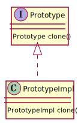

```java
// Java 天生支持原型模式，Object 有一个 clone 方法
// 但要想使用必须实现一个标记接口 Cloneable
public class Main {
    public static void main(String[] args)throws CloneNotSupportedException {
        Realizetype obj1 = new Realizetype("message");
        Realizetype obj2 = obj1.clone();
        System.out.println(obj1 == obj2);
        System.out.println(obj1.getMessage() == obj2.getMessage());
    }
}

class Realizetype implements Cloneable {
    private String message;
    Realizetype() {}
    Realizetype(String message) {
        this.message = message;
    }
    public String getMessage() { return this.message; }
    @Override
    public Realizetype clone() throws CloneNotSupportedException{
        return new Realizetype(this.message);
    }
}
```

### 工厂方法模式

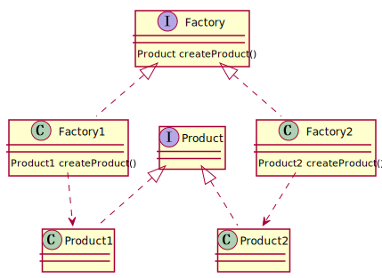

### 抽象工厂模式

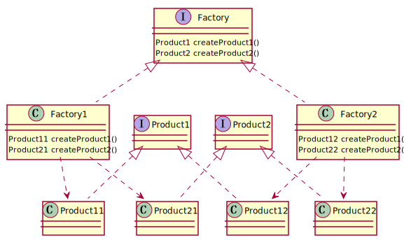

### 建造者模式

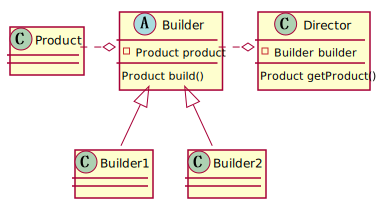

## 结构型模式

### 代理模式

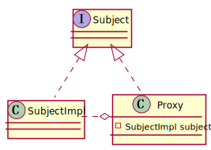

### 装饰模式

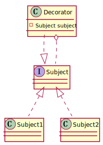

### 适配器模式

#### 类适配器

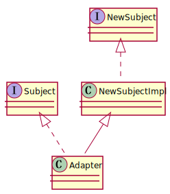

#### 对象适配器

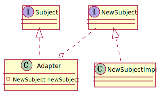

### 外观模式

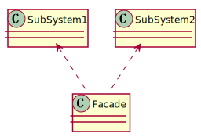

### 桥接模式

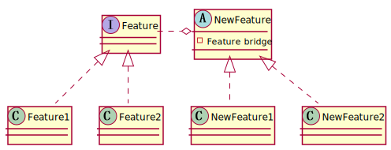

### 享元模式

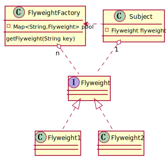

### 组合模式

#### 透明组合

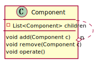

#### 安全组合

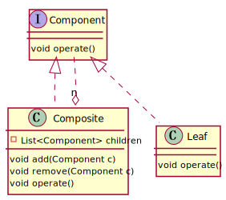

## 行为型模式

### 模板方法模式

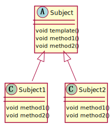

### 策略模式

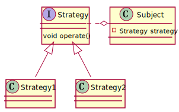

### 命令模式

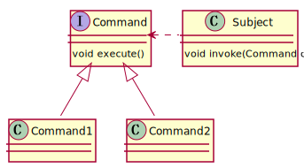

### 责任链模式

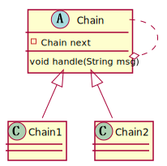

### 状态模式

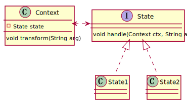

- Context：状态持有者
- State：状态

### 观察者模式

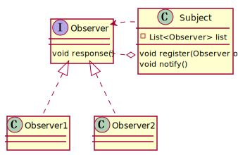

- Subject：被观察者
- Observer：观察者

### 中介者模式

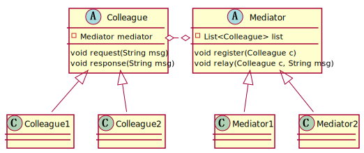

- Colleague：个体
- Mediator：中介者

### 迭代器模式

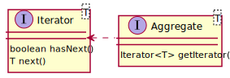

- Aggregate：聚合器
- Iterator：迭代器

### 访问者模式

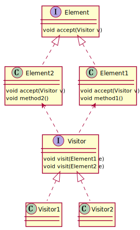

- Element：被访问者
- Visitor：访问者

### 备忘录模式

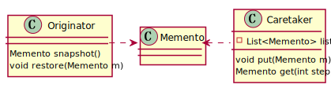

- Originator：备忘录源
- Memento：备忘录
- Caretaker：备忘录管理者

### 解释器模式

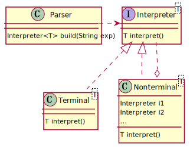

- Expression：表达式
- Parser：表达式解析器

## 设计原则

- 单一职责原则：一个类应该有且只有一个功能职责，避免多功能间的耦合。
- 里氏替换原则：子类可以扩展父类的功能，但不能改变父类原有的功能。
- 依赖倒置原则：面向接口编程。
- 接口隔离原则：每个接口应该拥有最小的粒度，其功能具有内聚的特点。
- 最小知识原则（迪米特）：两个功能无关的类禁止相互调用。
- 开闭原则：对扩展开放，对修改关闭
- 合成复用原则：优先考虑组合和聚合进行耦合，提高灵活性，也称为软耦合。其次才考虑使用继承进行耦合，也称为硬耦合。
