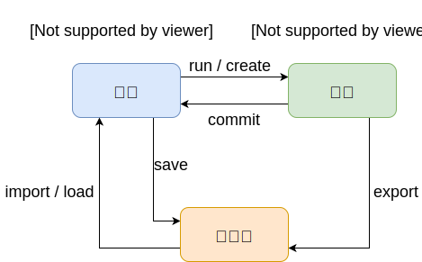

Docker 是一个工具，可以帮助开发人员构建、卸载与再现软件的运行时环境，它包含一个命令行程序、一个后台守护进程、以及一组远程资源服务。

<!-- more -->

- 通过 UNIX 的**容器技术**，对容器的运行时环境进行良好的封装（Namespaces 技术），并对竞争资源进行管理和保护（Cgroups 技术）
- 通过**镜像技术**，对容器的运行时状态进行打包、分发和再现
- 通过**远程仓库**，对镜像进行有效的管理

> **容器技术与虚拟机技术**
>
> 虚拟机技术是通过 Hypervisor 对物理资源进行共享管理，然后在上层构建出多个不同的操作系统。然而缺点是很明显的，就是操作系统的构建是很笨重的，想象一下，在一个 Linux 宿主机中为了某种目的通过 Hypervisor 又从头到尾构建出一个类似的 Linux 从系统，是多么不明智的做法。
>
> 容器技术摒弃了 Hypervisor ，自身直接调用 Linux 宿主机上的内核，然后在上层构建出多个轻量级的类 Linux 的运行环境。缺点也是很明显的，不够灵活，只有 Linux 拥有这样的技术，Windows 暂时还没有，也不可能在 Linux 的宿主机上通过容器技术构建出一个 Windows 运行环境。

docker 命令的格式

```sh
$ docker <sub> <options>
```

docker 命令预览



## docker run

创建容器并启动

```sh
$ docker run <options> <image> <start-cmd>
	# --name <container-name>
	# --detach, -d
	# --interactive, -i
	# --tty, -t
	# --rm
	# --env, -e <env-key>=<env-value>
	# --port, -p <host-port>:<container-port>
	# --net <net-name>
	# --volume, -v <host-v>:<container-v>
	# --restart always
	# --entrypoint <entry-cmd>
	# --memory, -m <memory-size>
	# --cpu-shares, -c <cpu-weight>
```

## docker create

和 `docker run` 相同，只不过该命令不会启动容器

## docker start/restart/stop/rm

启动/重启/终止/删除容器

```sh
$ docker start/restart/stop/rm <options> <container> [<container>...]
```

## docker exec

在一个运行的容器中启动一个新命令

```sh
$ docker exec <options> <container> <exec-cmd>
	# --detach, -d
	# --interactive, -i
	# --tty, -t
```

## docker logs

查看容器的日志

```sh
$ docker logs <options> <container>
	# --follow, -f : 追踪logs输出，ctrl+c 终止追踪
```

## docker ps

列出容器的信息

```sh
$ docker ps <options>
	# --all, -a
```

## docker inspect

查看容器信息

```sh
$ docker inspect <options> <container>
	# --format, -f <fmt-str>
```

## docker search

在远程库搜索

```sh
$ docker search <options> <search-str>
```

## docker pull/push

```sh
$ docker pull/push <options> <container>
```

## docker commit

从容器中构造新的镜像

```sh
$ docker commit <options> <container> <image>
	# --author, -a <author>
	# --message, -m <message>
```

## docker tag

 打标签

```sh
$ docker tag <source-image> <new-image>
```

## docker save/load

导出/导入镜像

```sh
$ docker save -o <path> <image> [<image> ...]
$ docker load -i <path>
```

## docker export/import

导出容器的文件系统（会抛弃历史和相关元信息）/ 导入并打标签

```sh
$ docker export -o <path> <container>
$ docker import <path> <image>
```

## docker build

从 Dockerfile 构造新的镜像

```sh
$ docker build <options> <path-to-context>
	# --tag, -t <image>
	# --file, -f <path-to-dockerfile>
```

```dockerfile
# Dockerfile 模板

FROM <image>
RUN <command>
ENTRYPOINT ["<entry-cmd>"...]
CMD ["<cmd>"...]
COPY --chown=<user>:<group> <s1> ... <d>
ENV <env-key>=<env-value>
VOLUME ["<v1>",...]
EXPOSE <p1> ...
WORKDIR <dir>
USER <user>
ONBUILD <dockerfile-cmd> # 在以当前镜像为基础镜像构建时再执行
```

## docker history

显示镜像层的信息

```sh
$ docker history <image>
```

## docker rmi

删除镜像

```sh
$ docker rmi <image>
```

## docker network

```bash
$ docker network create <options> <net-name>
	# --driver bridge/host
$ docker network ls
$ docker network rm <net-name>
```

## docker compose

```yaml
# docker-compose.yml 骨架

version: "3"
services:
  <container-name>:
    build: <path>
    image: <image-name>
    container_name: <name>
    ports:
    - xx:xx
    - xx:xx
    volumes:
    - xx:xx
    - xx:xx
    enviroment:
    - xx=xx
    - xx=xx
    command: <command>
    depends_on:
    - xx
    - xx
    dns:
    - xx
    - xx
    network_mod: xx
    restart: always
    stdin_open: true
    tty: true
volumes:
  xxx: {}
```

```sh
$ docker-compose -f <path-to-file> up -d
$ docker-compose -f <path-to-file> down
```

