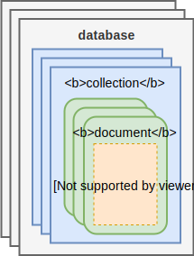

# MongoDB

## 简介

MongoDB 是一个综合性能的、无模式的、分布式的文档数据库解决方案。



## 数据类型

## 基本操作

### database

```
show dbs
use <db_name>
db
db.dropDatabase()
```

### collection

```
show collections
db.createCollection("<collection_name>")
db.<collection_name>.drop()
```

### insert

```
db.<collection_name>.insert(<document>)
db.<collection_name>.insertMany([<document1>,<document2>...])
```

### update

```
db.<collection_name>.update(<condition_document>,<update_document>)
```

### remove

```
db.<collection_name>.remove()
```

### find

```
db.<colletion_name>.find(<condition_document>,<select_document>)
db.<colletion_name>.findOne(<condition_document>,<select_document>)
```

### skip

### limit

### sort

### index

```
db.<colletion_name>.createIndex(<index_document>)
db.<colletion_name>.getIndexes()
db.<colletion_name>.dropIndexes()
db.<colletion_name>.dropIndex("<index_name>")
```

### explain

## 集群

