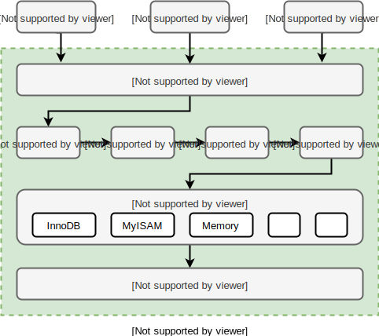
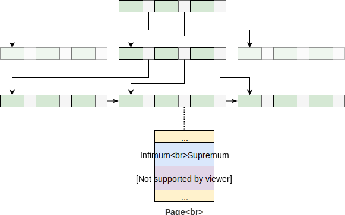
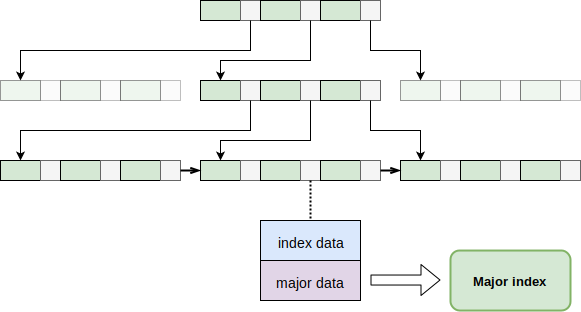
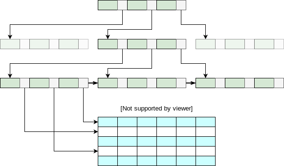

# MySQL


## 架构设计



## 配置文件

```ini
[mysqld]
port = _port

```

## 命令行

```sh
$ mysql -h _host -u _user -p
```


## SQL 语句

### INSERT INTO

### DELETE FROM

### UPDATE

### SELECT

```sql
SELECT <select_list>
FROM <table1>
<join_type> JOIN <table2> ON <join_condition>
WHERE <where_condition>
GROUP BY <group_by_list>
HAVING <having_condition>
ORDER BY <order_by_list>
LIMIT <limit_num>

-------- 机读顺序 ---------
-- FROM <table1>
-- ON <join_condition>
-- <join_type> JOIN <table2>
-- WHERE <where_condition>
-- GROUP BY <group_by_list>
-- HAVING <having_condition>
-- SELECT <select_list>
-- ORDER BY <order_by_list>
-- LIMIT <limit_num>
```

#### 连接

MySQL 支持全连接、内连接、左连接、右连接

| type                  | 描述   | 驱动         |
| --------------------- | ------ | ------------ |
| , xxx                 | 全连接 | 左表驱动右表 |
| inner join xxx on xxx | 内连接 | 小表驱动大表 |
| left join xxx on xxx  | 左连接 | 左表驱动右表 |
| right join xxx on xxx | 右连接 | 右表驱动左表 |

#### 小表驱动大表

```sql
-- a > b
SELECT * FROM a WHERE a.id in (SELECT id from b)
-- a < b
SELECT * FROM a WHERE exists (SELECT 1 FROM b WHERE b.id=a.id)
```

#### 慢查询日志

### INDEX

索引是为了提高查询效率而设计的一种特殊的数据结构。MySQL 主要用的是 B+Tree。

- B+Tree 可以有效减少磁盘 IO
- B+Tree 可以提供高效的范围查询

#### 索引类型


#### 索引失效

- 函数、计算、类型转换
- 范围条件
- 不等于 `<>` `!=`
- `is null` `is not null`
- `like '%abcd'`
- `or`

### 系统配置语句

```mysql
SHOW GLOBAL VARIABLES; -- 查看所有变量
SELECT @@_global-variable-name; -- 查看单个变量
SET GLOBAL _global-variable-name=XXX; -- 设置变量值
```

### 系统内置函数


## 查询优化

### EXPLAIN

用于分析 SELECT 语句的执行情况

| 字段名       | 描述                                                         |
| ------------ | ------------------------------------------------------------ |
| id           | 表示执行顺序，相同时自上而下，不相同时大者优先。起始为 1     |
| select_type  | 表示查询类型。<br />**SIMPLE** 简单查询（不包含子查询和 union）<br />**PRIMARY** 主查询<br />**SUBQUERY** 子查询<br />**DERIVED** 临时表查询<br />**UNION** 联合查询<br />**UNION RESULT** 联合结果查询 |
| table        | 查询所针对的表，如果是临时表，则会被命名为 derived\<id\>     |
| type         | 表示表访问类型。<br />**system** 全表只有一行，多出现在 mysql 的系统表里<br />**const** 查询用到主键或唯一索引，且条件是一个常量<br />**eq_ref** 查询用到主键或唯一索引，但条件不是一个常量<br />**ref** 查询用到非唯一性索引<br />**range** 查询用到了索引，但条件是范围查询<br />**index** 全索引扫描<br />**ALL** 全表扫描 |
| possible_key | 可能用到的索引                                               |
| key          | 实际用到的索引                                               |
| key_len      | 索引扫描的可能字节数                                         |
| ref          | 查询条件的引用类型。const 常量                               |
| rows         | 可能扫描的行数                                               |
| Extra        | 额外信息。<br />**using filesort** 文件内排序，表示没有用到索引中的排序结果<br />**using temporary** 使用了临时内存表<br />**using index** 使用了覆盖索引<br />**using where** 使用了索引进行查找 |

### SHOW PROFILES

分析语句执行的资源损耗情况

## 锁（InnoDB）

### 共享锁和拍他锁

InnoDB 实现了行级的共享锁和排他锁，读与读共享，读与写、写与写排他。


## 事务（InnoDB）

> 事务的四大特性 (ACID)
>
> - atomicity，即原子性，事务中的所有操作要么全部执行，要么全部不执行，不予许在中间停滞
> - consistency，即一致性，事务前后要保证数据的完整无误
> - isolation，即隔离性，事务的执行不能被其他并行的事务干扰
> - durability，即持久性，事务一旦提交，对数据的改变是永久的，否则事务将毫无意义

### 原子性的实现

原子性包含了持久性，为了避免歧义，一般原子性指的是异常回滚。MySQL 为每一行记录维护了一个 Undo log 的版本链，当执行异常时，可以通过 Undo log 回滚到初始状态。

> Undo log 的底层原理是 MySQL 为每一张表都自动生成了两列数据，一列是事务 ID，一列是 Undo 指针，所以版本链中的每一个节点其实都是表中存着的记录，只不过有些记录你看不到而已，随着时间的推移，会把无用的版本链节点删除。

### 隔离性的实现

Undo log 维护的事务 ID 以及系统自身维护的激活事务列表可以用来实现隔离算法。InnoDB 提供了对隔离性的完美支持，一共有四种隔离级别：

- **未提交读**：不隔离，直接读取版本链的第一条记录
- **提交读**：事务内每次 SELECT 前会先得到激活事务 ID 列表和最大事务 ID，后面简称“快照”，然后从版本链的第一条记录开始，直到找到一个事务 ID 小于等于最大事务 ID 且不在激活事务 ID 列表里的记录。
- **可重复读**：事务内第一次 SELECT 会生成“快照”，随后的 SELECT 会沿用第一次生成的“快照”找记录。
- **串行化**：最严格的隔离级别，事务内每个 SELECT 都会给目标记录上锁，从而阻塞其他事务对同一目标记录的操作。

> **隔离性与锁**
>
> 

### 持久性的实现

事务提交前，会先记录 Redo log 之后再进行真正的数据修改，这样当数据修改发生故障，还可以通过 Redo log 在下一次启动时修复故障带来的影响。

> **原子性、隔离性和持久性都是为了实现一致性**

## 日志

### 错误日志

- log_error：错误日志的存放路径
- log_warnings：表示是否记录告警信息到错误日志，0表示不记录告警信息，1表示记录告警信息，大于1表示各类告警信息

### 普通查询日志

- general_log：表示查询日志是否开启

- log_output：以哪种方式存放。`FILE`表示存放于文件中，`TABLE`表示存放于表mysql.general_log中

  > 同样适用于慢查询，`TABLE`表示存放于表 mysql.slow_log

- general_log_file：表示查询日志存放于文件的路径

### 慢查询日志

- slow_query_log：表示查询日志是否开启
- slow_query_log_file：表示查询日志存放于文件的路径
- long_query_time：表示多长时间的查询被认为"慢查询"，默认10s

### 二进制日志

- log_bin：表示二进制日志是否开启
- log_bin_basename：二进制日志文件前缀名，其中包含路径
- max_binlog_size：二进制日志文件的最大大小，超过此大小，二进制文件会自动滚动
- log_bin_index：二进制日志文件索引文件名
- binlog_format：决定了二进制日志的记录方式
  - `STATEMENT`以语句的形式记录，日志量少但不能保证完全恢复数据
  - `ROW`以数据修改的形式记录，日志量大但可以保证数据完全恢复

```sh
$ mysqlbinlog _log_bin_basename.000001
$ mysqlbinlog --start-position=XXX --stop-position=XXX _log_bin_basename.000001 > recover_file.sql
```

```mysql
#临时关闭binlog
set sql_log_bin=0;
#执行sql文件
source recover_file.sql
#开启binlog
set sql_log_bin=1;
```

## 存储原理

### InnoDB

#### 聚集索引



#### 辅助索引



### MyISAM

#### 非聚集索引



## 集群


