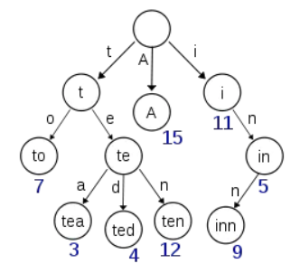
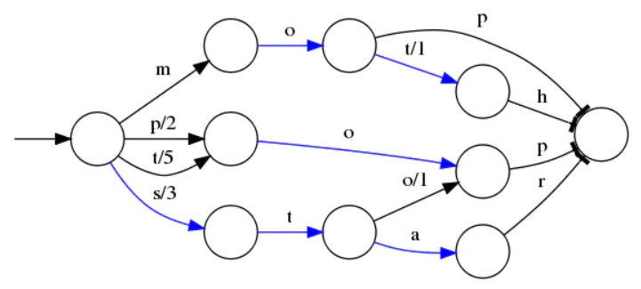
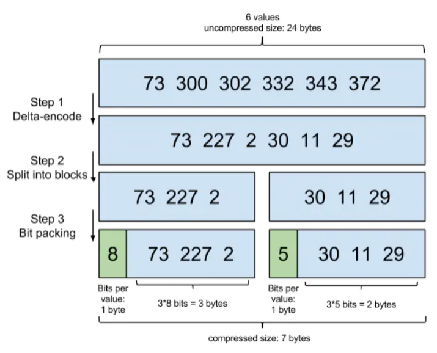
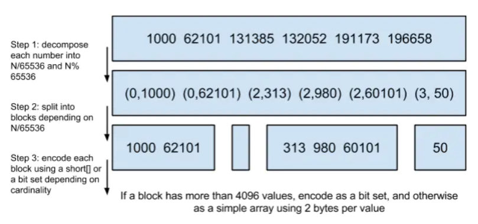
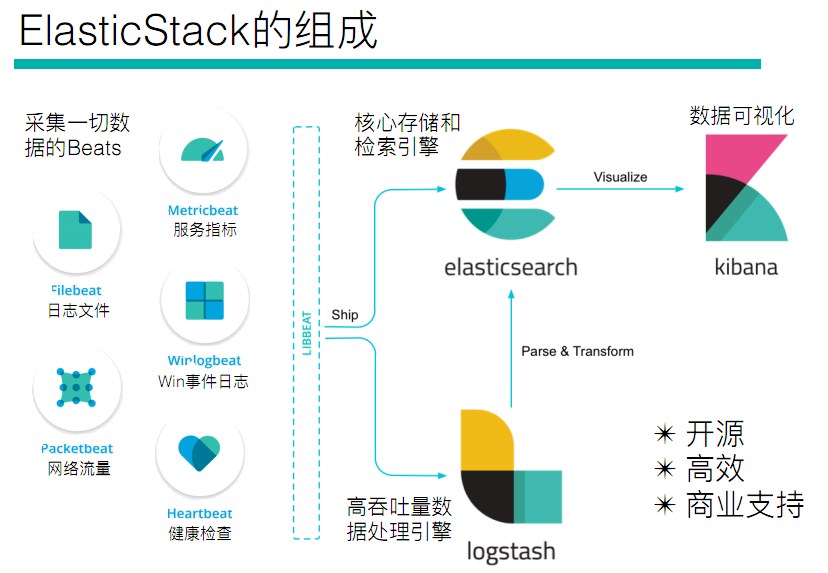

# Elasticsearch 学习笔记

Elasticsearch 是一个开源的基于 Lucene 的 RESTful API 的实时的分布式搜索分析引擎，它能让你以前所未有的速度和规模，去探索你的数据。

<!-- more -->

> 大致结构可以与 MongoDB 对应，需要注意的是在 elasticsearch 中，同一个 type 中的同一个字段必须要有相同的类型，MongoDB 则没有这个要求。究其原因，是因为 Elasticsearch 为同一个 type 的每一个存在的字段都建立了倒排索引。

## Hello Elasticsearch

```sh
# https://www.elastic.co/cn/downloads/elasticsearch
$ cd elasticsearch-<version>
$ ./bin/elasticsearch

# or

$ docker run -itd --name elasticsearch -p 9200:9200 -p 9300:9300 -e "discovery.type=single-node" elasticsearch
```

插入数据

```sh
$ curl -X PUT "localhost:9200/megacorp/employee/1?pretty" -H 'Content-Type: application/json' -d'
{
    "first_name" : "John",
    "last_name" :  "Smith",
    "age" :        25,
    "about" :      "I love to go rock climbing",
    "interests": [ "sports", "music" ]
}
'
$ curl -X PUT "localhost:9200/megacorp/employee/2?pretty" -H 'Content-Type: application/json' -d'
{
    "first_name" :  "Jane",
    "last_name" :   "Smith",
    "age" :         32,
    "about" :       "I like to collect rock albums",
    "interests":  [ "music" ]
}
'
$ curl -X PUT "localhost:9200/megacorp/employee/3?pretty" -H 'Content-Type: application/json' -d'
{
    "first_name" :  "Douglas",
    "last_name" :   "Fir",
    "age" :         35,
    "about":        "I like to build cabinets",
    "interests":  [ "forestry" ]
}
'
```

ID 搜索

```sh
$ curl -X GET "localhost:9200/megacorp/employee/1?pretty"
```

全量搜索

```sh
$ curl -X GET "localhost:9200/megacorp/employee/_search?pretty"
```

简单搜索

```sh
$ curl -X GET "localhost:9200/megacorp/employee/_search?q=last_name:Smith&pretty"
$ curl -X GET "localhost:9200/megacorp/employee/_search?pretty" -H 'Content-Type: application/json' -d'
{
    "query" : {
        "match" : {
            "last_name" : "Smith"
        }
    }
}
'
```

复杂搜索

```sh
$ curl -X GET "localhost:9200/megacorp/employee/_search?pretty" -H 'Content-Type: application/json' -d'
{
    "query" : {
        "bool": {
            "must": {
                "match" : {
                    "last_name" : "smith" 
                }
            },
            "filter": {
                "range" : {
                    "age" : { "gt" : 30 } 
                }
            }
        }
    }
}
'
```

全文搜索

```sh
$ curl -X GET "localhost:9200/megacorp/employee/_search?pretty" -H 'Content-Type: application/json' -d'
{
    "query" : {
        "match" : {
            "about" : "rock climbing"
        }
    }
}
'
```

短语搜索

```sh
$ curl -X GET "localhost:9200/megacorp/employee/_search?pretty" -H 'Content-Type: application/json' -d'
{
    "query" : {
        "match_phrase" : {
            "about" : "rock climbing"
        }
    }
}
'
```

聚合分析

```sh
$ curl -X GET "localhost:9200/megacorp/employee/_search?pretty" -H 'Content-Type: application/json' -d'
{
    "aggs": {
        "all_interests": {
            "terms": { "field": "interests" }
        }
    }
}
'
```

## 核心概念


### Index

一个 Index 类似于传统关系数据库中的一个数据库 ，是一个存储关系型文档的地方。

### Type

一个 Type 类似于传统关系数据库中的一个表，用于文档的分组，规定了文档字段的类型，同一类型的文档的同一字段类型必须一致。

> 在 6.0.0 中弃用，以后将不再可能在索引中创建多个类型，并且将在更高版本中删除类型的整个概念。

### Document

一个 Document 类似于传统关系数据库的一行数据，不过这里表示为一个 JSON 。默认的，一个文档中的每一个属性都有一个倒排索引，用于加速搜索。

### Term

Elasticsearch 为了加速搜索，为 Document 的每一个字段（甚至是子字段）都会自动解析出相应的 term 来建立倒排索引，其中分词器就是用于解析 term 的。

> 如果字段是一个数组，会对每一个元素进行 term 提取，如果字段是一个子对象，会对每个子字段分别进行 term 提取

## 类型

| 一级分类 | 二级分类     | 具体类型                             |
| :------- | :----------- | :----------------------------------- |
| 核心类型 | 字符串类型   | text,keyword                         |
| h        | 整数类型     | integer,long,short,byte              |
| h        | 浮点类型     | double,float,half_float,scaled_float |
| h        | 逻辑类型     | boolean                              |
| h        | 日期类型     | date                                 |
| h        | 范围类型     | range                                |
| h        | 二进制类型   | binary                               |
| 复合类型 | 数组类型     | array                                |
| f        | 对象类型     | object                               |
| f        | 嵌套类型     | nested                               |
| 地理类型 | 地理坐标类型 | geo_point                            |
| d        | 地理地图     | geo_shape                            |
| 特殊类型 | IP类型       | ip                                   |
| t        | 范围类型     | completion                           |
| t        | 令牌计数类型 | token_count                          |
| t        | 附件类型     | attachment                           |
| t        | 抽取类型     | percolator                           |

> text 会被分词器解析成多个 term，而 keyword 不会被分词器解析，本身就是一个 term

## 集群

Elasticsearch 天生就是分布式的，并且在设计时屏蔽了分布式的复杂性。

### 节点

- 主节点负责管理集群范围内的所有变更，例如索引、节点等，但不涉及到文档级别的变更和搜索等操作
- 任何节点都可以接受用户请求，并将请求直接转发到文档所在的节点，收集回数据，并将最终结果返回給用户

### 分片

- 主分片负责写操作，也可以处理读操作，在索引建立的时候就已经确定了主分片数
- 副本分片只是一个主分片的拷贝，用于冗余备份，同时可以处理读操作
- 分片和副本分片一般会倾向于在不同节点进行存储

#### 写过程

1. 客户端通过hash选择一个node发送请求，这个node被称做coordinating node（协调节点），
2. 协调节点对docmount进行路由，将请求转发给到对应的primary shard
3. primary shard 处理请求，将数据同步到所有的replica shard
4. 此时协调节点，发现primary shard 和所有的replica shard都处理完之后，就反馈给客户端。

#### 读过程

1. 客户端发送get请求到任意一个node节点，然后这个节点就称为协调节点，
2. 协调节点对document进行路由，将请求转发到对应的node，此时会使用随机轮询算法，在primary shard 和replica shard中随机选择一个，让读取请求负载均衡，
3. 接收请求的node返回document给协调节点，
4. 协调节点，返回document给到客户端

#### 搜索过程

1. 客户端发送请求到协调节点，
2. 协调节点将请求大宋到所有的shard对应的primary shard或replica shard ；
3. 每个shard将自己搜索到的结果返回给协调节点，返回的结果是dou.id或者自己自定义id，然后协调节点对数据进行合并排序操作，最终得到结果。
4. 最后协调节点根据id到个shard上拉取实际 的document数据，左后返回给客户端。

### 健康监控

- `green` 所有的主分片和副本分片都正常运行。
- `yellow` 所有的主分片都正常运行，但不是所有的副本分片都正常运行。
- `red` 有主分片没能正常运行。

## Rest API

### Index 操作

```json
# 添加索引
PUT /myindex
{
    "mappings": {
        "properties": {
            "xxx": {
                "type": "text/keyword..."
            }
        }
    }，
    "settings" : {
        "number_of_shards" : 3,
        "number_of_replicas" : 1
    }
}

# 获取索引
GET /myindex

# 删除索引
DELETE /myindex
```

### Document 操作

```json
# 添加或者全量更新文档
PUT /myindex/_doc/1
{
    "xxx": "xxx"
}

# 部分更新文档
POST /myindex/_doc/1/_update
{
    "doc": {
        "xxx": "xxx"
    }
}

# id 搜搜
GET /myindex/_doc/1

# 简单搜索
GET /myindex/_doc/_search?q=xxx:xxx

# 复杂搜索
GET /myindex/_doc/_search
{
    "query": {
        // 全量检索
        "match_all": {},
        // 全文检索
        "match": {
            "xxx": "xxx" // 分词形成多个 term 进行检索
        },
        // 多字段全文检索
        "multi_match": {
            "query": "xxx",
            "fields":["xxx","xxx"]
        },
        // 短语检索，即确保多个 term 存在且相邻才会匹配
        "match_phrase": {
            "xxx": "xxx xxx"
        },
        // 术语检索
        "term": {
            "xxx": "xxx" // 不分词，直接 term 检索
        },
        // 多术语检索
        "terms": {
            "xxx": [
                "xxx",
                "xxx"
            ]
        }
        // 范围检索
        "ranger": {
            "xxx": {
                "gt/gte/lt/lte": x,
                "from": "1950-01-11",
                "to": "1990-01-11",
                "include_lower": true,
                "include_upper": false
            }
        }
        // 布尔
        "bool": {
            // must/should/must_not 对 match/term/ranger 等进行逻辑组合
            // 还可以 filter,它和 query 的区别在于不计算匹配度，性能更高
        }
    },
    "_source": [
        "xxx",
        "xxx"
    ],
    "sort": {
        "xxx": {
            "order": "desc/asc"
        }
    },
    "from": x,
    "size": x,
    "highlight": {
        "fields" : {
            "xxx" : {}
        }
        "pre_tags": "<xxx>",
        "post_tags": "</xxx>"
    }
}

# 聚合分析
GET /myindex/_doc/_search
{
    "aggs" : { 
        "xxx" : { 
            "terms/histogram/avg/min/max" : { 
                "field": "xxx",
                // 针对桶聚合可以排序
                "order": {
                    "_count/_term" : "asc/desc" 
                }
            },
            // 针对桶聚合还可以定义嵌套聚合
            "aggs": {
                // ...
            },
            "filter": {
                // ...
            }
        }
    }
}

# 删除文档
DELETE /myindex/_doc/1
```

## Java API


## Spring Data Elasticsearch


## 倒排索引原理


 


### 文本 term 压缩

tire



FST



### posting list 压缩

Frame of Reference



Roaring Bitmap



## Elastic Stack 生态圈



### Beats

#### FileBeat

```yaml
filebeat.inputs:
- type: stdin
  enabled: true/false
- type: log
  paths:
  - "/var/log/apache2/*"
  tags: ["xxx","xxx"]
  fields:
    apache: true
  fields_under_root: true
  enabled: true/false

output.console:
  pretty: true
  enabled: true/false
output.file:
  path: "/tmp/filebeat"
  filename: filebeat
  enabled: true/false
output.logstash:
  hosts: ["127.0.0.1:5044"]
  enabled: true/false
output.elasticsearch:
  hosts: ["https://myEShost:9200"]
  enabled: true/false
```

```sh
$ filebeat -e -c xxx.yaml
```

#### Metricbeat

```yaml
metricbeat.config.modules:
  path: ${path.config}/modules.d/*.yml
  reload.enabled: false
  
output.logstash:
  hosts: ["127.0.0.1:5044"]
  enabled: true/false
output.elasticsearch:
  hosts: ["https://myEShost:9200"]
  enabled: true/false
```

```sh
$ metricbeat modules list
$ metricbeat modules enable xxx
$ metricbeat modules disable xxx
$ metricbeat -e -c xxx.yaml
```

### Logstash

```conf
input {
    file {
        path => "/xxx/xxx.log"
    }
    
}

filter {
    mutate {
        split => {
            "message" => "|"
        }
    }
}

output {
    stdout {
        codec => rubydebug
    }
    elasticsearch {
        hosts => ["xxx.xxx.xxx.xxx:9200"]
    }
}
```

```sh
$ logstash -f xxx.conf
```


grok

mutate

```
convert   #类型转换
gsub      #字符串替换
split/join/merge    #字符串切割、数组合并为字符串、数组合并为数组
rename    #字段重命名
update/replace   #字段内容更新或替换
remove_field     #删除字段
```


### Kibana