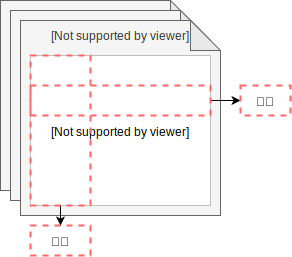

结构化查询语言(Structured Query Language)简称 SQL ，是用于访问和处理关系型数据库的标准的计算机语言。

<!-- more -->

## 基础知识



### 关键字


### 运算符

| 操作符      | 描述           |
| :---------- | :------------- |
| =           | 等于           |
| <>          | 不等于         |
| >           | 大于           |
| <           | 小于           |
| >=          | 大于等于       |
| <=          | 小于等于       |
| BETWEEN AND | 在某个范围内   |
| LIKE        | 搜索某种模式   |
| NOT LIKE    | 不搜索某种模式 |
| IN          | 匹配多个值     |
| AND         | 与             |
| OR          | 或             |
| IS NULL     |                |
| IS NOT NULL |                |

> LIKE 和 NOT LIKE 用于匹配字符串，`%`代表一个或多个字符，`_`代表一个字符，

## CREATE DATABASE

```sql
CREATE DATABASE _db-name;
```

## ALTER DATABASE

## DROP DATABASE

## CREATE TABLE

```sql
CREATE TABLE _tb-name (
  _prop-name _type [_constraint] [INDEX] [AUTO_INCREMENT],
  ...
  [CONSTRAINT _constraint-name] _constraint(_prop-name ...),
  INDEX(...)
);
```

>不同的 SQL 实现者中，type 的写法各有不同

> Constraint 有一下几种：
>
> - NOT NULL 非空约束
> - UNIQUE 唯一约束
> - PRIMARY KEY 主键约束，相当于非空加唯一，每个表只能有一个主键
> - FOREIGN KEY REFERENCES 外键列，指向其他表的主键，值必须是对方主键值之一
> - CHECK 条件约束
> - DEFAULT 指定默认值

## ALTER TABLE

```sql
ALTER TABLE _tb-name ADD _prop-name _type;
ALTER TABLE _tb-name DROP _prop-name;
ALTER TABLE _tb-name ALTER _prop-name _type;
```

## DROP TABLE

## CREATE INDEX

```sql
CREATE INDEX _index-name ON _tb-name(...);
```


## DROP INDEX

```sql
DROP INDEX _index-name ON _tb-name;
```


## INSERT INTO

```sql
INSERT INTO _tb-name VALUES (_v, _v,....);
INSERT INTO _tb-name (_p, _p,...) VALUES (_v, _v,....);
```

## UPDATE

```sql
UPDATE _tb-name SET _p = _v, _p = _v... WHERE _p = _v;
```

## DELETE

```sql
DELETE FROM _tb-name WHERE _p = _v;
```

## SELECT

```sql
SELECT _p, _p AS _pa... FROM _tb-name, _tb-name AS _ta;
SELECT * ...; -- 所有属性
SELECT DISTINCT ...; -- 去重
SELECT ... FROM ... WHERE _p = _v; -- 条件查询
SELECT ... FROM ... ORDER BY _p, _p, _p DESC; -- 结果集排序
SELECT ... FROM ... LIMIT _offset, _rows; -- 限制结果集数量
SELECT ... FROM _tb-name [FULL/LEFT/RIGHT/INNER] JOIN _tb-name ON ...; -- 多表连接查询
SELECT ... UNION [ALL] SELECT ...; -- 多结果集联合，ALL 表示允许重复
SELECT ... INTO _other-tb-name FROM ...; -- 将结果集插入到另一张表中

```


## CREATE VIEW

```sql
CREATE VIEW _view-name AS SELECT ...;
```

## DROP VIEW

```sql
DROP VIEW _view-name;
```

## 三大范式

- 所有字段都是不需分解的原子字段
- 拥有主键字段，且所有非主键字段完全依赖于主键字段
- 非主键字段之间不能存在依赖关系