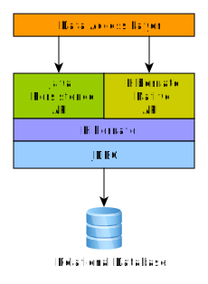
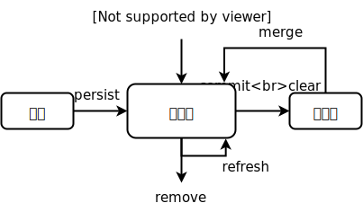

# Hibernate

Hibernate 解决了关系数据库和面向对象程序设计之间的映射问题，使得开发者可以通过面向对象的方式解决关系型数据持久化问题。JPA 提出后，Hibernate 全面拥抱 JPA 标准。

<!-- more -->



## Hello Hibernate

持久化对象

```java
package com.sunny.hibernate.entity;

import javax.persistence.Entity;
import javax.persistence.GeneratedValue;
import javax.persistence.GenerationType;
import javax.persistence.Id;
import javax.persistence.Table;

@Entity
@Table(name = "user")
public class User {
    @Id
    @GeneratedValue(strategy = GenerationType.IDENTITY)
    private Integer id;

    private String name;

    public void setId(Integer id) {
        this.id = id;
    }
    public Integer getId() {
        return this.id;
    }

    public void setName(String name) {
        this.name = name;
    }
    public String getName() {
        return this.name;
    }
}
```

使用 JPA API

```xml
<!-- META-INF/persistence.xml -->
<persistence
    xmlns="http://java.sun.com/xml/ns/persistence"
    xmlns:xsi="http://www.w3.org/2001/XMLSchema-instance"
    xsi:schemaLocation="http://java.sun.com/xml/ns/persistence http://java.sun.com/xml/ns/persistence/persistence_2_0.xsd"
    version="2.0">
  <persistence-unit name="com.sunny.hibernate">
    <provider>org.hibernate.jpa.HibernatePersistenceProvider</provider>
    <class>com.sunny.hibernate.entity.User</class>
    <properties>
      <property name="hibernate.connection.driver_class" value="com.mysql.cj.jdbc.Driver" />
      <property name="hibernate.connection.url" value="jdbc:mysql://localhost:3306/hibernate" />
      <property name="hibernate.connection.username" value="root" />
      <property name="hibernate.connection.password" value="888888" />
      <property name="hibernate.dialect" value="org.hibernate.dialect.MySQL8Dialect" />
      <property name="hibernate.show_sql" value="true" />
      <property name="hibernate.format_sql" value="true" />
      <property name="hibernate.hbm2ddl.auto" value="update" />
    </properties>
  </persistence-unit>
</persistence>
```

```java
package com.sunny.hibernate;

import javax.persistence.EntityManager;
import javax.persistence.EntityManagerFactory;
import javax.persistence.Persistence;

import com.sunny.hibernate.entity.User;

public class App {
    public static void main(String[] args) {
        EntityManagerFactory fac = Persistence.createEntityManagerFactory("com.sunny.hibernate");
        EntityManager em = fac.createEntityManager();

        em.getTransaction().begin();
        User u1 = new User();
        u1.setName("sunny");
        em.persist(u1);
        em.getTransaction().commit();

        em.getTransaction().begin();
        User u2 = em.find(User.class, 1);
        System.out.println(u2.getName());
        u2.setName("sunnysunny");
        em.flush();
        em.getTransaction().commit();

        em.getTransaction().begin();
        User u3 = em.find(User.class, 1);
        System.out.println(u3.getName());
        em.remove(u3);
        em.getTransaction().commit();

        em.close();
        fac.close();
    }
}
```

## Hibernate 配置

| 属性                                       | **描述**                                                  |
| :----------------------------------------- | :-------------------------------------------------------- |
| **hibernate.dialect**                      | 这个属性使 Hibernate 应用为被选择的数据库生成适当的 SQL。 |
| **hibernate.connection.driver_class**      | JDBC 驱动程序类。                                         |
| **hibernate.connection.url**               | 数据库实例的 JDBC URL。                                   |
| **hibernate.connection.username**          | 数据库用户名。                                            |
| **hibernate.connection.password**          | 数据库密码。                                              |
| **hibernate.connection.autocommit**        | 允许在 JDBC 连接中使用自动提交模式。                      |
| **hibernate.max_fetch_depth**              | 关联映射中的外连接抓取深度                                |
| **hibernate.show_sql**                     | 输出所有SQL语句到控制台                                   |
| **hibernate.format_sql**                   | 在log和console中打印出更漂亮的SQL                         |
| **hibernate.jdbc.fetch_size**              | 指定JDBC抓取数量的大小                                    |
| **hibernate.jdbc.batch_size**              | 允许Hibernate使用JDBC2的批量更新的大小                    |
| **hibernate.hbm2ddl.auto**                 | update、create、create-drop                               |
| **hibernate.cache.use_second_level_cache** | 二级缓存开关                                              |
| **hibernate.cache.use_query_cache**        | 查询缓存开关（不建议开启，影响性能）                      |

## PO 映射

Hibernate 的 PO 映射推荐采用 JPA 的映射注解

### 类映射

```java
@Entity
@Table(
    name = "xxx", // 表名
    indexes = {
        @Index(
            name = "xxx", // 索引名
            columnList = "xxx,xxx",
            unique = true
        )
    },
    uniqueConstraints = {
        @UniqueConstraint(
            name = "xxx", // 唯一约束名
            columnNames = {"xxx", "xxx"}
        )
    }
)
public class Xxx {
    // ...
}
```

### 属性映射

```java
// ...
public class Xxx {
    @Id
    @GeneratedValue(
        strategy = GenerationType.IDENTITY
    )
    private Xxx xxx;

    @Column(
        name = "xxx", // 列名
        nullable = true, // 是否允许为空
    )
    @Basic // 可有可无，可以定义抓取策略
    private Xxx xxx;

    @Temporal(TemporalType.TIMESTAMP) // DATE | TIME | TIMESTAMP
    private Date xxx;
    
    @Lob
    private byte[] xxx;
    
    @Version // 乐观锁
    private long version;
    
    @Transient // 不持久化
    private Xxx xxx;
}
```

### 集合属性映射

集合属性需要声明为接口类型，如 Set、List、Map，因为持久化时，Hibernate 会用自己的实现类赋值

```java
// ...
public class Xxx {
    @ElementCollection(fetch = FetchType.LAZY) // EAGER | LAZY
    @CollectionTable(
        name = "xxx", // 集合表名
        joinColumns = {
            @JoinColumn(
                name = "xxx", // 外键列名
                referencedColumnName = "xxx", // 主键列名
                nullable = false
            )
        }
    )
    @Column(name = "xxx", nullable = false)
    private Set<Xxx> xxx;
}
```

```java
// ...
public class Xxx {
    @ElementCollection(fetch = FetchType.LAZY) // EAGER | LAZY
    @CollectionTable(
        name = "xxx", // 集合表名
        joinColumns = {
            @JoinColumn(
                name = "xxx", // 外键列名
                referencedColumnName = "xxx", // 主键列名
                nullable = false
            )
        }
    )
    @Column(name = "xxx")
    @OrderColumn(name = "xxx")
    private List<Xxx> xxx;
}
```

```java
// ...
public class Xxx {
    @ElementCollection(fetch = FetchType.LAZY) // EAGER | LAZY
    @CollectionTable(
        name = "xxx", // 集合表名
        joinColumns = {
            @JoinColumn(
                name = "xxx", // 外键列名
                referencedColumnName = "xxx", // 主键列名
                nullable = false
            )
        }
    )
    @Column(name = "xxx")
    @MapKeyColumn(name = "xxx")
    private Map<Xxx, Xxx> xxx;
}
```

### 组件属性映射

```java
@Embeddable
public class Exx {
    @Column(name = "xxx")
    private Xxx xxx;
    // ...
    @Parent
    praivate Xxx owner;
}
```

```java
@Entity
// ...
public class Xxx {
    // ...
    private Exx xxx;
}
```

> 当集合属性的元素或者 Map 的键是组件的话，不需要再定义 @Column 和 @MapKeyColumn

### 关联映射

#### 1 > 1

```java
// ...
public class Xxx {
    @OneToOne(
        targetEntity = Xxx.class,
        cascade = CascadeType.ALL // ALL | PERSIST | MERGE | REMOVE | REFRESH | DETACH
    )
    @JoinColumn(
        name = "xxx",
        referencedColumnName = "xxx",
        unique = true
    )
    private Xxx xxx;
}
```

> 当双向关联时
>
> ```java
> // ...
> public class Xxx {
>     @OneToOne(mappedBy = "xxx") // 另一端的属性名
>     private Xxx xxx;
> }
> ```

#### 1 > N

```java
// ...
public class Xxx {
    @OneToMany
    @JoinColumn( // 注意，这里的外键列是存在另一端的
        name = "xxx",
        referencedColumnName = "xxx"
    )
    public Set<Xxx> xxx;
}
```

> 当双向关联时
>
> ```java
> // ...
> public class Xxx {
>     @OneToMany(mappedBy = "xxx") // 另一端的属性名
>     private Set<Xxx> xxx;
> }
> ```

#### N > 1

```java
// ...
public class Xxx {
    @ManyToOne
    @JoinColumn(
        name = "xxx",
        referencedColumnName = "xxx",
        nullable = false
    )
    private Xxx xxx;
}
```

#### N > N

```java
// ...
public class Xxx {
    @ManyToMany
    @JoinTable(
        name = "xxx", // 连接表名
        joinColumns = {
            @JoinColumn(
                name = "xxx",
                referencedColumnName = "xxx"
            )
        },
        inverseJoinColumns = {
            @JoinColumn(
                name = "xxx",
                referencedColumnName = "xxx"
            )
        }
    )
}
```

### 继承映射

#### 单表（默认）

在根类上增加辨识者列，用于区分父类和子类

```java
@Entity
@DiscriminatorColumn(
    name = "xxx", // 辨识者列名
)
@DiscriminatorValue("xxx") // 辨识字符串
public class Fxx {
    // ...
}
```

```java
@Entity
@DiscriminatorValue("xxx") // 辨识字符串
public class Cxx extends Fxx {
    // ...
}
```

#### 多表关联

```java
// 根类
@Inheritance(stratigy = InheritanceType.JOINED)
```

#### 多表分离

```java
// 根类
@Inheritance(stratigy = InheritanceType.TABLE_PER_CLASS)
```

> 因为数据分离了，所以不能使用自增主键

## Java API

### PO 的状态

EntityManager 代表一个持久化上下文，PO根据与上下文的关系分为以下 4 种状态：

- **瞬态**：已完成实例化，但未与上下文关联。
- **持久态**：已与上下文关联，关联或修改都会将被 Hibernate 检测到，并转换成持久化操作。
- **脱管态**：与上下文关联断开后，对象仍然存在于内存中，对它的修改不会立即生效，直到再次和上下文关联，还是会转换成持久化操作的。
- **删除态**：关联期间被执行删除操作，对象仍然存在于内存中，对它的修改不会生效。



> merge 会生成一个新的持久态对象

### JPQL

```java
String jpql = "update User set name = :newName where age > 30";
int count = em.createQuery(jpql).setParameter("newName", "xxx").executeUpdate();
// delete 同理
```

```java
String jpql = "select User from User where age > :age";
List<User> users = em.createQuery(jpql).setParameter("age", 30).getResultList();
User user = em.createQuery(jpql).setParameter("age", 30).getSingleResult();
```

### 动态条件查询

动态条件查询提供了编程式的类型安全的查询方式，是一种 JPQL 的替代方案。

```java
// 获取PO
CriteriaBuilder builder = entityManager.getCriteriaBuilder();
CriteriaQuery<Person> criteria = builder.createQuery( Person.class );
Root<Person> root = criteria.from( Person.class );
criteria.select( root );
criteria.where( builder.equal( root.get( Person_.name ), "John Doe" ) );
List<Person> persons = entityManager.createQuery( criteria ).getResultList();

// 获取PO的属性
CriteriaBuilder builder = entityManager.getCriteriaBuilder();
CriteriaQuery<String> criteria = builder.createQuery( String.class );
Root<Person> root = criteria.from( Person.class );
criteria.select( root.get( Person_.nickName ) );
criteria.where( builder.equal( root.get( Person_.name ), "John Doe" ) );
List<String> nickNames = entityManager.createQuery( criteria ).getResultList();

// 获取多个值
CriteriaBuilder builder = entityManager.getCriteriaBuilder();
CriteriaQuery<Tuple> criteria = builder.createQuery( Tuple.class );
Root<Person> root = criteria.from( Person.class );
Path<Long> idPath = root.get( Person_.id );
Path<String> nickNamePath = root.get( Person_.nickName);
criteria.multiselect( idPath, nickNamePath );
criteria.where( builder.equal( root.get( Person_.name ), "John Doe" ) );
List<Tuple> tuples = entityManager.createQuery( criteria ).getResultList();
for ( Tuple tuple : tuples ) {
    Long id = tuple.get( idPath );
    String nickName = tuple.get( nickNamePath );
}

// 多root
CriteriaBuilder builder = entityManager.getCriteriaBuilder();
CriteriaQuery<Tuple> criteria = builder.createQuery( Tuple.class );
Root<Person> personRoot = criteria.from( Person.class );
Root<Partner> partnerRoot = criteria.from( Partner.class );
criteria.multiselect( personRoot, partnerRoot );
Predicate personRestriction = builder.and(
    builder.equal( personRoot.get( Person_.address ), address ),
    builder.isNotEmpty( personRoot.get( Person_.phones ) )
);
Predicate partnerRestriction = builder.and(
    builder.like( partnerRoot.get( Partner_.name ), prefix ),
    builder.equal( partnerRoot.get( Partner_.version ), 0 )
);
criteria.where( builder.and( personRestriction, partnerRestriction ) );
List<Tuple> tuples = entityManager.createQuery( criteria ).getResultList();

// join
CriteriaBuilder builder = entityManager.getCriteriaBuilder();
CriteriaQuery<Phone> criteria = builder.createQuery( Phone.class );
Root<Phone> root = criteria.from( Phone.class );
// Phone.person is a @ManyToOne
Join<Phone, Person> personJoin = root.join( Phone_.person );
criteria.where(
    builder.and(
        builder.isNotEmpty(root.get(Phone_.calls)),
        builder.gt(personJoin.get(Person_.age), 30)
    )
);
List<Phone> phones = entityManager.createQuery( criteria ).getResultList();
```

### 锁

```java
entityManager.find(Person.class, id, LockModeType.PESSIMISTIC_WRITE);

List<Person> persons = 
    entityManager.createQuery("select DISTINCT p from Person p", Person.class)
    .setLockMode( LockModeType.PESSIMISTIC_WRITE )
    .getResultList();
```

### 事务

```java
entityManager.getTransaction().begin();
entityManager.getTransaction().commit();
entityManager.getTransaction().rollback();
```

