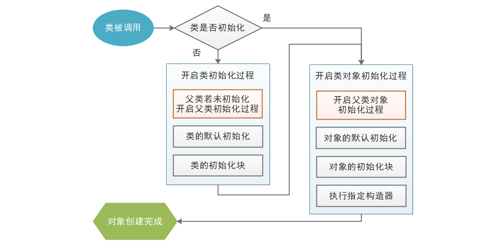
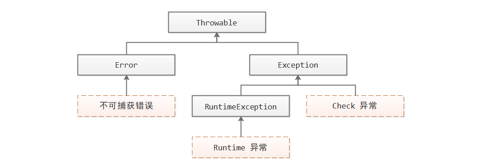
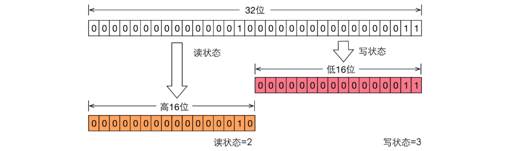

# Java 学习笔记

Java 是由 Sun Microsystems 公司于 1995 年 5 月推出的**面向对象**的程序设计语言，其设计宗旨是屏蔽底层开发的复杂性，提高开发效率。

<!-- more -->

- 语法方面，屏蔽了 C++ 中的操作符重载、多继承、指针等复杂特性，增加了类型自动转换、自动垃圾回收、异常处理等特性
- 编译方面，引入虚拟机 JVM，屏蔽了多平台的差异，只需要将源代码编译成可在虚拟机中运行的字节码，便可以在多平台运行，并且支持字节码动态创建和修改

## 注释

```java
// 单行注释

/*
多
行
注
释
*/

/**
 * 文档注释
 * @author xxx
 * @param xxx xxx
 * @exception xxx xxx
 * @return xxx
 * @version xxx
 * @deprecated xxx
 */
```

## 标识符

Java 是强类型语言

```java
_type _name = _init_value;
```

- 所有标识符必须先声明后使用
- 所有标识符具有一个类型，并接受指定类型的值
- 由字母、数字、下划线`_`、美元符`$`组成
- 不能以数字开头
- 不能直接使用`_`作为标识
- 不能与 Java 关键字同名

## 类型系统

| 数据类型 | 种类                                                 | 存储方式 |
| -------- | ---------------------------------------------------- | -------- |
| 基本类型 | byte、short、int、long、char、float、double、boolean | 值       |
| 引用类型 | 数组、类、接口                                       | 指针     |

### 整型

| 类型名称 | 占用位数 | 表示范围                       |
| -------- | -------- | ------------------------------ |
| byte     | 8 bits   | -128 ~ 127                     |
| short    | 16 bits  | -32,768 ~ 32,767               |
| int      | 32 bits  | -2,147,483,648 ~ 2,147,483,647 |
| long     | 64 bits  | -9.22e18 ~ 9.22e18             |

> **整型直接量表示法**
>
> - 十进制 `nnn`
>
> - 二进制 `0Bnnn`
>
> - 八进制 `0nnn`
>
> - 十六进制 `0Xnnn`
>
> - 所有整形直接量默认按照 int 类型来处理，后缀`L`可以改为 long 处理

### 字符型

char 代表字符型。Java 采用 16 位的 Unicode 字符集作为编码方式。

> **字符型直接量表示法**
>
> - 单个字符 `'A'`
> - 转义字符 `'\n'`
> - Unicode 值 `\uXXXX`
> - 整形直接量直接赋值

### 浮点型

| 类型名称 | 占用位数 | IEEE 754 标准 |
| -------- | -------- | ------------- |
| float    | 32 bits  | 1/8/23        |
| double   | 64 bits  | 1/11/52       |

> **进制转换中的精度损失**
>
> 当浮点数进行从十进制转换成二进制时则可能存在精度损失。解决方案是采用 BigDecimal 类。

> **浮点型直接量表示法**
>
> - 小数点 `0.1`
> - 科学计数法 `5.12E2`
> - 所有浮点型直接量默认按照 double 类型来处理，后缀`F`可以改为 float 处理
> - 浮点数支持正无穷大、负无穷大、非数

### 布尔型

boolean 代表布尔型，占用 8 bits ，使用 true / false 表示

> 基本类型自动转换
>
> 

### 数组

`_type[]` 代表数组，指针指向一段大小相同连续排列的内存片段。

```java
_type[] _name = new _type[_size];
_type[] _name = {xxx, xxx, xxx...};
```

> 数组定义允许嵌套，即 `_type[][]`

### 类与接口

类与接口是 Java 类型的拓展机制，任何标准库的和自定义的类与接口都被当做类型，运用在 Java 的源代码中。

## 运算符

运算符用于实现最基本的逻辑功能。

### 算术运算符

- `+` 加、字符串连接
- `-` 减
- `*` 乘
- `/` 除
- `%` 求余
- `++` 自加
- `--` 自减

> - 浮点数可以对 0.0 作除或者求余
> - 自加和自减：放在左，先操作；放在右，后操作

### 位运算符

- `&` 按位与
- `|` 按位或
- `~` 按位非
- `^` 按位异或
- `<<` 左移补零
- `>>` 右移补符号位
- `>>>` 右移补零

### 赋值运算符

- `=` 直接赋值
- `+= -= *= /= %= &= |= ^= <<= >>= >>>=` 

### 比较运算符

- `>`
- `<`
- `>=`
- `<=`
- `==`
- `!=`

### 逻辑运算符

- `&&`
- `&`
- `||`
- `|`
- `!`
- `^`

### 条件运算符

- `xxx ? xxx : xxx`

## 流控制

### 选择结构

#### if

```java
if (_logic_exp) {
    ...
}

if (_logic_exp) {
    ...
} else if (_logic_exp) {
    ...
} else {
    ...
}
```

#### switch

```java
switch(_exp){
    case _value:
       ...
    case _value:
       ...
    default:
       ...
}
```

### 循环结构

#### for

```java
for (_init; _logic_exp; _post) {
    ...
}

for (_type xxx: _array_exp) {
    ...
}
```

#### while

```java
while(_logic_exp) {
	...
}

do {
	...
} while (_logic_exp);
```

> - continue 继续下一轮循环
> - break 跳出循环，或跳出 switch 判断

## 类与对象

### 类定义

```java
package xxx.xxx.xxx;

import xxx.xxx.Xxx;
import static xxx.xxx.Xxx.xxx;

public class Xxx {
    static _type xxx;
    static {
        // ...
    }
    static _type/void xxx() {
        // ...
    }
    
    _type xxx;
    {
        // ...
    }
    
    Xxx() {
        // ...
    }
    
    _type/void xxx() {
        // ...
    }
}
```

#### 包机制

package 定义了类所属的包空间，当缺省时，将使用默认包空间，即根空间。

import 引入了该类所用到的其他包空间的类定义；import static 引入了该类所用到的其他包空间的类的静态成员。如果没有引入或者有重名问题，需要在源代码中使用类的全限定名，即包名+类名。

#### static

类也是一种特殊的对象，它们都是 java.lang.Class 的实例对象。static 修饰的变量和方法属于类成员。

#### 变量成员

在类中定义的变量称为变量成员

- 被 final 修饰的变量成员只能被赋值一次。

#### 初始化块

初始化块将在变量成员赋初始值后执行。

#### 构造器

构造器负责对象的实例化，在初始化块执行之后再执行。缺省时，会默认提供一个空执行体的无参构造器；否则不会默认提供一个空执行体的无参构造器，需要显式定义。

#### 方法成员

方法不能独立存在，必须定义在合适的类中。

- 形参采用值传递的方式
- 执行体中可以定义局部变量，被 final 修饰时只能被赋值一次
- Java 支持方法重载，即方法名相同但形参不同，编译器根据方法形参列表和最小类型原则来确定方法调用
- Java 支持方法递归调用

> 最小类型原则：当有多个方法匹配时，则根据继承关系，选择最小的类型所对应的方法

#### 注解


### 封装

| 修饰符名称 | 同一个类中 | 同一个包中 | 子类中 | 全局范围内 |
| ---------- | :--------: | :--------: | :----: | :--------: |
| private    |     O      |     X      |   X    |     X      |
| default    |     O      |     O      |   X    |     X      |
| protected  |     O      |     O      |   O    |     X      |
| public     |     O      |     O      |   O    |     O      |

> default 表示不加任何访问控制符

> 外部类也可以使用访问控制符来修饰，支持 public 和 default。当外部类使用 public 修饰时，文件名必须和该类名一致，因此一个源文件中只能有一个 public 类。

### 继承

非私有的非静态的成员（构造器除外）都可以被子类继承。

```java
public class Xxx extends Xxx {
    // ...
}
```

- 在构造器中，this(xxx) 调用其他构造器。缺省时，会在开头隐式调用父类的无参构造器；也可以通过 super(xxx) 显式调用父类构造器；当父类没有无参构造器时，必须显式调用。
- this 代表当前对象，super 代表当前对象的父类对象。
- 被 final 修饰的类无法被继承

### 多态

可以通过变量调用编译时类型的方法，但如果运行时类型重写了编译时类型的方法，则变量会优先调用运行时类型的方法。由于运行时类型不固定，相同类型的变量在调用同一个方法时就可能表现出不同的行为特征，这就是多态。

- 方法重写必须满足，形参列表相同，返回值类型相同或更小，访问控制符相同或更大，捕获的异常类型相同或者更小，异常数量相同或更少
- 多态只适用于成员方法，对于成员变量来说，不会优先访问运行时类型的重名成员变量
- 被 final 修饰的方法无法被重写

> **强制类型转换**
>
> |                | 自动类型转换             | 强制类型转换        |
> | -------------- | ------------------------ | ------------------- |
> | 基本类型       | 小类型 `-->` 大类型      | 大类型 `-->` 小类型 |
> | 引用类型（类） | 子类 `-->` 父类 （多态） | 父类 `-->` 子类     |
>
> 强制类型转换的格式 `(targetType)xxx`

#### 抽象类

```java
public abstract class Xxx {
    public abstract Xxx xxx();
}
```

如果一个类至少有一个成员方法没有执行体，则该类为抽象类。

- 抽象类需要被 abstract 修饰
- 没有执行体的方法可能来自 abstract 修饰的成员方法，可能来自于父类 abstract 成员方法，也可能来自未实现的接口方法。
- 抽象类无法被实例化

> 抽象类中的 this 和 子类中的 super
>
> 抽象类也可以有自己的构造器，底层也可以创建自己的实例，但是这样的实例是个“半成品”，是无法被直接使用的。相应的 this、super 并不代表抽象类实例，而是代表那个“半成品”

#### 接口

接口是彻底抽象的一种类，每一个成员方法都默认添加了 public abstract 修饰，因为彻底抽象，放宽了限制，原本类仅支持单继承，接口则支持多实现。

```java
public interface Xxx {
    Xxx xxx();
    Xxx xxx();
}
```

> Lambda 表达式

### 内部类

内部类可以更好地封装在外部类中。

#### 非静态内部类

- 支持4种访问控制模式

- 可直接访问外部类的所有成员

- 不允许在非静态内部类定义静态成员。

- 外部非静态类成员可以通过创建内部类对象间接访问内部类成员

- 同名对策：外部类名.this.外部类非静态成员名；外部类名.外部类静态成员名

- 在外部类之外访问非静态内部类

  ```java
  Out.In varName = OutInstance.new In();
  ```

- 定义非静态内部类的子类

  ```java
  public class SubClass extends Out.In {
      //必须显式定义
      public SubClass(Out out) {
          out.super(xxx)
      }
  }
  ```

#### 静态内部类

- 支持4种访问控制模式

- 可直接访问外部类的所有静态成员

- 允许在静态内部类定义静态成员。

- 外部类成员可以通过内部类名或者创建内部类对象间接访问内部类成员

- 同名对策：外部类名.外部类静态成员名

- 在外部类之外访问静态内部类

  ```java
  Out.StaticIn varName = new Out.StaticIn();
  ```

- 定义静态内部类的子类

  ```java
  public class SubClass extends Out.StaticIn {...}
  ```

### 局部类对象

#### 匿名局部类对象

只需要使用一次的类，会立即创建对象。

```java
new 接口名() {...}
new 抽象类名(形参列表) {...}
```

> 被匿名内部类访问的局部变量，会自动被 final 修饰。

#### Lambda 表达式对象

Lambda 表达式已被很多编程语言所支持，它本身代表一个匿名函数。但是 Java 中，方法必须定义在类里。为了支持Lambda 表达式特性，Java 提出了“函数式接口”的概念，即只包含一个抽象方法的接口，用于支持 Lambda 表达式。

```java
interface $函数式接口名 {
    //一个抽象方法
    $返回值类型 $方法名($形参列表);
}
```

```java
//对应哪个函数式接口则取决于上下文
($形参列表) -> { $抽象方法体 }
```

- 如果参数只有一个，可以省略括号。

- 形参列表中的类型声明可以省略。

- 如果方法体只有一句，可以省略花括号，如果有，则可以省略句中的 return 。

- 进一步，根据这一句不同情形，可以使用 `::` 让其更加简洁

  | 情形           | 原始 Lambda 表达式                    | 简化后的表达式   |
  | -------------- | ------------------------------------- | ---------------- |
  | 调用类方法     | `(a,b,...) -> 类名.类方法(a,b,...)`   | `类名::类方法`   |
  | 调用对象方法   | `(a,b,...) -> 对象.对象方法(a,b,...)` | `对象::对象方法` |
  | 调用类对象方法 | `(a,b,...) -> a.对象方法(a,b,...)`    | `类名::对象方法` |
  | 调用构造器     | `(a,b,...) -> new 类名(a,b,...)`      | `类名::new`      |

### 枚举类

枚举类的对象是有限且固定的。

```java
public enum Season {
    SPRING,SUMMER,FALL,WINTER; //必须写在开头处
}
// 外部使用 <枚举类名>.<枚举值名> 来使用
```

- 枚举类可以定义成员变量、方法、构造器。

- 构造器只能是私有的，且如果有参数，每一个枚举值也要加上实参。
- 如果包含抽象方法或者实现了接口，每一个枚举值也要实现这些抽象方法和接口方法。
- 枚举类可以实现多个接口，但不能继承，也不可以被继承。

### 类加载与对象实例化



### 垃圾回收

当某一对象失去所有引用时，就变成垃圾等待回收。


- 不要主动调用 finalize() 
- 可能程序执行完毕也不会调用 finalize()
- `System.gc()` 通知系统进行垃圾回收

## 泛型

> 引用类型的强制类型转换有个弊端，编译时并不会去检查是否可以转换成功，运行时就容易引起 ClassCastException 异常。Java 5 以后，引入了泛型，将类型检查提前到了编译阶段，让程序更加健壮。

泛型的原义是“参数化类型”，即在定义类或者方法时指定一个参数化的类型，调用时则传入具体的类型，提供语言内置的类型检查机制，如果出现与类型不符的情况将无法通过编译。

### 泛型类、接口

```java
$修饰符 class/interface $类名<E,T> { // 泛型声明在类名之后
    // 内部或者继承或者实现里都可以使用类型 E T,就像函数里使用参数一样。
}
```

- 创建泛型类对象时需要显式指定类型参数值。
- 声明的泛型不能直接作为父类或者接口，但可以作为父类或者接口的泛型参数使用。
- 声明的泛型不能创建泛型类型数组，编译器无法确定实际类型，也就无法分配内存。
- 泛型类这个概念本身就是针对对象而言的，所有的类成员不允许使用泛型。

### 泛型方法

```java
public class MyClass {
    //泛型方法
    $修饰符 <E,T> $返回值类型 $方法名($形参列表) { //泛型声明在修饰符之后
        //内部或返回值类型或形参列表都可以使用类型 E T
    } 
}
```

- 访问泛型方法时不需要显式指定类型参数值，编译器将根据调用上下文来推断类型参数值。
- 访问泛型方法时也可以显式指定类型参数值，在方法名前添加`<>`即可
- 声明的泛型能够直接作为返回值类型、形参类型。
- 声明的泛型允许创建泛型类型数组。
- 泛型方法这个概念被用来表示方法的形参与形参、形参与返回值之间的类型依赖关系。

> **泛型构造器**同泛型方法的用法一样。

### 类型通配符

在使用泛型类的过程中，必须向运行时类型传入具体的类型，而 Java 允许向编译时类型传入一个类型范围，比如是某类的子类、是某类的父类等等。此时就需要用到类型通配符 `?` 。

```java
MyClass<?> mc = new MyClass<xxx>();
MyClass<? extends Father> mc = new MyClass<Child>();
MyClass<? super Child> mc = new MyClass<Father>();
```

由于使用通配符，导致泛型的类型不确定，所以变量无法访问一切与泛型相关的方法成员和变量成员，比如List<?> list 不可以访问 add() 方法，但可以访问 get() 方法。

> 声明泛型时也可以使用 extends、super 来限定泛型的范围，并且能够访问范围上限类型里面的方法成员和变量成员。

### 原始类型

如果没有为泛型类指定实际的类型参数，将成为“原始类型”，类型参数为上限类型。

- 任何泛型类对象都可以赋值给原始类型变量，这称为“类型擦除”

- 原始类型对象可以赋值给任何泛型类变量，这称为“类型转换”，但系统会发出警告。

- Java 不允许直接创建泛型数组。如果想要使用泛型类数组，必须通过原始类型创建：

  ```java
  List<String>[] lsa = new ArrayList[10];
  lsa[0] = new ArrayList<String>();
  ...
  ```

## 异常处理

|              | 含义                  | 程序流   |
| ------------ | --------------------- | -------- |
| Checked 异常 | 继承 Exception        | 强制处理 |
| Runtime 异常 | 继承 RuntimeException | 无需处理 |

### 异常处理机制

```java
class MyClass {
    //方法、构造器
    xxx xxx xxx(xxx) throws XxxException {
        //...
        try {
            //...
        } catch (XxxException e1) {
            //...
        } catch (XxxException e2) {
            //...
        } finally {
            //...
        }
    }
}
```

1. try `()` 中创建可自动回收的资源
2. 运行 try 块代码
3. 遇到异常，不再继续执行 try 块，依次寻找 catch 块是否与异常匹配
4. 如果匹配，则执行相应的 catch 块，再执行 finally 块
5. 如果未匹配，则直接执行 finally 块
6. 方法体可以继续抛出未处理的异常，交给外部程序处理。

> Check 异常必须被 catch 或者被 throws 。Runtime 异常则没有限制，但是如果没有得到处理，将直接终止程序运行。

> 如果 catch 的多个异常中有父子关系，需将子类异常放到前面。

> 方法体抛出异常，当重写该方法时，抛出的异常只能更小，且只能更少。

### 异常类



Throwable 常用方法：

- `String getMessage()` 返回此throwable的详细消息字符串。
- `void printStackTrace()` 将此throwable和其追溯打印到标准错误流。
- `void printStackTrace(PrintStream s)` 将此throwable和其追溯打印到指定的打印流。

自定义异常类：

```java
public class MyException extends Exception/RuntimeException/XxxException {
    public MyException() {}
    public MyException(String msg) {
        super(msg);
    }
}
```

## 命令行工具

### javac

```sh
$ javac -cp xxx.jar:xxx.jar -d xxx/ xxx.java xxx.java
```

### jar

```sh
$ jar -c -v -f xxx/xxx.jar -e Xxx -C xxx/ Xxx.class Xxx.class
$ jar -t -v -f xxx/xxx.jar
$ jar -x -v -f xxx/xxx.jar
```

### java

```sh
# java程序的入口是主类中的 main 函数
$ java -cp xxx.java:xxx.java -Dxxx=xxx Xxx xxx xxx ...
# 可直接运行的jar
$ java --jar xxx/xxx.jar
```

### javadoc

### jps

### jshell

## 项目管理工具

### maven

### gradle

## 核心类

### Ojbect

### 包装类

### String

### System

### Runtime

## 集合类

### Collection

#### Set

#### List

#### Queue

### Map

## I/O 类

## 工具类

### Arrays

### Collections

## 网络编程

## 并发编程

### 多线程

#### Thread

Thread 类是线程在 Java 中的抽象。主要 **API** 如下

- `static Thread currentThread()`

- `Thread(Runnable r)` 使用当前线程的线程组创建

- `Thread(ThreadGroup g, Runnable r)`

- `void setPriority(int p)`

  > 每当调度器决定运行一个新线程时， 首先会在具有高优先级的线程中进行选择， 尽管这样会使低优先级的线程完全饿死

  `static int Thread.MAX_PRIORITY`

  `static int Thread.MIN_PRIORITY`

  `static int Thread.NORM_PRIORITY`

- `void setDaemon(boolean b)` 设置是否为后台线程

  > 后台线程的任务是为其他线程提供服务，如果全部前台线程死亡，后台线程会自动死亡

- `void start()` 激活线程，进入执行状态，不可以二次调用。JVM 会自动注册一个该线程的强引用，所以即使没有显式的变量引用线程，活跃的线程依然不会被垃圾回收器回收。

- `static void sleep(long millis)` 当前线程进入限时等待状态，指定时间长度后自动恢复执行状态

- `static void yield()` 主动让当前线程失去CPU

- `void join()` 等待该线程实例执行完毕

- `void interrupt()` 将线程标记为“中断”，具体如何中断由 `run()` 的顺序流决定

  > 如果线程调用了对象的 `wait`方法，或者线程对象的 `join` 方法，或者调用了 `Thread.sleep` 方法，该方法将清除中断状态，并抛出`InterruptedException` 给这个线程。
  >
  > 如果线程阻塞在 `InterruptibleChannel` 上，该方法将设置中断状态，并抛出 `ClosedByInterruptException` 给这个线程。

- `boolean isInterrupted()` 判断线程是否为“中断”

- `static boolean interrupted()` 判断当前线程是否为“中断”，并清除中断状态

- `setContextClassLoader`

  > SPI 是服务提供者接口机制，是一种动态加载服务提供者类的方法
  >
  > ```java
  > //load方法会搜索类路径下的 META-INF/services/$(MyServices全路径名) 这个文件
  > //文件中罗列了这个服务的实现类的全路径名
  > //根据这些名利用线程上下文类加载器去加载类
  > ServiceLoader<MyService> myServices = ServiceLoader.load(MyService.class);
  > Iterator<MyService> myServiceIterator = myServices.iterator();
  > while (myServiceIterator.hasNext()) {
  >     MyService myService = myServiceIterator.next();
  >     ...
  > }
  > ```

##### Thread.State

Thread.State 表示线程状态的枚举类

- `NEW` 新建的线程对象还未执行

- `RUNNABLE` 线程正在 JVM 中被执行

- `BLOCKED` 等待获取监视器锁

  > 进入synchronized 临界区或者调用 Object#wait 后唤醒时，进入 BLOCKED 状态

- `WAITING` 无限期等待，直到被其他线程唤醒（Object）

  > Object#wait()、Thread#join()、LockSupport#park() 会使线程进入 WAITING 状态

- `TIMED_WAITING` 限时等待，直到被其他线程唤醒或者时限达到自我唤醒

  > Thread.sleep(xxx)、Object#wait(xxx)、Thread#join(xxx)、LockSupport#parkXXX(xxx) 会使线程进入 TIMED_WAITING 状态

- `TERMINATED` 线程终止，不可二次执行

> 因 IO 操作而阻塞的线程其实还是 RUNNABLE 的状态

##### ThreadGroup

ThreadGroup 类是线程组在 Java 中的抽象，主要的 API 如下：

- `ThreadGroup(String name)`
- `ThreadGroup(ThreadGroup g, String name)`
- `void interrupt()`
- `void setDaemon(boolean b)`

##### Thread.UncaughtExceptionHandler

表示一个非受检异常处理器，ThreadGroup 实现了 Thread.UncaughtExceptionHandler ，API：

- `void uncaughtException(Thread t, Throwable e)`

设置处理器的方法如下：

- `void Thread#setUncaughtExceptionHandler(UncaughtExceptionHandler h)` 设置线程的处理器
- `void Thread.setDefaultUncaughtExceptionHandler(UncaughtExceptionHandler h)` 设置默认的处理器

用于处理线程执行过程中的非受检异常，其处理流程如下：

1. 如果线程设置了处理器，那么交给线程处理器处理
2. 否则交给线程所在的线程组处理，其中默认实现如下
   1. 如果线程组有父线程组，那么就给父线程组处理
   2. 否则，如果有默认异常处理器，则交给该处理器处理
   3. 否则，输出栈轨迹到标准错误流上 

##### ThreadLocal\<T\>

ThreadLocal 是局部线程变量的抽象。主要 API 如下：

- `T get()` 获取与当前线程关联的指定类型的对象
- `void set(T value)` 设置与当前线程关联的指定类型的对象
- `void remove()` 删除与当前线程关联的指定类型的对象
- `static <S> ThreadLocal<S> withInitial(Supplier<S> s)` 生成一个有初始值的 ThreadLocal 对象

每一个线程都会持有一个 ThreadLocal.ThreadLocalMap 对象，该对象负责管理以 ThreadLocal 对象为 key 本地值为 value 的映射。而 ThreadLocal 对象自身不负责存储，而只负责访问或设置或删除当前线程的 ThreadLocal.ThreadLocalMap 对象的与自身对应的值对象。

> ThreadLocalMap 对象持有 ThreadLocal key 的弱引用，所以当所有强引用失效后，即使没有手动删除，ThreadLocal 对象也会被回收，从而出现 null key 现象。但是 ThreadLocal 对象对应的值对象并没有自动删除，而是在下一次 ThreadLocalMap 调用set, get，remove的时候才会被清除，有内存泄漏的隐患。所以不要忽略 remove 方法的调用。

##### Runnable

Runnable 代表一个无返回值的执行体，该接口只包含一个方法：

- `void run()`

Thread 实现了 Runnable 接口。默认将执行构造方法传入的 Runnable 对象的 run 方法。

```java
new Thread(runnableObj).start();
```

##### Callable\<V\>

Callable 代表一个有返回值的执行体，该接口只包含一个方法：

- `V call()`

##### Future\<V\>

Future\<V> 代表一个 Callable 执行体的管理器，提供了以下方法：

- `boolean cancel(boolean i)` 取消执行体，如果已经开始执行且 i 为 true ，则会尝试中断
- `boolean isCancelled()`
- `boolean isDone()`
- `V get()` 尝试获取执行体的返回值，如果还未完成，线程会阻塞至任务完成
- `V get(long timeout, TimeUnit unit)`

##### RunnableFuture\<V>

Callable 的执行体不能直接被线程对象接受，需要包装成 Runnable 对象。RunnableFuture\<V> 同时继承了 Runnable 、 Future\<V\> 接口。

##### FutureTask\<V\>

FutureTask 同时实现了 RunnableFuture\<V> 接口。FutureTask 对象的 run 方法会调用内置的 Callable 对象的执行体，并随后保存返回值。

```java
FutureTask<XXX> task = new FutureTask(callableObj)
new Thread(task).start();
...
XXX value = task.get();
```

#### Executor

Executor 表示一个执行器，

- `void execute(Runnable command)`

##### ExecutorService

ExecutorService 接口是 Executor 的子接口，增加了执行器需要的完备的服务方法，主要有：

- `<T> Future<T> submit(Callable<T> task)`
- `<T> List<Future<T>> invokeAll(Collection<Callable<T>> tasks)`
- `<T> T invokeAny(Collection<Callable<T>> tasks)`
- `void shutdown()`
- `List<Runnable> shutdownNow()`

##### ThreadPoolExecutor

ThreadPoolExecutor 使用池化算法实现了 ExecutorService 。

- 减少创建和销毁线程的性能损耗
- 有效地管理系统资源，防止系统崩溃

构造一个完整的 ThreadPoolExecutor 对象依次需要以下参数：

- `int corePoolSize` 线程池核心线程数
- `int maximumPoolSize` 线程池最大线程数
- `long keepAliveTime` 当线程数大于核心线程数时，空闲线程的等待时限
- `TimeUnit unit`
- `BlockingQueue<Runnable> workQueue` 该阻塞队列用于存放 execute 方法提交的等待执行的任务
- `ThreadFactory threadFactory` 线程工厂
- `RejectedExecutionHandler handler` 拒绝执行处理器

> java.util.concurrent.Executors 是一个工具类，可以创建简单的线程池对象，但不推荐在生产环境中使用。

底层的执行流程如下：

1. execute 或 submit 方法提交任务
2. 如果当前线程数小于核心线程数，新建核心线程执行当前任务
   1. 执行完后，将一直从任务队列中取任务执行
3. 否则，向任务队列添加当前任务，如果添加成功，返回
4. 否则，如果当前线程数小于最大线程数，新建非核心线程执行当前任务
   1. 执行完后，将一直从任务队列中取任务执行，如果一直闲置了足够长时间，将销毁该线程
5. 否则，调用拒绝执行处理器的相关方法

##### ForkJoinPool

##### ScheduledExecutorService

ScheduledExecutorService 接口是 ExecutorService 的子接口，增加了任务调度方法：

- `ScheduledFuture<?> schedule(Runnable command, long delay, TimeUnit unit)`
- `<V> ScheduledFuture<V> schedule(Callable<V> callable, long delay, TimeUnit unit)`
- `ScheduledFuture<?> scheduleAtFixedRate(Runnable command, long initialDelay, long period, TimeUnit unit)`
- `ScheduledFuture<?> scheduleWithFixedDelay(Runnable command, long initialDelay, long delay, TimeUnit unit)`

##### ScheduledThreadPoolExecutor


#### CompletionService\<V>

CompletionService\<V> 表示一个即可以接收任务也可以处理任务结果的服务，主要 API 如下：

- `Future<V> submit(Callable<V> task)` 提交任务
- `Future<V> take()` 返回一个已经完成的任务结果，如果没有则阻塞
- `Future<V> poll()` 非阻塞，如果没有任务完成则返回 null

> ExecutorService 只负责接收任务，接收的同时会返回 Future 对象给主调，所以不负责处理任务结果。

##### ExecutorCompletionService\<V>

ExecutorCompletionService\<V> 是 CompletionService\<V> 的一种实现：

- `ExecutorCompletionService(Executor e)`
- `ExecutorCompletionService(Executor e, BlockingQueue<Future<V>> q)`

底层维护了一个 Executor 对象和一个 BlockingQueue\<Future\<V>> 对象，当接收任务是会将任务对象包装成 QueueingFuture\<V> 对象，该对象会在任务完成时自动将任务结果添加到阻塞队列中。

#### CompletionStage\<T>

CompetionStage\<T> 表示一个异步计算的阶段，可以在计算完成时自动执行相应的处理：

- `<U> CompletionStage<U> thenApply(Function<T,U> fn)`
- `<U> CompletionStage<U> applyToEither(CompletionStage<T> other, Function<T, U> fn)`
- `<U,V> CompletionStage<V> thenCombine(CompletionStage<U> other,BiFunction<T,U,V> fn)`
- `CompletionStage<Void> thenRun(Runnable action)`
- `CompletionStage<Void> runAfterBoth(CompletionStage<?> other, Runnable action)`
- `CompletionStage<Void> runAfterEither(CompletionStage<?> other, Runnable action)`
- `CompletionStage<Void> thenAccept(Consumer<? super T> action)`
- `CompletionStage<Void> acceptEither(CompletionStage<T> other, Consumer<T> action)`
- `<U> CompletionStage<Void> thenAcceptBoth(CompletionStage<U> other,BiConsumer<T,U> action)`
- `<U> CompletionStage<U> thenCompose(Function<T,CompletionStage<U>> fn)`
- `CompletionStage<T> whenComplete(BiConsumer<T, Throwable> action)`
- `CompletionStage<T> exceptionally(Function<Throwable, T> fn)`
- `<U> CompletionStage<U> handle(BiFunction<T, Throwable,U> fn)`

##### CompletableFuture\<T>

同时实现了 Future\<T> 、 CompletionStage\<T> 两个接口，即实现了异步执行和结果访问两个功能。该类是 Java 实现“函数是编程”的关键。主要 API 如下：

- `CompletableFuture()` 构造一个处于未完成阶段的对象，没有实际意义
- `static <U> CompletableFuture<U> completedFuture(U value)`
- `static CompletableFuture<Void> runAsync(Runnable runnable)`
- `static <U> CompletableFuture<U> supplyAsync(Supplier<U> supplier)`

### 线程同步

#### volatile

> volatile 英文“易挥发的不稳定的”

- 可见性：保证了变量在工作内存中被修改后，能立刻反应到主内存和其他工作内存中
- 禁止指令重排：保证了变量在当前工作内存中被修改时，语义顺序前的指令都已完成，语义顺序后的指令还未开始执行（考虑到其他线程得知修改后，能够根据修改线程的语义逻辑作出正确的逻辑判断）

#### synchronized

JVM 没有把 lock 和 unlock 开放给字节码使用，但 JVM 开放了更高层次的指令 monitorenter 和 monitorexit ，反应到java代码中就是 synchronized 关键字。要想执行同步安全的代码段就先获取附属的同步监视器的锁定，否则将阻塞，直到获取锁定，执行过程中，其他线程会因无法获取锁定而被阻塞。

- 代码块同步

  ```java
  synchronized(obj) {
      ...
  } // 同步监视器是 obj
  ```

- 方法同步

  ```java
  class xxx {
      xxx synchronized xxx methodname(xxx) {
          ...
      }
  } // 同步监视器是 this
  ```

Object 类提供了三个方法用于实现通信，前提是对象必须被当做同步监视器

- `void wait()` 放弃锁定，阻塞当前线程，等待直到被唤醒
- `void wait(long time)` 可以自动唤醒
- `void notify()` 随机唤醒一个在此同步监听器上等待的线程
- `void notifyAll()` 唤醒所有在此同步监听器上等待的线程

##### 运行流程

随着 Java 版本的迭代，synchronized 的性能得到了充分的优化，底层经历了**偏向锁**、**轻量级锁**、**重量级锁**三个阶段，同时进行了**锁消除**、**锁粗化**等优化手段。

#### CAS

CAS 全名 Compare and Swap ，是一项乐观锁技术，也称为无锁技术。CAS 定义了一个原子性的操作：执行写入之前判断内存值与期望值是否相等，如果相等则执行写入，返回成功信号，如果不相等则放弃写入，返回失败信号。

> 这种无锁技术只能适用于一些资源竞争不激烈的情景，它可以避免加锁解锁带来的性能损耗；但是如果资源竞争过于激烈，可能出现多次尝试 CAS 都失败而带来的性能损耗。

> 现如今很多 CPU 都支持 CAS 指令。

sun.misc.Unsafe 对象提供了对 CAS 的支持：

- `boolean compareAndSwapInt(Object o, long offset, int expected, int x)`
- `boolean compareAndSwapLong(Object o, long offset, long expected, long x)`
- `boolean compareAndSwapObject(Object o, long offset, Object expected, Object x)`

> sun.misc.Unsafe 包装了 jdk.internal.misc.Unsafe 。

##### VarHandle

##### Atomic

Unsafe 类对于开发者不是很友好，java.util.concurrent.atomic 包提供了更友好的 API，并且增加了很多常用的原子操作方法以供开发者使用。

AtomicInteger 是最常用的原子类，主要的 API 如下：

- `int addAndGet(int delta)`
- `int getAndAdd(int delta)`
- `int incrementAndGet()`
- `int getAndIncrement()`

> 除了 AtomicInteger ，该包下还支持了 boolean、long、对象引用、数组元素、对象字段等功能。

> **解决 CAS 操作的 ABA 问题**
>
> ```java
> AtomicStampedReference<String> reference = new AtomicStampedReference<String>(str1,1);
> reference.compareAndSet(str1,str2,reference.getStamp(),reference.getStamp()+1);
> ```

#### AQS

> 协调多个线程运行状态的工具对象称为同步器。

AQS 全名 AbstractQueuedSynchronizer ，即抽象队列同步器，是一种同步器的实现框架类，可以实现阻塞锁和顶层的一些同步器。

底层维护了一个 volatile 的 int 的变量 state ，需要重写以下 API 来改变 state ：

- `protected boolean tryAcquire(int arg)`
- `protected boolean tryRelease(int arg)`
- `protected int tryAcquireShared(int arg)`
- `protected boolean tryReleaseShared(int arg)`
- `protected boolean isHeldExclusively()`

> AQS定义两种资源共享方式：Exclusive 和 Shared

外部通过以下 API 来访问 AQS 实现类：

- `final void acquire(int arg)`
- `final void acquireInterruptibly(int arg)`
- `final void acquireShared(int arg)`
- `final void acquireSharedInterruptibly(int arg)`
- `final boolean release(int arg)`
- `final boolean releaseShared(int arg)`

##### acquire - release 流程

**acquire**

1. 尝试获得锁，如果获得锁，直接返回
2. 否则，将当前线程包装成 Node 对象放入等待队列的尾部，激活自旋
   1. 如果前驱为 head 且尝试获得锁成功，删除旧 head ，设置自身为 head，停止自旋
   2. 否则，阻塞当前线程，等待被唤醒，唤醒后重新自旋
3. 线程中断自处理。

**release**

1. 尝试释放锁，一般都会成功的
2. 唤醒 head 的后继 Node

##### acquireShared - releaseShared 流程

#### Lock

Lock 接口的方法提供了更加灵活的锁定操作：

- `void lock()`
- `void lockInterruptibly()` 可被中断
- `boolean tryLock()`
- `boolean tryLock(long time, TimeUnit unit)` 可被中断
- `void unlock()`
- `Condition newCondition()` 获取条件对象

用法如下：

```java
lock.lock();
try{
    //处理任务
}catch(Exception ex){
     
}finally{
    lock.unlock();   //释放锁
}
```

```java
if(lock.tryLock(<指定时间长度或者不指定>)) {
     try{
         //处理任务
     }catch(Exception ex){
         
     }finally{
         lock.unlock();   //释放锁
     } 
}else {
    //如果不能获取锁，则直接做其他事情
}
```

```java
lock.lockInterruptibly();// 如果等待过程中当前线程被标记为“中断”，则会抛出异常，必须被捕获
try {  
 //.....
}
finally {
    lock.unlock();
}
```

##### ReentrantLock

ReentrantLock 实现了 Lock ，称为可重入锁，内部定义了一个非公平同步器和一个公平同步器，都继承自 AQS 。同步器内部维护了一个 state ，当获取锁时会判断当前线程是否持有锁，从而实现重入逻辑。

> Lock 对象也是一种的同步器，实现类中借助了 AQS 的支持。

> 可重入的意思是，获取锁的线程可以再次获取锁。

##### ReadWriteLock

ReadWriteLock 代表读写锁，API 如下：

- `Lock readLock()` 获取读锁
- `Lock writeLock()` 获取写锁

##### ReentrantReadWriteLock

ReentrantReadWriteLock 实现了 ReadWriteLock ，称为可重入读写锁，内部也是定义了一个非公平同步器和一个公平同步器，都继承自 AQS 。此外还定义了一个读锁和一个写锁，这两个锁将共享宿主对象的同步器，巧妙的是，同步器里维护的 state 整型变量一分为二，分别由读锁和写锁维护。



当获得锁时，会通过复合变量 state 实现读写锁之间的制约关系。

| 当前锁状态 | 读锁请求       | 写锁请求         |
| ---------- | -------------- | ---------------- |
| 无锁       | 可以           | 可以             |
| 读锁       | 可以（可重入） | 阻塞（不可重入） |
| 写锁       | 阻塞（可重入） | 阻塞（可重入）   |

##### Condition

通过Lock实例的 `newCondition()` 方法，获取对应的Condition实例，该接口有如下方法：

- `void await()` 
- `await`的其他变体，功能丰富
- `void signal()`
- `void signalAll()`

该接口的实现类一般为 AQS 的内部类 ConditionObject 。

> 监视器同时承担了锁和线程通信两个功能，而同步锁只负责锁功能，线程通信则交给 Condition 对象来负责，这样，一个同步锁可以产生多个 Condition 对象，且多个 Condition 对象只负责自己的等待线程，不会相互影响。

##### LockSupport

#### 同步器

##### CountDownLatch

称为倒计时门栓，这种同步器可以实现：在一个或多个线程中等待其他线程完成一定数量的操作后继续执行。

- `CountDownLatch(int count)` count 表示倒计时总数
- `void await()` 等待至倒计时为零，或被中断
- `void countDown()` 倒计时减一

内部定义了一个同步器继承自 AQS ，倒计时就是 state 变量，每当调用 countDown 时，释放一次锁，state 减一，当调用 await 方法时，获取锁，如果 state 为零则获取成功，否则进入队列等待。

##### CyclicBarrier

称为栅栏，这种同步器可以实现：让多个线程彼此等待，直到等待的线程达到一定数量后继续执行。

- `CyclicBarrier(int parties)`
- `CyclicBarrier(int parties, Runnable barrierAction)` 定义栅栏任务
- `int await()` 
- `void reset()` 重置

内部维护了一个 ReentrantLock 对象 lock 和一个锁对象的 Condition 对象 trip ，原理就是通过在 trip 上等待栅点实现的。因为考虑到了重置，所以内部还维护了一个 Generation 对象，其中的 broken 表示当前代是否被破坏，当调用 reset 时，将设置当前代的 broken ，每一个被唤醒的线程都会抛出 BrokenBarrierException。

##### Semaphore

称为信号量，这种同步器可以实现：指定一定数量的“许可证”，线程可以获取许可和释放许可，如果没有空闲的许可证，则阻塞当前线程至获得许可证。

- `Semaphore(int permits)`
- `Semaphore(int permits, boolean fair)`
- `void acquire()`
- `void release()`

内部定义了一个非公平同步器和一个公平同步器，都继承自 AQS 。

##### Exchanger


##### BlockingQueue

当生产者线程试图向满的队列中添加元素，会被阻塞，直到不满的时候自动被唤醒；当消费者线程从空大队列中取出元素时，会被阻塞，直到不空的时候自动被唤醒。

常用的接口实现有 ArrayBlockingQueue、LinkedBlockingQueue ...

> LinkedTransferQueue 在 LinkedBlockingQueue 的基础上添加了两个方法：
>
> - transfer：如果已有消费者等待，则直接传递并返回，否则，入队，并等待至元素被消费
> - tryTransfer：如果已有消费者等待，则直接传递并返回 true，否则，不入队并返回 false

### 线程安全

#### 线程安全的级别

1. 不可变：对于不可变类对象的访问一定是线程安全的
2. 绝对安全：对一个对象的访问不需要额外的同步措施
3. 相对安全：对一个对象的单次访问不需要额外的同步措施
4. 线程兼容：对一个对象的单次访问需要额外的同步措施
5. 线程对立：即使提供额外的同步措施也无法保证对象的正确访问

#### StringBuffer

#### ConcurrentHashMap

1.7 版本时，采用分段锁保证线程安全，数据结构为“分段锁+数组+链表”；1.8 版本时，采用 synchronized+CAS 保证线程安全，数据结构为“数组+链表/红黑树”。

官方没有提供 ConcurrentHashSet 类，需要通过 ConcurrentHashMap 对象的如下方法得到对应的 Set 对象

- `Set<K> newKeySet()` 返回键集，不能添加集元素
- `Set<K> keySet(V v)` 参数是默认键值，将返回键集，可以添加集元素

或者调用 `Collections.newSetFromMap(concurrentHashMapObj)` 得到对应的 Set 对象

#### ConcurrentSkipListMap 与 ConcurrentSkipListSet

#### ConcurrentLinkedQueue 与 ConcurrentLinkedDeque

#### CopyOnWriteArrayList 与 CopyOnWriteArraySet

## 反射编程

