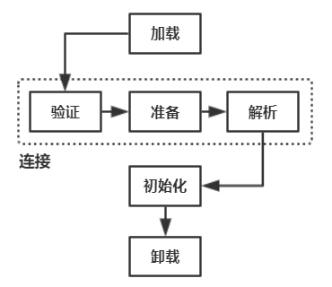
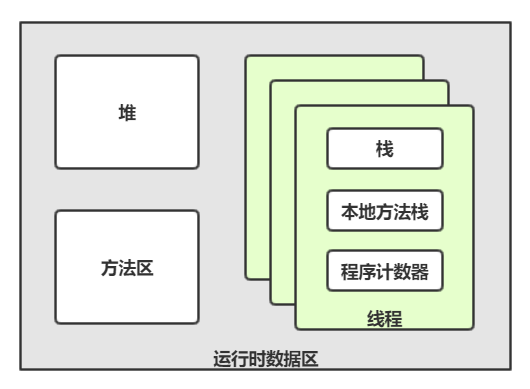
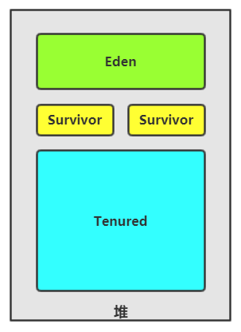
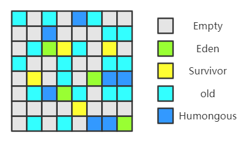
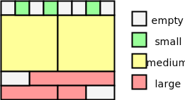
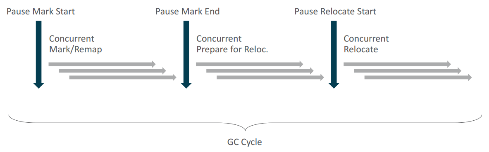
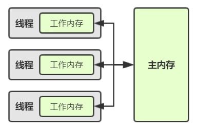
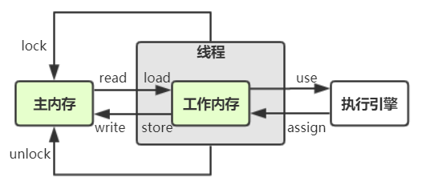

# JVM 学习笔记

JVM（Java Virtual Machine）是对硬件模拟的软件实现，屏蔽的不同平台的差异性

<!-- more -->

## 字节码

.class 文件是一种以字节为单位的无间隔符的二进制文件，包含了 JVM 指令和其他辅助信息。JVM 规范要求 .class 文件使用强制性的语法和结构化约束，任何其他语言的实现者都可以以 .class 文件的形式将 JVM 作为语言的产品交付媒介，而 JVM 不关心 .class 的来源是什么语言。所以 JVM 保证了“平台无关性”，.class 规范保证了“语言无关性”。

### 文件结构

u1、u2、u4、u8 代表“无符号数”，info 代表“表”，即一种复合结构

| 名称                | 描述                         | 类型 | 数量  |
| ------------------- | ---------------------------- | ---- | ----- |
| magic               | class 文件的标识             | u4   | 1     |
| minor_version       | 次版本号                     | u2   | 1     |
| major_version       | 主版本号（jdk1 -> 45）       | u2   | 1     |
| constant_pool_count | 常量池计数                   | u2   | 1     |
| constant_pool       | 常量池，包含字面量和符号引用 | info | ^ - 1 |
| access_flags        | 类层次的访问信息             | u2   | 1     |
| this_class          | 当前类索引（指向某个常量）   | u2   | 1     |
| super_class         | 父类索引（指向某个常量）     | u2   | 1     |
| interfaces_count    | 接口计数                     | u2   | 1     |
| interfaces          | 接口索引（指向某个常量）     | u2   | ^     |
| fields_count        | 字段计数                     | u2   | 1     |
| fields              | 字段信息                     | info | ^     |
| methods_count       | 方法计数                     | u2   | 1     |
| methods             | 方法信息                     | info | ^     |
| attributes_count    | 属性表计数                   | u2   | 1     |
| attributes          | 属性表                       | info | ^     |

### 类加载

#### 类加载时机

- new 某类的对象
- 读取某类的静态字段
- 调用某类的静态方法
- 反射调用某类（java.lang.reflect）
- 子类触发父类的加载
- 虚拟机启动时的主类加载
- 方法句柄与某类相关（java.lang.invoke.MethodHandle）
- 接口如果有默认方法，那么实现类会触发接口的加载

#### 类加载流程



- 加载：获取二进制字节流，生成一个代表这个类的 java.lang.Class 对象。
- 验证：确保 Class 文件的字节流中包含的信息符合当前虚拟机的要求，并且不会危害虚拟机自身的安全。
- 准备：为类变量分配内存并设置类变量默认初始值，这些变量所使用的内存都将在方法区中进行分配。
- 解析：虚拟机将常量池内的符号引用替换为直接引用的过程。
- 初始化：执行类中定义的 Java 程序代码，包括类变量的赋初值和静态代码块。
- 卸载：方法区的垃圾回收

#### 类加载器

上面的所有步骤都是通过类加载器来实现的，类加载器的基类为 ClassLoader。当JVM启动时会形成由三个类加载器组成的层次结构：

- 启动类加载器。

  - 由C++实现，用户无法获得实例。
  - 加载JAVE_HOME\lib目录，或者-Xbootclasspath参数的路径。

- 扩展类加载器。

  - sun.misc.Launcher$ExtClassLoader实现。
  - 加载JAVA_HOME\lib\ext目录，或者java.ext.dirs系统变量指定的路径。

- 系统类加载器

  - sun.misc.Launcher$AppClassLoader实现。
  - 加载用户类路径Classpath上的类，即-classpath或java.class.path。

类加载器实例之间存在父子关系（通过组合实现的父子关系），即子类加载器含有一个父类加载器变量，如果这个变量不为 null ，则父亲是指定的父类加载器，如果为 null ，则父亲是启动类加载器，而 Java 无法获取启动类加载器的控制权。所以暴露在外的类加载器都有父亲。加载流程如下：

1. 如果显式指定了类加载器，则使用该类加载器负责加载，如`MyClassLoader.loadClass("xxx")`。如果没有指定，则使用被依赖类所使用的类加载器负责加载。

   > `java -cp xxx -d xxx 主类名` ：主类所使用的类加载器就是系统类加载器

2. 确定加载器之后，在缓存里查询自身是否已经加载了目标类，如果找到，则直接返回，如果没有，继续下一步

   > 不同的类加载器可以加载同名类，所以需要使用类的权限定名和类加载器共同标识了内存中缓存的类。

3. 自身加载时，如果该加载器有父类加载器，则委托给父类加载器加载，此时检测异常，如果加载成功，则返回，如果出现异常，继续下一步

   > 父类加载器限定了子类加载器能够加载的类名称，例如任何类无法加载`java.lang.String`

4. 根据自身的加载方法加载目标类，如果加载成功，则返回，如果不成功，则抛出异常

> 以上策略暗含了三种类加载机制：**全盘负责**、**父类委托**、**缓存机制**

##### 自定义类加载器

需要继承 ClassLoader，API 如下：

- `public Class<?> loadClass(String name) throws ClassNotFoundException`

  负责加载类对象

- `protected Class<?> findClass(String name) throws ClassNotFoundException`

  负责加载的实现

- `public static ClassLoader getSystemClassLoader()` 获取系统类加载器

- `public final ClassLoader getParent()` 获取父类加载器

- 其他的一些辅助方法，如查询缓存、文件系统加载、连接等

> 只需要重写 findClass 方法，即可自定义加载规则。但如果需要改变加载策略，可以重写 loadClass 方法，但一般不会这么做。

##### 线程上下文类加载器

> 核心类都是由启动类加载器加载的，如果核心类代码需要引用非核心类，根据加载流程是加载不到非核心类的。为了解决这个问题，引入线程上下文类加载器，核心类可以通过线程得到设定的类加载器，从而加载非核心类。

线程上下文类加载器是伴随线程的一种类加载器引用，其默认引用的就是系统类加载器，可以自行设置，这种设定方便了类加载器的访问。

> SPI 服务提供者接口机制，是一种动态加载服务提供者类的方法，底层就用到了线程上下文类加载器。

### 执行引擎

JVM 可以像物理机执行机器码一样，执行字节码，发挥作用的就是 JVM 的执行引擎

### Javassist 框架

是一个处理字节码的框架

```java
// ClassPool 代表一个类容器
ClassPool pool = ClassPool.getDefault(); // 默认代表系统类空间
pool.insertClassPath("/usr/local/javalib"); // 添加一个classpath

// CtClass 代表一个抽象的Java类
CtClass cc = pool.get("xxx.xxx.Xxx"); // 搜索一个类
CtClass cc = pool.makeClass("xxx.xxx.Xxx"); // 创建空类

// 2. 新增一个字段 private String name;
// 字段名为name
CtField param = new CtField(pool.get("java.lang.String"), "name", cc);
// 访问级别是 private
param.setModifiers(Modifier.PRIVATE);
// 初始值是 "xiaoming"
cc.addField(param, CtField.Initializer.constant("xiaoming"));

// 3. 生成 getter、setter 方法
cc.addMethod(CtNewMethod.setter("setName", param));
cc.addMethod(CtNewMethod.getter("getName", param));

// 4. 添加无参的构造函数
CtConstructor cons = new CtConstructor(new CtClass[]{}, cc);
cons.setBody("{name = \"xiaohong\";}");
cc.addConstructor(cons);

// 5. 添加有参的构造函数
cons = new CtConstructor(new CtClass[]{pool.get("java.lang.String")}, cc);
// $0=this / $1,$2,$3... 代表方法参数
cons.setBody("{$0.name = $1;}");
cc.addConstructor(cons);

// 6. 创建一个名为printName方法，无参数，无返回值，输出name值
CtMethod ctMethod = new CtMethod(CtClass.voidType, "printName", new CtClass[]{}, cc);
ctMethod.setModifiers(Modifier.PUBLIC);
ctMethod.setBody("{System.out.println(name);}");
ctMethod.insertBefore("System.out.println(\"起飞之前准备降落伞\");");
ctMethod.insertAfter("System.out.println(\"成功落地。。。。\");");
cc.addMethod(ctMethod);

byte[] b = cc.toBytecode(); // 得到修改后的字节码数组
Class c = cc.toClass(); // 得到修改后的类
cc.writeFile("path"); // 保存到 class 文件
```

### Cglib 框架

全名 Code Generate Library ，最重要的用途是通过继承的方式动态代理目标类。

```java
Enhancer enhancer = new Enhancer();
enhancer.setSuperclass(MyClass.class);
enhancer.setCallbacks(new Callback[]{
    new MethodInterceptor() {
        @Override
        public Object intercept(Object o, Method method, Object[] objects,
                                MethodProxy methodProxy) throws Throwable {
            System.out.println("before");
            Object result = methodProxy.invokeSuper(o, objects);
            System.out.println("after");
            return result;
        }
    },
    new MethodInterceptor() {
        @Override
        public Object intercept(Object o, Method method, Object[] objects,
                                MethodProxy methodProxy) throws Throwable {
            System.out.println("before2");
            Object result = methodProxy.invokeSuper(o, objects);
            System.out.println("after2");
            return result;
        }
    }
});
enhancer.setCallbackFilter(new CallbackFilter() {
    @Override
    public int accept(Method method) {
        if (method.getName().endsWith("2")) return 1;
        else return 0;
    }
});
MyClass p = (MyClass) enhancer.create();
p.doSomething();
p.doSomething2();
```

### ASM 框架

### groovy 语言

### kotlin 语言


## 垃圾回收

JVM 提供了各种各样的垃圾回收器，程序员不再需要关心对象的内存释放问题。

### 运行时数据区



#### 程序计数器

记录当前线程所执行的字节码的行号。

- 如果是执行 native 方法，则为 Undefined

#### 栈与本地方法栈

存放栈帧的位置，栈帧对应这一个方法调用。

- 内部维护了一个局部变量表，其大小在编译期就确定了
- 会抛出 StackOverflowError
- 不太可能抛出 OutOfMemoryError
- 当遇到 native 方法时，会把该方法的栈帧放到本地方法栈。
- -Xss ：线程栈空间大小

#### 堆

存放对象实例和数组。

- 垃圾回收的最主要的区域，根据回收策略不同，还可以进行细分
- 会抛出 OutOfMemoryError
- -Xms ：初始堆大小
- -Xmx ：堆最大
- -XX:+HeapDumpOnOutOfMemoryError

#### 方法区

存放类信息、常量池、静态变量、编译后的伪机器码等

- 很少进行垃圾回收，主要针对常量池和类卸载

  > 类卸载的条件：不存在类实例、类的加载器已回收、不存在类对应的 Class 对象引用

- 会抛出 OutOfMemoryError

- -XX:MetaspaceSize(jdk8 后方法区被称为元空间)

- -XX:MaxMetaspaceSize

> 常量池：用于编译器确定的字面量和符号引用，同时，运行时产生的常量也可以存放于此。

#### 直接内存

直接内存在 JVM 管理之外，用于避免不必要的数据复制。

- 堆中会产生一个对直接内存的引用
- 会抛出 OutOfMemoryError
- -XX:MaxDirectMemorySize

### 堆对象

如果说字节码是静态的类，那么存在堆中的就是动态的对象，而 GC 所主要关注的就是堆对象


- 对象头由 Mark Word 和 Klass Word 组成（数组还包含一个数组长度字段），包含了对象的元数据，比如数组大小、类型引用、分代年龄、锁状态等
- 实例数据则是对象本身的有效信息。
- 规定对象大小必须为 8 字节的整数倍，所以需要对齐填充

### 垃圾标记算法

- 引用计数算法：在对象中添加一个引用计数器，每当有一个地方引用它时，计数器值就加一；当引用失效时，计数器值就减一； 任何时刻计数器为零的对象就是不可能再被使用的。这种算法无法解决循环引用的问题
- 可达性分析算法：从“GC Roots”出发，构建“引用链”，所有未被链接到的对象就是不可能再被使用的。Java 中的“GC Roots”通常包括栈中的引用的对象、方法区中的类静态属性引用的对象等

### 垃圾回收算法

- 清除：⚪🔵🔴⚪🔴🔵⚪🔵    ➤    ⚪🔵⚪⚪⚪🔵⚪🔵
- 清除-整理：⚪🔵🔴⚪🔴🔵⚪🔵    ➤    🔵🔵🔵⚪⚪⚪⚪⚪
- 复制-清除：【⚪🔵🔴🔵】【⚪⚪⚪⚪】    ➤    【⚪⚪⚪⚪】【🔵🔵⚪⚪】

### 分代垃圾回收器



| 垃圾回收器        | 线程   | STW  | 回收算法  | 说明                       |
| ----------------- | ------ | ---- | --------- | -------------------------- |
| Serial            | 单线程 | yes  | 复制-清除 | 内存消耗小                 |
| ParNew            | 多线程 | yes  | 复制-清除 | Serial 的多线程版本        |
| Parallel Scavenge | 多线程 | yes  | 复制-清除 | 关注吞吐量                 |
| Serial Old        | 单线程 | yes  | 清除-整理 | 内存消耗小                 |
| Parallel Old      | 多线程 | yes  | 清除-整理 | 搭配 Parallel Scavenge     |
| CMS Old           | 多线程 | no   | 清除      | 停顿小，浮动垃圾、空间碎片 |

| 命令行参数                            | 相关  | 描述                                               |
| ------------------------------------- | ----- | -------------------------------------------------- |
| -Xmn=xx                               |       | 年轻代大小                                         |
| -XX:NewRatio=xx                       |       | 年轻代与年老代的比率                               |
| -XX:SurvivorRatio=xx                  |       | Survivor与Eden的比率                               |
| -XX:MaxTenuringThreshold              |       | Survivor的存活次数阈值                             |
| -XX:PretenureSizeThreshold            |       | 直接进入年老代的对象大小阈值                       |
| -XX:+UseSerialGC                      | 【1】 | Serial + Serial Old                                |
| -XX:+UseParallelGC                    | 【2】 | Parallel Scavenge + Parallel Old                   |
| -XX:+UseConcMarkSweepGC               | 【3】 | ParNew + CMS + Serial Old(备选)                    |
| -XX:ConcGCThreads=xx                  | 2、3  | GC 线程数                                          |
| -XX:GCTimeRatio=xx                    | 2     | 设置吞吐量 1/(1+xx)                                |
| -XX:+UseAdaptiveSizePolicy            | 2     | 激活后将动态配置细节参数                           |
| -XX:CMSInitiatingOccupancyFraction=xx | 3     | 设置CMS触发的老年代内存百分比                      |
| -XX:+UseCMSCompactAtFullCollection    | 3     | 激活后Full GC会进行空间碎片清理                    |
| -XX:CMSFullGCsBeforeCompaction=xx     | 3     | 设置多少次Full GC后，下一次Full GC进行空间碎片清理 |

> CMS 的四个阶段
>
> - 初始标记：STW 后得到 GC roots
> - 并发标记：唤醒用户线程，并发标记可达对象
> - 重新标记：STW 后修复并发阶段的影响，并重新标记，确定要清除的对象
> - 并发清除：唤醒用户线程，并发清除垃圾对象

> CMS 的浮动垃圾是指初始标记后，用户线程产生的新垃圾，这些垃圾不会在本次GC中得到清理。而且，当新垃圾过大，导致内存消耗殆尽，会产生Concurrent Mode Failure ，从而使用备选的 Serial Old 进行 Full GC。为了降低CMF的产生概率，可以调节 -XX:CMSInitiatingOccupancyFraction

### G1 垃圾回收器



和 CMS 一样，关注的是停顿时间，不同的是，G1 可以指定期望的停顿时间，推荐80 ~ 200 ms，底层原理就是将堆进行了分域，“化整为零”，当要进行垃圾回收时，可以根据期望的停顿时间，选取最有回收价值的区域来进行垃圾回收。

- 初始标记：STW 后得到 GC roots
- 并发标记：唤醒用户线程，并发标记可达对象
- 最终标记：STW 后修复并发阶段的影响
- 筛选回收：对各个区域根据回收价值进行排序，再根据期望停顿时间，选取最有价值的几个区域进行垃圾回收

| 命令行参数              | 描述           |
| ----------------------- | -------------- |
| -XX:+UseG1GC            | 开启 G1        |
| -XX:G1HeapRegionSize=xx | region 大小    |
| -XX:MaxGCPauseMillis=xx | 期望停顿毫秒数 |

> G1 因为分域的概念，对大内存的支持要远远优于 CMS 。

### ZGC 垃圾回收器



ZGC 利用读屏障将本该停顿的时间碎片分散到了用户线程，从而达到了 GC 停顿最多 10 ms 的目标。底层原理是染色指针和内存映射，和 G1 遍历对象不同，ZGC 遍历的是指针。

ZGC 的分域与 G1 不同：

- 小：2M （size<256K）
- 中：32M （256K<=size<4M）
- 大：N x 2M （4M<=size ，且只存一个，不会被重分配）

具体经历了一下几个阶段：



- Pause Mark Start阶段：是STW阶段，用来标记GC Roots直接关联到的对象；
- Concurrent Mark阶段：并发过程，从GC Roots出发，对堆上的对象做遍历进行可达性分析，ZGC的特点是这个阶段的可达性标记是在指针上，而不是在对象上进行的；
- Pause Mark End阶段：是STW阶段，用来处理上个并发阶段期间的应用变化；
- Concurrent Prepare for Relocate阶段：并发阶段，这个阶段主要用来得出本次GC过程需要清理哪些Page，将这些Page组成重分配集合。ZGC在这个阶段会扫描全堆所有的Page，用更大的扫描范围的代价换取不需要维护类似G1中Remembered Set；
- Pause Relocate Start阶段：是STW阶段，为 Concurrent Relocate 做准备；
- Concurrent Relocate阶段：并发阶段，此阶段是ZGC执行过程中的核心阶段，这个过程的主要目标是把重分配集中的存活对象复制到新的Page上，并为每个Page维护一个转发表（Forward Table）记录旧对象到新对象的转向关系，同时修改染色指针状态为“重映射状态”。得益于染色指针的使用，Page的对象被移走之后，这个Page马上就可以被释放和重用。根据染色指针的标记位得知对象所处的状态，如果此时应用访问了旧对象就可以被读内存屏障截获，然后根据转发表，将访问转发到复制的新对象上，同时更新引用值，ZGC把这个特性称为自愈（Self-Healing）；
- Concurrent Remap阶段：此阶段是并发的，此阶段主要目标是更新整个堆中指向重分配集中旧对象的所有引用。由于ZGC拥有自愈特性，所以这个阶段是个不紧急的任务，所以实现时，把这个阶段合并到下次gc的Concurrent Mark阶段了，反正都要遍历对象图，索性合并到一次遍历中。

| 命令行参数  | 描述     |
| ----------- | -------- |
| -XX:+UseZGC | 开启 ZGC |

> jdk15 之前还需要加上 `-XX:+UnlockExperimentalVMOptions`

> ZGC 基本上不需要参数调优

### GC 监控

#### GC 日志

| 参数                   | 描述                         |
| ---------------------- | ---------------------------- |
| -XX:+PrintGC           | 输出 GC 日志                 |
| -XX:+PrintGCDetails    | 输出 GC 的详细日志           |
| -XX:+PrintGCDateStamps | 输出 GC 的时间               |
| -XX:+PrintHeapAtGC     | 在进行GC的前后打印出堆的信息 |
| -Xloggc:filename       | 输出到文件                   |

#### jps

```sh
$ jps -l
```

#### jstat

```sh
$ jstat -gc <jvmid>
```

#### jinfo

```sh
$ jinfo -flag Xxx <jvmid>
$ jinfo -flag Xxx=xx <jvmid> # 仅支持运行期可修改的 flag
```

#### jconsole

可视化工具

## 并发


### 内存模型



- 从 Java 内存区域的角度看，主内存对应了堆中的数据，工作内存对应了栈中的区域
- 从底层硬件的角度看，主内存对应了物理内存，工作内存对应了 CPU 的高速缓存

#### 八大基本操作



- read 和 load 、 store 和 write ，必须成对出现，保证顺序性，不保证连续性
- assign 之后，必须保证执行 store
- 不允许无原因地执行 store
- 不允许工作内存自创主内存未知的变量
- 获取锁的线程可以多次 lock 和 unlock
- lock 之后，将会清空工作内存中 lock 对应的变量，并重新 load 或 assign
- unlock 的前提是当前线程持有锁
- unlock 之前，必须先将工作内存中 lock 对应的变量同步会主内存，并使其他工作内存的副本失效
- read、load、use、assign、store、write 是原子性的
- lock、unlock 并没有包含在指令集中，而是提供了二个更高层次的指令 monitorentor、monitorexit，这两个指令可以实现更大范围内的原子性

#### 八大先行发生规则

> 操作A先行发生于操作 B，不仅仅是时间上的先后，而是说在发生操作B之前，操作A产生的影响能被操作B观察到，“影响”包括修改了内存中共享变量的值、 发送了消息、 调用了方法等。

- 在一个线程中，语义前的操作先行发生于语义后的操作
- 对于一个对象，unlock 操作先行发生于后发生的 lock 操作
- 对于一个 volatile 变量，写操作先行发生于后发生的读操作
- Thread 对象的 start() 方法先行发生于该线程内的所有操作
- 线程内的所有操作都先行发生于该 Thread 对象的 join() 方法返回
- Thread 对象的 interrupt() 先行发生于该线程内后发生的 Thread.interrupted() 返回 true
- 一个对象的初始化完成（构造函数执行结束）先行发生于它的 finalize() 方法的开始
- A 操作先行发生于 B 操作，B 操作先行发生于 C 操作，则 A 操作先行发生于 C 操作

### volatile


### synchronized


>上图中涵盖了**偏向锁**、**轻量级锁**等优化措施，除此之外：
>
>- 锁消除：当检测到不可能存在锁竞争时会进行锁消除处理
>- 锁粗化：当检测到一段代码反复对同一个对象加锁解锁，会进行锁粗化处理

> 64 位操作系统的 Mark Word 有 64 位
>
> | 状态     | 64位                                                         |
> | -------- | ------------------------------------------------------------ |
> | 无锁·    | `[ (25)unused | (32)hashcode | (1)unused | (4)age | 0 | 01 ]` |
> | 偏向锁   | `[ (54)thread id  | (2)epoch | (1)unused | (4)age | 1 | 01 ]` |
> | 轻量级锁 | `[ (62)lock record pointer                            | 00 ]` |
> | 重量级锁 | `[ (62)monitor pointer                                | 10 ]` |

