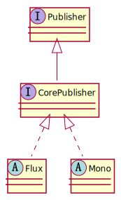

Reactor 是 Reactive Streams 的实现者，内部使用了 JDK 8 的**函数式接口**，即`CompletableFuture`、`Stream`、`Duration`，向外暴露了组合式的异步的**数据流接口**，即`Flux` 、`Mono`，全面支持了非阻塞的反应式编程范式。

<!-- more -->

- 传统的阻塞式编程有两个问题：1、无法利用多核优势；2、阻塞时浪费线程资源
- 并发运行阻塞式代码虽然可以利用多核优势，但使用场景有限
- JDK 原生的异步 API 只是单纯提供了异步能力，但是当组合使用是，会导致代码可读性差，不易维护
- `Flux` (0 - N)、`Mono`(0 - 1) 几乎解决了所有痛点

## Reactive Streams 标准

JDK 1.2 引入了迭代器模式，设计思想是 “**拉取数据**”。Reactive Streams 引入了反应式模式是一种观察者模式的扩展，设计思想变成了“**推送数据**”。JDK 1.9 已将相关接口集成到了 `java.util.Flow` 中

```java
//数据发布者
interface Publisher<T> {
    public void subscribe(Subscriber<? super T> subscriber); // 关联订阅者
}

//数据订阅者
interface Subscriber<T> {
    public void onSubscribe(Subscription subscription);// 关联建立时的处理逻辑
    public void onNext(T item);// 得到数据时的处理逻辑
    public void onError(Throwable throwable);// 出现异常时的处理逻辑
    public void onComplete();// 数据完成读取时的处理逻辑
}

//数据下发器
interface Subscription {
    public void request(long n);// 实现“背压”
    public void cancel();// 撤销关联
}
```

## Hello Reactor

引入 `io.projectreactor:reactor-core`

```java
public class App {
    public static void main(String[] args) {
        Flux.range(0, 9).subscribe(System.out::println);
        Mono.just("sunny").subscribe(System.out::println);
    }
}
```

## 核心组件

### Flux & Mono



### Sink

> Flux & Mono 只是一个数据流的抽象，每次 subscribe 时，都要根据源头的数据生成规则重新走一遍； Sinks.many()、Sinks.one()、Sinks.empty() 则是一个实实在在的数据流实体，由 Sink 产生的 Flux & Mono 每次 subscribe 的都是同一个数据源，根据冷热进行不同的处理。

### BaseSubscriber

一个官方提供的 Subscriber 适配器。

## 创建数据流

### 声明式创建

```java
Flux.just("foo", "bar", "foobar");
Flux.fromIterable(iterable);
Flux.fromArray(array);
Flux.range(5, 3); // 5,6,7
Flux.interval(Duration.ofSeconds(1)); // 只能保证前后间隔>=1秒
Flux.error(e);
```

```java
Mono.just("foo");
Mono.error(e);
```

### 命令式创建

```java
Flux.generate(
    () -> {
        // return init state
    },
    (state, sink) -> {
        // sink.next(xxx) 只能被调用一次
        // sink.complete()
        // sink.error(xxx)
        // return next state
        // 如果返回之前，sink api 没有被调用会抛出 IllegalStateException
    }
);

Flux.create(
    sink -> {
        // sink.next(xxx) 可以在多个线程中被调用多次
        // sink.complete()
        // sink.error(xxx)
    }
);

// using a diposable
Flux.using(
    () -> {
        // return a disposable
    },
    disposable -> {
        // return a flux according disposable
    },
    disposable -> {
        // post handle disposable after flux end
    }
);

// lazy 由lambda表达式提供Flux
Flux.defer(() -> {
    // return Flux
})
```

```java
Mono.create(
    sink -> {
        // sink.success(xxx)
        // sink.error(xxx)
    }
);

// also can using a disposable like Flux
// alse can lazy like Flux
```

### Sinks（3.4.0 新增）

实现了 Flux 和 Sink 的解耦。

```java
// sink 的创建
Sinks // 数据源工具类
    .many() // 多数据流
        .unicast() // 单播，只能被订阅一次
            .<T>onBackpressureBuffer() // 缓存数据
            .<T>onBackpressureError() // 不缓冲，直接抛出异常
        .multicast() // 多播
            .<T>onBackpressureBuffer() // 只对第一个订阅者缓存数据
            .<T>directAllOrNothing() // 当所有订阅者有demand，发送数据才会成功
            .<T>directBestEffort() // 发送数据给有demand的订阅者，如果都没有demand，返回异常结果
        .replay() // 多播且可回放历史数据
            .<T>all() // 可回放全部历史数据
            .<T>latest() // 可回放最新数据
            .<T>limit(int) // 可回放指定数量的最新数据
            .<T>limit(Duration) // 可回放最近时间段的最新数据

// sink api
sink.asFlux(); // 转换成Flux
sink.emitNext(t, (signalType, emitResult) -> {
    // 失败处理器
});
sink.emitError(e, (signalType, emitResult) -> {
    // 失败处理器
});
sink.emitComplete((signalType, emitResult) -> {
    // 失败处理器
});
sink.tryEmitNext(t); // return emitResult
sink.tryEmitError(e); // return emitResult
sink.tryEmitComplete(); // return emitResult
```

## 中间操作

```java
// 假设flux为Flux<T>类型，flux2为Flux<U>
flux.handle((ele, sink) -> {/* handle ele to R, next into sink or not */}); // Flux<R>
flux.filter(ele -> {/*return bool according to the ele*/}); // Flux<T>
flux.buffer(4); // Flux<List<T>>
flux.window(4); // Flux<Flux<T>>
flux.groupBy(ele -> {/* return K */}); // Flux<GroupedFlux<K,T>>
flux.zipWith(flux2, (T s1, U s2) -> {/* return R */}); // Flux<R>
flux.take(4); // Flux<T>
flux.takeLast(4); // Flux<T>
flux.reduceWith(() -> {/* init R state */}, (state, ele) -> {/* new state */}); // Mono<R>
Flux.merge(flux, ...); // Flux<T>
Flux.mergeSequential(flux, ...); // Flux<T>
flux.map(ele -> {/* return R */}); // Flux<R>
flux.flatMap(ele -> {/* return Flux<R> */}); // Flux<R>
// 保证顺序
flux.flatMapSequential(ele -> {/* return Flux<R> */}); // Flux<R>
// 映射逻辑串行执行
flux.concatMap(ele -> {/* return Flux<R> */}); // Flux<R>
```

> 更多操作参考：[https://projectreactor.io/docs/core/release/reference/#which-operator](https://projectreactor.io/docs/core/release/reference/#which-operator)

## 订阅数据流

```java
// 假设flux为Flux<T>类型
flux.subscribe(); 

flux.subscribe(Consumer<? super T> consumer); 

flux.subscribe(Consumer<? super T> consumer,
          Consumer<? super Throwable> errorConsumer); 

flux.subscribe(Consumer<? super T> consumer,
          Consumer<? super Throwable> errorConsumer,
          Runnable completeConsumer); 

flux.subscribe(Consumer<? super T> consumer,
          Consumer<? super Throwable> errorConsumer,
          Runnable completeConsumer,
          Consumer<? super Subscription> subscriptionConsumer);

// 可以流式调用 dispose() 解除订阅
```

```java
// 热数据流
ConnectableFlux<T> hotFlux = flux.publish();
hostFlux.subscribe(xxx);
hostFlux.connect();
// or
ConnectableFlux<T> hotFlux = flux.publish().autoConnect(2);
hostFlux.subscribe(xxx);
hostFlux.subscribe(xxx);
```

## 监听事件

```java
flux.doOnNext(ele -> {});
flux.doOnCancel(() -> {});
flux.doOnComplete(() -> {});
flux.doOnError(e -> {});
flux.doOnTerminate(() -> {}); // complete or error
flux.doOnRequest(n -> {});
flux.doOnSubscribe(subscription -> {}); // 只能用于监控
flux.doOnEach(signal -> {});
```

> 所有的监听处理都只能用于“副作用”，修改原有行为将产生程序逻辑错误。

## 错误恢复

```java
flux.onErrorContinue((e, ele) -> {}); // 处理上游异常，处理导致异常的元素，丢弃并恢复上游
flux.onErrorMap(e -> {/* return new e */}); // 替换异常并向下游传递
flux.onErrorResume(e -> {/* return new Flux */}); //处理异常，提供新的数据流向下游传递元素
flux.onErrorReturn(xxx); // 直接向下游提供最后一个元素
```

## 背压

```java
flux.onBackpressureError(); // 当上游元素到来时，下游没有demand，将抛出异常
flux.onBackpressureDrop(); // 当上游元素到来时，下游没有demand，直接丢弃元素
flux.onBackpressureLatest(); // 当上游元素到来时，下游没有demand，缓存一个，并随时更新缓存
flux.onBackpressureBuffer(); // 当上游元素到来时，下游没有demand，无上限缓存元素
flux.onBackpressureBuffer(5, BufferOverflowStrategy.ERROR); // 有上限缓存元素，缓存满了抛出异常
flux.onBackpressureBuffer(5, BufferOverflowStrategy.DROP_OLDEST); // 有上限缓存元素，缓存满了放弃最老的
flux.onBackpressureBuffer(5, BufferOverflowStrategy.DROP_LATEST); // 有上限缓存元素，缓存满了放弃最新的
```

## 线程调度

```java
Schedulers.parallel(); // 非弹性实例，线程数取决于CPU核数
Schedulers.single(); // 单线程实例
Schedulers.boundedElastic(); // 弹性实例，线程数的上限取决于CPU核数
Schedulers.newXxx(); // 实例不共享，里面的线程资源不是守护线程，需要主动dispose
Schedulers.immediate(); // 在本地线程直接调度
Schedulers.fromExecutorService(es); // 在外部提供的ExecutorService上调度

// 调度器切换
flux.subscribeOn(s).subscribe(xxx); // 指定subscribe动作的调度器
flux.publishOn(s).map(xxx); // 指定后续处理的调度器
```

- 默认的调度器一般都是 immediate ，除非指定了 subscribe 动作的调度器
- interval 方法比较特殊，subscribeOn 无效，它会自行在 parallel 上执行