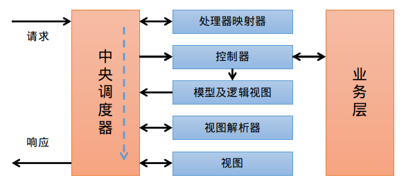

# Spring Boot 学习笔记

Spring Boot 在 Spring 容器的基础上旨在实现 “开箱即用” 

<!-- more-->

- SPI 和 Conditional 注解提供了可插拔的特性
- application.yml 和 ConfigurationProperties 注解提供了约定大于配置的特性
- maven/gradle 插件和 SpringApplication 类提供了构建独立运行 jar 包的特性

## Boot

> 下面是 Spring Boot 与常见的项目进行整合和使用

Spring Boot 采用 yaml 或者 properties 文件进行配置，通常使用 yaml

```yaml
xxx:
  xxx:
    xxx: xxx
    xxx: xxx
  xxx:
  - xxx: xxx
  - xxx: xxx
# ${XXX:xxx} 取值环境变量，没有则取后面的默认值
```

> mvn spring-boot:run -Dspring-boot.run.jvmArguments="..."

## Web

### WebMVC

> `spring-boot-starter-web`

ServletContainerInitializer 是 Servlet 3.0 新增的一个接口，主要用于在容器启动阶段通过编程风格进行配置，以取代通web.xml配置注册。Spring提供了一个实现类 SpringServletContainerInitializer，进一步配合 Spring Boot 的优良特性，简化了 Restful 风格的 web 开发。



> 随着前后端分离技术的发展，这里只分析控制器的用法。

#### 注解开发

- @Controller：控制器声明
- @RequestMapping：请求方法映射（捕捉）
- @RequestParam：query 参数映射
- @RequestHeader：header 参数映射
- @RequestAttribute：请求属性参数映射
- @PahVariable：路径参数映射
- @CookieValue：Cookie 参数映射
- @RequestBody：json/xml 请求体参数映射
- @ResponseBody：json/xml 响应体声明
- @RestController：@Controller + @ResponseBody
- @ExceptionHandler：异常处理器
- @ControllerAdvise：控制器增强，通常配合 @ExceptionHandler 实现全局异常处理
- @RestControllerAdvise：@ControllerAdvise + @ResponseBody

#### 参数解析绑定

Controller 方法体的参数是通过 Spring 配好的参数解析器解析出来并传递的，每个解析器都有一个 supportsParameter 方法指示该解析器是否支持指定的参数。

- 根据参数名寻找
- 根据注解指定
- 根据对象的属性名寻找，并自定创建对象并赋值
- ...

解析出来的是字符串，还需要类型转换器转换成参数的类型进行绑定，默认支持

- 基础类型
- String
- 包装类
- ...

> 自定义类型转换器
>
> ```java
> @Component
> public class XxxConverter implements Converter<String, Xxx> {
>     
>        @Override
>        public Xxx convert(String source) {
>            // ...
>        }
> }
> ```

> 有些类型的参数是 MVC 内部类型，可以跳过解析直接绑定，常见的就是两个：HttpServletRequest 和 HttpServletResponse

#### HandlerInterceptor


#### ResponseBodyAdvice


### WebFlux


### Actuator

Spring Boot Actuator的关键特性是在应用程序里提供众多Web端点，通过它们了解应用程序运行时的内部状况。 

| ID                 | Description                                                  |
| :----------------- | :----------------------------------------------------------- |
| `auditevents`      | Exposes audit events information for the current application. Requires an `AuditEventRepository` bean. |
| `beans`            | Displays a complete list of all the Spring beans in your application. |
| `caches`           | Exposes available caches.                                    |
| `conditions`       | Shows the conditions that were evaluated on configuration and auto-configuration classes and the reasons why they did or did not match. |
| `configprops`      | Displays a collated list of all `@ConfigurationProperties`.  |
| `env`              | Exposes properties from Spring’s `ConfigurableEnvironment`.  |
| `flyway`           | Shows any Flyway database migrations that have been applied. Requires one or more `Flyway` beans. |
| `health`           | Shows application health information.                        |
| `httptrace`        | Displays HTTP trace information (by default, the last 100 HTTP request-response exchanges). Requires an `HttpTraceRepository` bean. |
| `info`             | Displays arbitrary application info.                         |
| `integrationgraph` | Shows the Spring Integration graph. Requires a dependency on `spring-integration-core`. |
| `loggers`          | Shows and modifies the configuration of loggers in the application. |
| `liquibase`        | Shows any Liquibase database migrations that have been applied. Requires one or more `Liquibase` beans. |
| `metrics`          | Shows ‘metrics’ information for the current application.     |
| `mappings`         | Displays a collated list of all `@RequestMapping` paths.     |
| `scheduledtasks`   | Displays the scheduled tasks in your application.            |
| `sessions`         | Allows retrieval and deletion of user sessions from a Spring Session-backed session store. Requires a Servlet-based web application using Spring Session. |
| `shutdown`         | Lets the application be gracefully shutdown. Disabled by default. |
| `threaddump`       | Performs a thread dump.                                      |

| Property                                    | Default        |
| :------------------------------------------ | :------------- |
| `management.endpoints.jmx.exposure.exclude` |                |
| `management.endpoints.jmx.exposure.include` | `*`            |
| `management.endpoints.web.exposure.exclude` |                |
| `management.endpoints.web.exposure.include` | `info, health` |

### Security

> `spring-boot-starter-security`

Spring Security 是 Spring 实现的认证授权框架，随着 Spring Boot 的流行，逐渐成为 Shiro 的替代者。

> 认证：确认用户身份
>
> - 基于 Session 的认证，即服务端维护用户登录信息
> - 基于 Token 的认证，即客户端维护用户登录信息
>
> 授权：确认某个身份是否有权限对某种资源进行某种操作
>
> - ACL：用户直接维护了一个资源操作的列表表示它的权限
> - ABAC：基于属性的访问控制，即用户属性、资源属性、操作属性、环境属性等输入参数计算出是否有权限
> - RBAC：基于角色的访问控制，即资源操作和用户解耦，中间加个角色，资源操作和用户分别与角色进行联系

```java
@EnableWebSecurity
public class MySecurityConfig extends WebSecurityConfigurerAdapter {

    @Override
    protected void configure(HttpSecurity http) throws Exception {
        // 安全配置
        http.authorizeRequests()
            .antMatchers("/xx/xx").permitAll()
            .antMatchers("/xx/xx").hasRole("xx")
            .anyRequest().authenticated();
        http.formLogin()
            .loginPage("/xx");
            .successForwardUrl("/xx")
            .failureForwardUrl("/xx");
        http.logout()
            .logoutSuccessUrl("/xx");
        http.rememberMe()
            .rememberMeParameter("remeber");
    }
    
    @Override
    protected void configure(AuthenticationManagerBuilder auth) {
        auth.authenticationProvider(xxx)
    }
}

// UserDetailService
@Service
public class MyUserDetailService implements UserDetailService {
    @Override
    public UserDetails loadUserByUsername(String username) throws UsernameNotFoundException {
        // ...
        return User.builder()
				.username("xxx")
				.password("xxx")
				.roles("xxx")
                .authorities("xxx")
				.build();
    }
}
```

## Data

```yaml
spring:
  datasource:
    driver-class-name: xxx
    url: xxx
    username: xxx
    password: xxx
```

> 动态数据源：`com.baomidou:dynamic-datasource-spring-boot-starter`
>
> ```yaml
> spring:
>   datasource:
>     dynamic:
>       primary: master
>       strict: false
>       datasource:
>         master:
>           url: jdbc:mysql://xx.xx.xx.xx:3306/dynamic
>           username: root
>           password: 123456
>           driver-class-name: com.mysql.jdbc.Driver # 3.2.0开始支持SPI可省略此配置
>         slave_1:
>           url: jdbc:mysql://xx.xx.xx.xx:3307/dynamic
>           username: root
>           password: 123456
>           driver-class-name: com.mysql.jdbc.Driver
> ```
>
> ```java
> // 注解在service、mapper、repository的类上或方法上，实现动态切换
> @DS("slave_1")
> ```

### JDBC

JdbcTemplate

### JPA

Repository

### Redis

### MongoDB

### Elasticsearch

## Test

>`spring-boot-starter-test`

```java
import org.junit.jupiter.api.*;
import static org.junit.jupiter.api.Assertions.*; // 断言
import static org.junit.jupiter.api.Assumptions.*; // 前置条件
import org.springframework.boot.test.context.SpringBootTest;

@SpringBootTest
public class AppTest {
    @Test
    public void testAppHasAGreeting() {
        // ...
    }
}
```

| JUnit 5     | JUnit 4      | 说明                                                         |
| :---------- | :----------- | :----------------------------------------------------------- |
| @Test       | @Test        | 被注解的方法是一个测试方法。与 JUnit 4 相同。                |
| @BeforeAll  | @BeforeClass | 被注解的（静态）方法将在当前类中的所有 @Test 方法前执行一次。 |
| @BeforeEach | @Before      | 被注解的方法将在当前类中的每个 @Test 方法前执行。            |
| @AfterEach  | @After       | 被注解的方法将在当前类中的每个 @Test 方法后执行。            |
| @AfterAll   | @AfterClass  | 被注解的（静态）方法将在当前类中的所有 @Test 方法后执行一次。 |
| @Disabled   | @Ignore      | 被注解的方法不会执行（将被跳过），但会报告为已执行。         |

| 断言方法                         | 说明                                                 |
| :------------------------------- | :--------------------------------------------------- |
| `assertEquals(expected, actual)` | 如果 *expected* 不等于 *actual* ，则断言失败。       |
| `assertFalse(booleanExpression)` | 如果 *booleanExpression* 不是 `false` ，则断言失败。 |
| `assertNull(actual)`             | 如果 *actual* 不是 `null` ，则断言失败。             |
| `assertNotNull(actual)`          | 如果 *actual* 是 `null` ，则断言失败。               |
| `assertTrue(booleanExpression)`  | 如果 *booleanExpression* 不是 `true` ，则断言失败。  |

## Logging