Spring Cloud 是一整套分布式开发的生态体系，利用 Spring Boot，围绕 Spring Cloud Dependencies 这个核心项目，整合了现如今主流的微服务技术选型。

<!-- more -->

- 服务注册中心
- 服务配置中心
- 服务调用
- 服务治理
- 服务网关
- 消息传递
- 链路追踪
- 服务监控

## 理论基础

### 微服务

### CAP 理论

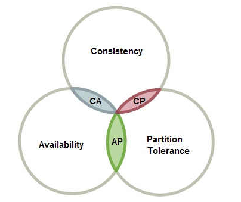

- Consistency - 访问分布式的数据时，总能拿到最新最准确的结果
- Availability - 任意时刻任何地点的请求总能在一定时间内得到回应
- Partition Tolerance - 网络不可靠的前提下，当发生网络分区时，要么保证一致性，使个别分区不可用，要么保证可用性，牺牲分区之间的数据一致性。

> 因为网络是不可靠的，所以针对分布式系统，分区容错性是必须要满足的。

### BASE 理论

BASE 理论是对 CAP 理论的妥协，即当发生分区容错时：

- Basically Available - 使每个分区都可以对外提供服务，保证基本可用
- Soft state - 在一定时间内可以容忍数据不一致的软状态出现
- Eventually consistent - 当分区容错消除后，可以从软状态恢复成数据一致性的状态

## 服务注册中心

### Eureka

#### 服务端

>`spring-cloud-starter-netflix-eureka-server`

```yaml
# eureka 单节点
server:
  port: port
eureka:
  instance:
    hostname: hostname
  client:
    registerWithEureka: false
    fetchRegistry: false
    serviceUrl:
      defaultZone: http://${eureka.instance.hostname}:${server.port}/eureka/
      
# eureka 多节点
server:
  port: port
eureka:
  instance:
    instance-id: id
    prefer-ip-address: true
    hostname: hostname
  client:
    registerWithEureka: false
    fetchRegistry: false
    serviceUrl:
      defaultZone: http://h1:p1/eureka/,http://h2:p2/eureka/
```

```java
// 启动 eureka 服务端
@EnableEurekaServer
```

> **自我保护机制**：当客户端因为网络分区故障没有按时向服务端发送心跳，服务端依然会保存客户端信息不删除，直到一定的时间内还是没有联通才会删除。
>
> ```yaml
> # 服务端关闭自我保护机制
> eureka:
>   server:
>      enable-self-preservation: false
>      eviction-interval-timer-in-ms: 30000
> ```

#### 客户端

> `spring-cloud-starter-netflix-eureka-client`

```yaml
server:
  port: port
spring:
  application:
    name: name
eureka:
  instance:
    instance-id: id
    prefer-ip-address: true
  client:
    service-url:
      default-zone: http://host1:port1/eureka/,http://host2:port2/eureka/
```

```java
// 启动 eureka 服务端
@EnableEurekaClient
```

> **健康检查**：改用 actuator 的健康状态发送心跳
>
> ```yaml
> # 启用健康检查
> eureka:
>     client:
>        healthcheck:
>          enabled: true
>     instance:
>        lease-renewal-interval-in-seconds: s
>        lease-expiration-duration-in-seconds: s
> ```

### Zookeeper

> `spring-cloud-starter-zookeeper-discovery`

```yaml
server:
  port: port
spring:
  application:
    name: name
  cloud:
    zookeeper:
      connect-string: host:port
```

```java
// 开启服务发现功能
@EnableDiscoveryClient
```

### Nacos

#### 服务端

> Nacos 名字的由来是 **Dynamic Naming and Configuration Service** ，在 Spring Cloud 中可以胜任任何具有中心管理逻辑的组件，即服务注册与发现中心组件、分布式配置中心组件、消息总线组件等

> Nacos 服务端支持 AP 模式和 CP 模式的切换

#### 客户端

> **com.alibaba.cloud** `spirng-cloud-starter-alibaba-nacos-discovery`

```yaml
server:
  port: port
spring:
  application:
    name: name
  cloud:
    nacos:
      discovery:
        serverAddr: localhost:8848
```

```java
// 开启服务发现功能
@EnableDiscoveryClient
```

## 服务配置中心

随着微服务的增多，配置信息的管理成为一个问题，应该进行统一管理，

### Config

#### 服务端

> `spring-cloud-config-server`

```yaml
spring:
  cloud:
    config:
      server:
        git:
          uri: git repo
          # username:
          # password:
          # default-label:
          # search-paths:
```

```java
// 开启配置服务器
@EnableConfigServer
```

> 文件命名规范：`{application}-{profile}.yml` profile 必不可少，可用 default

> 地址写法：
>
> ```
> /{application}-{profile}.yml --> 使用默认label
> /{label}/{application}-{profile}.yml
> ```

#### 客户端

> `spring-cloud-starter-config`

```yaml
# ------>>>> bootstrap.yml <<<<-------
spring:
  cloud:
    config:
      uri: config_server_uri
      label: master
      name: config-client
      profile: dev
```

> boostrap.yml 会优先于 application.yml 加载，得到配置中心的指定配置信息。boostrap.yml 和从配置中心得到的配置信息的优先级都高于 application.yml。

>Spring Cloud Config 没有很好的解决配置信息的动态刷新问题。当中心的配置修改后，配置服务器的配置信息可以响应，但是其他服务就没办法响应了，需要重新启动，或者借助 actuator 的 POST 刷新功能，手动进行响应。

### Nacos

#### 服务端

> Nacos 服务端天生支持分布式配置的集中管理，不再需要像 Config 那样借助 Github、Gitee 等外部支持

Nacos 内建了一个数据库 derby 完成配置的持久化，也可以切换到外部的 MySQL 来完成持久化任务：

1. 在 MySQL 中运行初始化脚本 nacos-mysql.sql

2. 修改 Nacos 配置 conf/application.properties

   ```properties
   spring.datasource.platform=mysql
   db.num=1
   db.url.0=jdbc:mysql://xxx:3306/nacos-devtest?...
   ```

#### 客户端

> **com.alibaba.cloud** `spring-cloud-starter-alibaba-nacos-config`

```yaml
# ------>>>> bootstrap.yml <<<<-------
spring:
  application:
    name: xxx
  cloud:
    nacos:
      config:
        serverAddr: localhost:8848
        fileExtension: yaml
        group: XXX
        namespace: namespace-id
```

```yaml
# ------>>>> application.yml <<<<-------
spring:
  profiles:
    active: xxx,xxx
```


```java
// 开启配置的自动更新
@RefreshScope
```

## 服务调用

从原来的的单体应用分成若干个微服务后，服务与服务之间如何通讯成为一个关注点，通常，服务调用有两种形式：

- http：Ribbon、OpenFeign
- rpc：Dubbo

### Ribbon

> `spring-cloud-starter-netflix-ribbion`

Ribbon 的本质是负载均衡算法代理了 RestTemplate 调用，使得 RestTemplate 可以接受服务注册中心的服务名作为 http 的地址。默认轮训，也内置了多种策略，只支持 Eureka ，也可以自定义策略支持其他服务注册中心。

```java
// 开启服务发现功能
@EnableDiscoveryClient
```

```java
// 引入 RestTemplate 组件并加注解增强
@Bean
@LoadBalanced
public RestTemplate restTemplate() {
    return new RestTemplate();
}
```

```java
// 调用 RestTemplate 组件
T t = restTemplate.getForObject("http://"+SERVICE_NAME+PATH, T.class);
T t = restTemplate.postForObject("http://"+SERVICE_NAME+PATH, req, T.class)
```

#### 自定义负载均衡策略

核心组件：

- ILoadBalancer 服务容器
- IRule 持有 ILoadBalancer 进行选择
  - RoundRobinRule 轮训
  - RandomRule 随机
  - ...

自定义策略只需要将一个 IRule 的 bean 加入 Spring 容器中就可以替换默认的 IRule 。

```java
// 自定义 IRule
public class NewIRule extands AbstractLoadBalancerRule {
    @Override
    public Server choose(Object key) {
        return choose(getLoadBalancer(), Object key);
    }
    public Server choose(ILoadBalancer lb, Object key) {
        // ...
    }
}
```

### OpenFeign 

> `spring-cloud-starter-openfeign`

OpenFeign 是对 Ribbon 的封装，实现了声明式的 Web 客户端，提供了对 SpringWeb 注解的支持。

```java
// 开启服务发现功能和 feign 声明式支持
@EnableDiscoveryClient
@EnableFeignClients
```

```java
// 编写 @FeignClient 接口，会被 @EnableFeignClients 扫描到并加入spring容器
@FeignClient(value = "SERVICE_NAME")
public interface Xxx {
    // 和编写 Controller 的写法一致，只不过不用写方法实现
    // 注意：方法参数中应尽量使用相关注解声明一下
}
```

```java
// 注入并使用接口里的方法
@Resource
private Xxx xxx;
```

### Dubbo

> **com.alibaba.cloud** `spring-cloud-starter-dubbo`

> Dubbo 3.0 即将发布，引入了 响应式的特性即 Mono/Flux

#### 接口实现者

```yaml
spring:
  application:
    name: provider
  cloud:
    nacos:
      discovery:
        server-addr: localhost:8848

dubbo:
  application:
    id: ${spring.application.name}
  registry:
    address: spring-cloud://localhost:8848
  protocols:
    dubbo:
      port: 20881
```

```java
// 开启 Dubbo 支持，可以扫描到@Service的实现类
@EnableDubbo
```

```java
@Service(version = "1.0.0") // 不是spring的@Service
public HelloServiceImp implements HelloService {
    // implementation
}
```

#### 接口调用者

```yaml
server:
  port: 9020
  tomcat:
    threads:
      max: 5

spring:
  application:
    name: consumer
  cloud:
    nacos:
      discovery:
        server-addr: localhost:8848

dubbo:
  registry:
    address: spring-cloud://localhost:8848
  cloud:
    subscribed-services: provider
```

```java
// 注入接口
@Reference(version = "1.0.0")
private HelloService helloService;
```

> **实现异步调用**：
>
> - 接口方法返回类型设置为 `CompletableFuture<Xxx>`
> - 实现者利用`CompletableFuture.supplyAsync(() ->{...})`构造

#### RpcContext

底层使用 ThreadLocal 实现，当发送调用请求时或接受调用请求时都会改变当前线程对应的上下文对象

```java
RpcContext ctx = RpcContext.getContext(); // 获得当前线程的上下文对象
ctx.setAttachment(key, value);
ctx.getAttachment(key);
ctx.isConsumerSide();
ctx.isProviderSide();
ctx.getUrl();
ctx.getFuture();
```

#### Filter 拓展

```java
public class XxxFilter implements Filter {
    public Result invoke(Invoker<?> invoker, Invocation invocation) throws RpcException {
        // before filter ...
        Result result = invoker.invoke(invocation);
        // after filter ...
        return result;
    }
}
```

````
src
 |-main
    |-java
        |-com
            |-xxx
                |-XxxFilter.java (实现Filter接口)
    |-resources
        |-META-INF
            |-dubbo
                |-org.apache.dubbo.rpc.Filter (纯文本文件，内容为：xxx=com.xxx.XxxFilter)
````

```java
@Service(... filter="xxx")
@Reference(... filter="xxx")
```

### Seata

> 版本在疯狂迭代中，使用方式和配置项还在不断变化中。

微服务开发中，经常需要多数据库联合调度，如何控制每一个库的事务成为一个难点，Seata 框架方便了我们编写分布式事务的痛点。

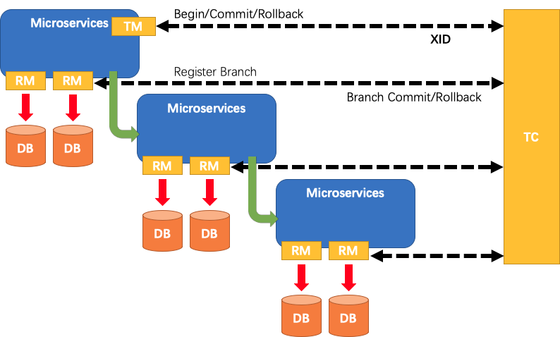

- TC (Transaction Coordinator) - 事务协调者

  维护全局和分支事务的状态，驱动全局事务提交或回滚。

- TM (Transaction Manager) - 事务管理器

  定义全局事务的范围：开始全局事务、提交或回滚全局事务。

- RM (Resource Manager) - 资源管理器

  管理分支事务处理的资源，与TC交谈以注册分支事务和报告分支事务的状态，并驱动分支事务提交或回滚。

SEATA 为我们提供 AT 强一致性事务和 SAGA 弱一致性事务。

- AT：无侵入式，在提交前挂起等待是否回滚或提交
- SAGA：需自行实现其正向操作提交和逆向操作提交

#### 事务协调者

- 注册：支持本地文件、nacos、zookeeper 等
- 配置：支持本地文件配置和外部配置如 nacos 等
- 数据持久化：支持本地文件和 mysql 两种形式

> 下面记录 nacos 注册和配置的过程，先找到 script 文件夹里的内容

1. config-center/config.txt 和 config-center/nacos/nacos-config.sh 放在一起

2. 修改好配置项，执行 sh 文件

   ```properties
   # 主要配置项
   # 配置默认的事务组
   service.vgroupMapping.seata_rest_user_tx_group=default
   
   # 配置mysql支持
   store.mode=db
   store.db.datasource=druid
   store.db.dbType=mysql
   store.db.driverClassName=com.mysql.jdbc.Driver
   store.db.url=jdbc:mysql://127.0.0.1:3306/seata?useUnicode=true
   store.db.user=root
   store.db.password=123456
   ```

3. 修改 registry.conf 文件，配置 nacos

   ```nginx
   registry {
     # file 、nacos 、eureka、redis、zk、consul、etcd3、sofa
     type = "nacos"
     nacos {
       application = "seata-server"
       serverAddr = "localhost"
       namespace = ""
       cluster = "default"
       username = "nacos"
       password = "nacos"
     }
   }
   
   config {
     # file、nacos 、apollo、zk、consul、etcd3
     type = "nacos"
   
     nacos {
       serverAddr = "localhost"
       namespace = ""
       group = "SEATA_GROUP"
       username = "nacos"
       password = "nacos"
     }
   }
   ```

4. 找到 seata-server.sh 并启动 TC 服务器

#### 事务管理器

> **com.alibaba.cloud** `spring-cloud-starter-alibaba-seata`

```yaml
seata:
  enabled: true
  application-id: seata-rest-user
  tx-service-group: seata_rest_user_tx_group
  config:
    type: nacos
    nacos:
      namespace:
      serverAddr: 127.0.0.1:8848
      group: SEATA_GROUP
      userName: "nacos"
      password: "nacos"
  registry:
    type: nacos
    nacos:
      application: seata-server
      server-addr: 127.0.0.1:8848
      namespace:
      userName: "nacos"
      password: "nacos"
```

```java
@GlobalTransactional
```

#### 资源管理器

> **com.alibaba.cloud** `spring-cloud-starter-alibaba-seata`

```yaml
seata:
  enabled: true
  application-id: seata-rest-user
  tx-service-group: seata_rest_user_tx_group
  enable-auto-data-source-proxy: true # 自动代理数据源
  config:
    type: nacos
    nacos:
      namespace:
      serverAddr: 127.0.0.1:8848
      group: SEATA_GROUP
      userName: "nacos"
      password: "nacos"
  registry:
    type: nacos
    nacos:
      application: seata-server
      server-addr: 127.0.0.1:8848
      namespace:
      userName: "nacos"
      password: "nacos"
```

```java
@Transactional // spring 注解
```

#### SAGA 模式

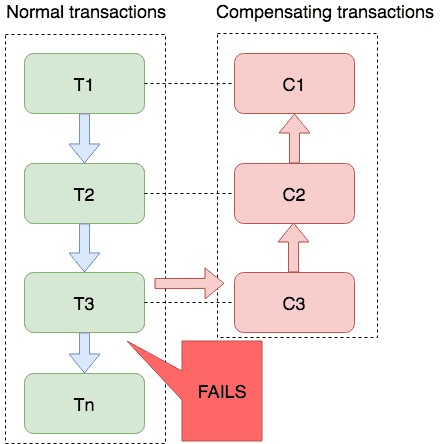

SAGA 模式也就是补偿模式，本地事务先提交解锁，提高性能，当异常发生时再执行补偿。

SEATA 是基于状态机引擎的事件驱动实现 SAGA 模式的，原理图如下：

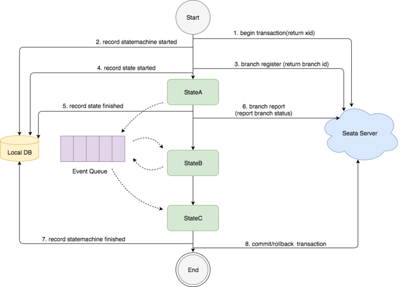


## 服务治理

如果在服务调用过程中，某个被调用节点故障，将会影响到调用节点的处理流程，倘若不加以治理，将形成雪崩效应，使真个服务器瘫痪。那么，解决方案就是实现服务自治理功能，当探测到节点故障时立即处理异常，避免故障“传染”。

### Hystrix（停更）

> `spring-cloud-starter-netflix-hystrix`

虽然停更了，但是它的理念非常先进，值的学习

#### 服务降级

服务降级的触发条件

- 方法运行超时
- 方法运行异常
- 当熔断器处于打开状态
- 当线程池的数量或者某个信号量违规

##### 服务提供者端

```java
// 开启熔断器支持
@EnableCircuitBreaker
```

```java
// 特定方法上应用熔断器
@HystrixCommand(fallbackMethod = "xxx", commandProperties = {
    @HystrixProperty(name = "xxx", value = "xxx"),
    @HystrixProperty(name = "xxx", value = "xxx")...
    // execution.isolation.thread.timeoutInMilliseconds 超时时间
})

// 特定类上应用默认熔断器配置
@DefaultProperties(defaultFallback = "xxx", commandProperties = {...})
```

##### 服务消费者端（整合 OpenFeign）

```java
// 开启熔断器支持
@EnableCircuitBreaker
```

```yaml
feign:
  hystrix:
    enabled: true
  # -- sentinel 同理
  sentinel:
    enabled: true
```

```java
// 提供一个实现类，作为bean加入到Spring容器中，赋值给 fallback
// 当服务端不可用时，调用 fallback 类上对应方法
@FeignClient(value = "xxx", fallback = Xxx.class)
```

#### 服务熔断

熔断流程：

```java
@HystrixProperty(name="curcuitBreaker.enable" value="true")
@HystrixProperty(name="curcuitBreaker.requestVolumeThreshold" value="10")
@HystrixProperty(name="curcuitBreaker.errorThresholdPercentage" value="60")
@HystrixProperty(name="curcuitBreaker.sleepWindowInMilliseconds" value="3000")
```

1. 熔断器初始为**关闭状态**，等待有效请求够 10 次，进行下一步
2. 当最近的 10 次有效请求中，如果有 6 次以上被服务降级了，那么熔断器将处于**打开状态** ，随后的请求直接降级，进行下一步，否则熔断器继续处于**关闭状态**，重复本步骤
3. 等 3 秒后，熔断器处于**半开半闭状态**，此时下一次请求尝试走正常流程，如果依然被降级了，那么熔断器将处于**打开状态**，重复本步骤，否则熔断器处于**关闭状态**，回到步骤 1

### Setinal

Sentinel 以流量为切入点，从流量控制、熔断降级、系统负载保护等多个维度保护服务的稳定性。

#### 服务端(dashboard)

Setinal 在 Hystrix 理念的基础上，增加了优雅的 Web 界面用于整体控制，主要负责管理推送规则、监控、集群限流分配管理、机器发现等。

#### 客户端

> **com.alibaba.cloud** `spring-cloud-starter-alibaba-sentinel`

```yaml
spring:
  cloud:
    sentinel:
      transport:
        dashboard: localhost:8858
        port: port # sentinel 客户端也需要被动接受服务端传过来的规则变更信息，所以要有本地端口
management:
  endpoints:
    web:
      exposure:
        include: "*"
```

```java
// 每一个controller的入口都会成为 sentinel 的一个对象资源，名称为访问路径
// 此外，还可以将如下注解加到某个方法上，成为 sentinel 管理的对象资源
// 这样就形成了一个调用链路树，根节点资源是 sentinel_spring_web_context
// 根节点的子节点是 controller 的入口资源
// 再下面就是注解声明的资源了
@SentinelResource(value = "xxx", blockHandler = "xxx", fallback = "xxx")
// blockHandler 只对规则违规进行处理
// fallback 用于处理代码运行异常
```

#### 流控规则

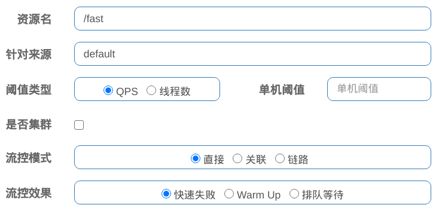

流控模式

- 直接: api达到限流条件时,直接限流
- 关联: 当关联的资源达到阈值时,就限流自己
- 链路: 只关联的入口资源达到阈值时,就限流自己

流控效果

- 快速失败: 直接失败,抛异常
- Warm Up: 根据codeFactor(冷加载因子,默认3)的值,从阈值codeFactor,经过预热时长,才达到设置的QPS阈值
- 排队等待: 匀速排队,让请求以匀速的速度通过,阈值类型必须设置为QPS,否则无效

#### 降级规则

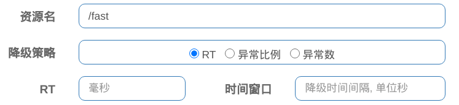

> 触发条件：请求数大于 5 ，且平均响应时间大于等于设定值

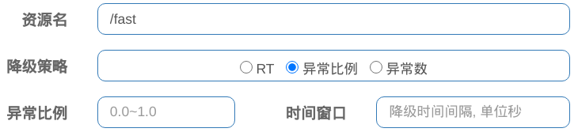

> 触发条件：QPS >= 5 且异常比例大于等于设定值

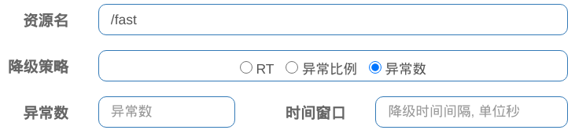

> 触发条件：一分钟内异常数大于等于设定值

#### 热点规则

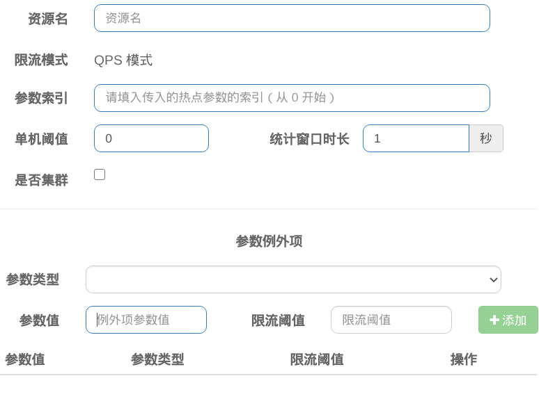

资源的方法参数进行限制，即对第几个参数的某个相同的值进行限流，上面的统一的限流标准，下面还可以对特定值设定单独的阈值。

> 仅仅对 @SentinelResource 修饰的方法资源有效，对 @XxxMapping 无效，不知道是不是 Bug

#### 系统规则

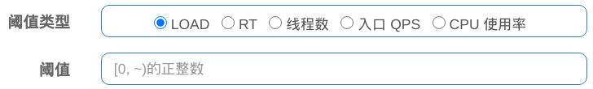

> LOAD 是 Linux 中的某个指标

#### 授权规则

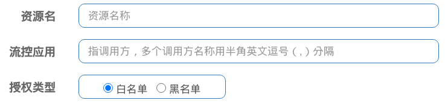

#### 规则持久化


## 服务网关

### Gateway

> `spring-cloud-starter-gateway`

> 如果要配合 Eureka 注册中心，需要禁止 Eureka 自动集成的 Ribbon 负载均衡，配置如下：
>
> ```yaml
> spring:
>     cloud:
>        loadbalancer:
>          ribbon:
>            enabled: false
> ```

构建与 Spring Boot 2.0、Spring WebFlux 之上

```yaml
spring:
  cloud:
    gateway:
      globalcors:
        cors-configurations:
          '[/**]':
            allowedOrigins: "http://xxx.xxx.xxx"
      default-filters:
      - ...
      discovery:
        locator:
          enabled: true # 自动发现服务并生成路由
      routes: # 自定义路由
      - id: id
        uri: uri # 服务发现并负载均衡支持 lb://service_name
        predicates: # 负责路由规则
        - Path= /consumer/**
        - After=2017-01-20T17:42:47.789+08:00[Asia/Shanghai]
        - Before=2017-01-20T17:42:47.789+08:00[Asia/Shanghai]
        - Between=2017-01-20T17:42:47.789+08:00[Asia/Shanghai], 2017-01-21T17:42:47.789+08:00[Asia/Shanghai]
        - Cookie=name, value
        - Header=name, value
        - Query=name, value
        - Host=xxx.xxx.xxx, xxx.xxx.xxx
        - Method=GET,POST
        - RemoteAddr=192.168.1.1/24
        - Weight=group_name, weight_value
        filters: # 负责拦截路由过程
        - AddRequestHeader=name, value
        - AddRequestParameter=name, value
        - PrefixPath=/xxx # 加前缀
        - StripPrefix=1 # 减前缀
```

```java
// 开启服务发现功能
@EnableDiscoveryClient
```

## 服务消息

### Stream

消息中间件有不同的技术实现，ActiveMQ、RabbitMQ、RocketMQ、Kafka 等，Stream 屏蔽了不同技术的底层实现细节，向上提供统一的编程接口。目前只支持 RabbitMQ、Kafka

> `spring-cloud-starter-stream-rabbit`

```yaml
spring:
  cloud:
    stream:
      binders:
        xxxBinder:
          type: rabbit
          environment:
            spring:
              rabbitmq:
                host: host
                port: port
                username: username
                password: password
      bindings:
        xxxBinding:
          group: group
          destination: topic
          content-type: application/json
          binder: XxxBinder # 与配置的 binder 名对应
```

#### 发送者

```java
public interface XxxSource {
    String XXX = "xxxBinding"; // 与配置的 binding 名对应
    @Output(XxxSource.XXX)
    MessageChannel xxx();
}
```

```java
@EnableBinding(XxxSource.class)
public class Xxx {
    @Resource
    private MessageChannel xxx; // xxx 与接口的方法名对应
    public void send() {
        // ...
        xxx.send(MessageBuilder.withPayload(xxx).build());
        // ...
    }
}
```

#### 接受者

```java
public interface XxxSink {
    String XXX = "xxxBinding"; // 与配置的 binding 名对应
    @Input(XxxSink.XXX)
    SubscribableChannel xxx();
}
```

```java
@EnableBinding(XxxSink.class)
public class Xxx {
    @StreamListener(XxxSink.XXX) // XXX 与 接口的属性名对应
    public void receive(Xxx payload) {
        // ...
    }
}
```

## 服务链路追踪

链路追踪可以帮助我们了解服务之间的调用关系，快速发现系统性能瓶颈，做出合理优化

### Sleuth 和 ZipKin

#### 服务端

```sh
$ docker run -d -p 9411:9411 openzipkin/zipkin
```

```http
http://localhost:9411/zipkin/
```

#### 客户端

> `spring-cloud-starter-zipkin`

```yaml
zipkin:
  base-url: http://localhost:9411/
sleuth:
  sampler:
    probability: 1
```

## 服务认证与授权

### OAuth2.0

> `spring-cloud-starter-oauth2`

OAuth2.0 是一个分布式系统的认证授权协议，允许用户可以在不向第三方应用提供用户名和密码的情况下授权第三方应用访问本应用的资源。

```
     +--------+                               +---------------+
     |        |--(A)- Authorization Request ->|   Resource    |
     |        |                               |     Owner     |
     |        |<-(B)-- Authorization Grant ---|               |
     |        |                               +---------------+
     |        |
     |        |                               +---------------+
     |        |--(C)-- Authorization Grant -->| Authorization |
     | Client |                               |     Server    |
     |        |<-(D)----- Access Token -------|               |
     |        |                               +---------------+
     |        |
     |        |                               +---------------+
     |        |--(E)----- Access Token ------>|    Resource   |
     |        |                               |     Server    |
     |        |<-(F)--- Protected Resource ---|               |
     +--------+                               +---------------+
```

> 最佳实践：jwt-非对称 + user-jdbc + client-jdbc
>
> **为简单起见，下面是 jwt-对称 + user-内存 + client-内存**

#### 授权服务

> 不建议和启动类写在一起

```java
@Configuration
@EnableAuthorizationServer
public class AuthoricationServerConfiguration extends AuthoricationServerConfigurerAdapter {
    @Bean
    public PasswordEncoder passwordEncoder() {
        return new BCryptPasswordEncoder();
    }

    @Bean
    public JwtAccessTokenConverter jwtAccessTokenConverter() {
        JwtAccessTokenConverter converter = new JwtAccessTokenConverter();
        converter.setSigningKey("123");
        return converter;
    }
    
    @Bean
    public TokenStore tokenStore() {
        return new JwtTokenStore(jwtAccessTokenConverter());
    }
    
    // spring security 的认证管理器
    @Autowired
    @Qualifier("authenticationManagerBean")
    private AuthenticationManager authenticationManager;
    
    // ---------- configure ------------
    @Override
    public void configure(ClientDetailsServiceConfigurer clients) throws Exception {
        // 配置第三方客户端
        // 内存方式
        clients
            .withClient("client")
            .secret(passwordEncoder().encode("secret"))
            .authorizedGrantTypes("authorization_code")
            .scopes("scope")
            .resourcdIds("resource")
            .autoApprove(false)
            .redirectUris("http://localhost:8081");        
    }
    
    @Override
    public void configure(AuthorizationServerEndpointsConfigurer endpoints) throws Exception {
        // 配置端点和令牌服务
        endpoints
            .tokenStore(tokenStore())
            .accessTokenConverter(jwtAccessTokenConverter())
            .authenticationManager(authenticationManager);
    }
    
    @Override
    public void configure(AuthorizationServerSecurityConfigurer security) throws Exception {
        // 配置端点的安全约束
        security
            .tokenKeyAccess("permitAll()")
            .checkTokenAccess("permitAll()")
            .allowFormAuthenticationForClients()
    }
}
```

```java
@EnableWebSecurity
public class WebSecurityConfiguration extends WebSecurityConfigurerAdapter {
    @Autowired
    private PasswordEncoder passwordEncoder;
    
    @Bean
    @Override
    protected AuthenticationManager authenticationManagerBean() {
        super.authenticationManagerBean();
    }

    // authentication manager 配置
    @Override
    protected void configure(AuthenticationManagerBuilder auth) throws Exception {
        // 内存形式
        auth.inMemoryAuthentication()
            .withUser("user")
            .password(passwordEncoder.encode("password"))
            .authorities("authority");
    }
}
```

#### 资源服务

```java
@Configuration
@EnableResourceServer
public class ResourceServerConfiguration extends ResourceServerConfigurerAdapter {
    @Bean
    @Qualifier("tokenStore")
    public TokenStore tokenStore() {
        return new JwtTokenStore(jwtAccessTokenConverter());
    }

    @Bean
    public JwtAccessTokenConverter jwtAccessTokenConverter() {
        JwtAccessTokenConverter converter = new JwtAccessTokenConverter();
        converter.setSigningKey("123");
        return converter;
    }
    
    @Override
    public void configure(HttpSecurity http) {
        // 配置资源访问
        http
            .csrf().disable()
            .antMatchers("/xx")
            .access("#oauth2.hasScope('scope') and hasAuthority('authority')");
    }
    
    @Override
    public void configure(ResourceServerSecurityConfigurer resources) throws Exception {
        resources
            .resourceId("resource")
            .tokenStore(tokenStore());
    }
}
```

#### 授权码模式流程

1. /oauth/authorize?client_id=client&response_type=code&scope=scope&redirect_uri=http://localhost:8081，得到授权码 http://localhost:8081/?code=xxxxxx
2. /oauth/token?client_id=client&client_secret=secret&grant_type=authorization_code&code=xxxxxx&redirect_uri=http://localhost:8081，得到令牌 xxxxxxxxx...
3. 请求资源时，请求头加上 `Authorization: Bearer xxxxxxxxx...`