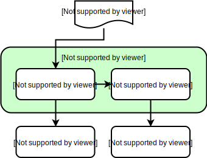
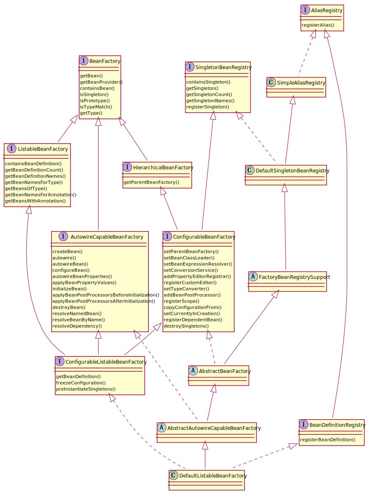
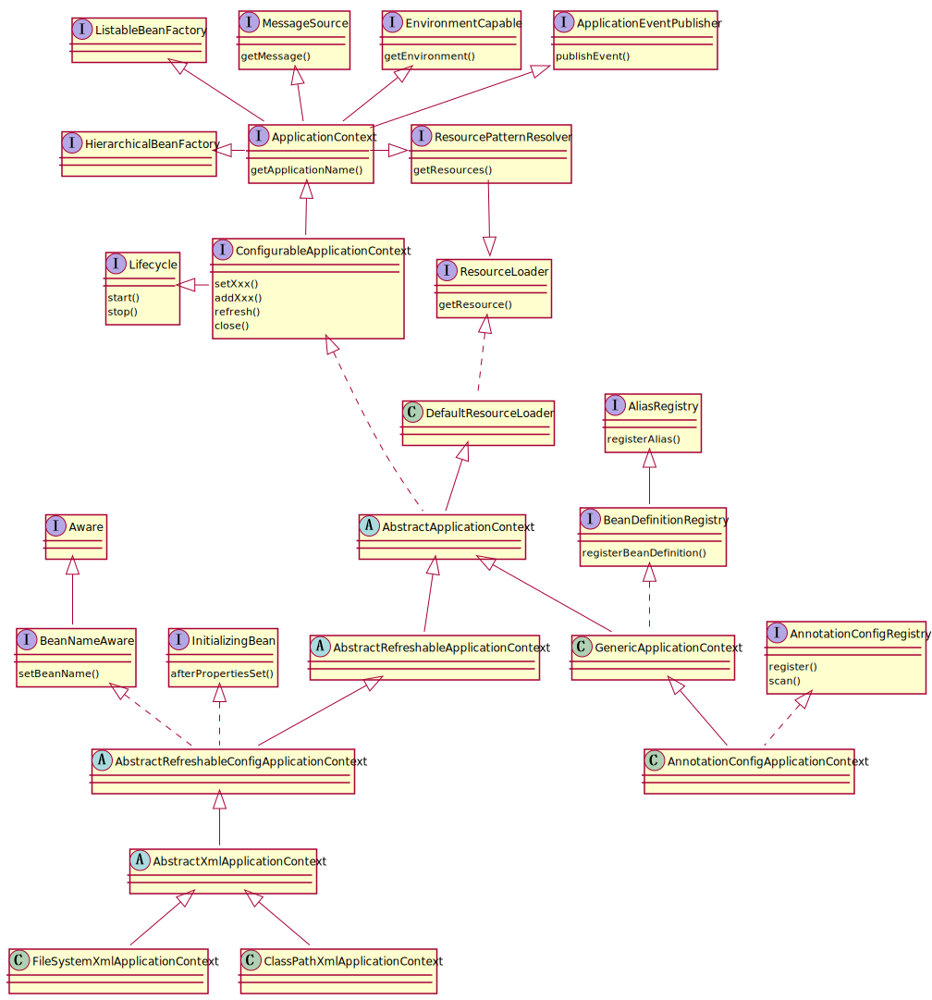
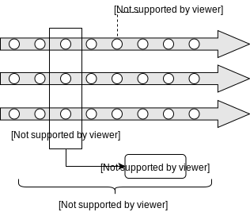

Spring是一个轻量级控制反转(IoC)和面向切面(AOP)的容器框架，并由此衍生出了一个庞大的生态体系。

<!-- more -->

## Spring 容器

### 容器组件




#### BeanFactory

提供了高级配置机制来管理任何类型的容器内对象



#### ApplicationContext

这就是 Spring 容器的标准接口，在 BeanFactory 的基础上，添加了一下主要特性：

- 自动实例化 Singleton
- 自动注册各种后处理器
- 国际化
- 容器内事件发布
- 配置资源管理
- 容器生命周期管理



#### Resource

Spring 容器支持两种资源配置形式：

- XML-based Config
- Java-based Config（我只关注这种形式）

> Spring 还支持另一种独特的配置形式，那就是 Annotation 注解，即将配置信息放到源代码中存放，从而降低了 XML-based 和 Java-based 里的复杂度

```java
@Configuration
@Import("xxx.xxx.XxxConfig") //引入其他配置类
public class XxxConfig {
    // ...
}
```

#### BeanDefination

包含了一下主要信息：

- 类型信息
- 行为信息
- 依赖信息
- 属性信息

### 容器配置（注解）

#### @Profile

标识应用不同的环境。外部使用时可以激活一个或多个 profile 标识

#### @Configuration

声明为一个 Java-based Config

#### @Import

引入外部 Bean 配置

```java
@Import({Xxx.class, Xxx,class})
// 普通的配置类或组件类
// ImportSelector 的实现类，根据注解元数据返回全限定类名的字符串数组，这些类可以是普通的配置类或组件类
// ImportBeanDefinitionRegistrar 的实现类，根据注解元数据注册 BeanDefinition
```

#### @Bean

被修饰方法的返回值会被当做一个 bean

#### @ComponentScan

和 @Component 配合完成 bean 的扫描添加

#### @Component

和 @ComponentScan 配合完成 bean 的扫描添加，类似的注解还有：@Controller（Prototype）、@Service、@Repository

#### @Scope

| 类型      | 描述                                                         | 适用场景    |
| --------- | ------------------------------------------------------------ | ----------- |
| singleton | 会被添加到容器缓存中，每次请求Bean时都返回同一个实例         | 无状态 Bean |
| prototype | 不会被添加到容器缓存中，每次请求Bean时都会新建一个实例出来。 | 有状态 Bean |

##### @Lookup

当 singleton bean 依赖一个 prototype bean 时，prototype 的性质就被破坏了，解决方案如下：

```java
// singleton class define
public abstract class MySingleton {
    @Lookup
    public abstract MyPrototype myPrototype();
    // ... 调用 myPrototype 方法获取 prototype 性质的 bean
}
```

#### @Lazy

如果不希望容器初始化之后立即初始化指定 singleton bean ，可以设置延迟加载行为

#### @PostConstruct

指定 bean 实例化之后的行为方法

#### @PreDestroy

指定 bean 实例销毁之前的行为方法

#### @DependsOn

在初始化当前 bean 之前初始化指定的 bean

#### Java-based Config

### 容器生命周期

spring 容器相当于一个复杂的工厂，这个工厂可以输入任何一个 POJO，容器中称为 Bean，并有效处理 Bean 之间的耦合后输出。

而其中的一道道处理工序是由一些 Spring Bean 负责完成的，也就是说，Spring 自身面向处理流程规定了一系列的接口，要想参与到 Spring 的处理流程中，就必须实现响应的接口，并被 Spring 识别生效。

想要认识到这些接口就必须了解容器的整个生命周期是怎样的，如图：


- BeanDefinitionRegistryPostProcessor's **postProcessBeanDefinitionRegistry**
- BeanFactoryPostProcessor's **postProcessBeanFactory**
- InstantiationAwareBeanPostProcessor's **postProcessBeforeInstantiation**
- SmartInstantiationAwareBeanPostProcessor's **determineCandidateConstructors**
- MergedBeanDefinitionPostProcessor's **postProcessMergedBeanDefinition**
- SmartInstantiationAwareBeanPostProcessor's **getEarlyBeanReference**
- InstantiationAwareBeanPostProcessor's **postProcessAfterInstantiation**
- InstantiationAwareBeanPostProcessor's **postProcessPropertyValues**
- BeanNameAware、BeanClassLoaderAware、BeanFactoryAware、EnvironmentAware、EmbeddedValueResolverAware、ResourceLoaderAware、ApplicationEventPublisherAware、MessageSourceAware、ApplicationContextAware、ServletContextAware's **setXxx**
- BeanPostProcessor's **postProcessBeforeInitialization**
- InitializingBean's **afterPropertiesSet**
- BeanPostProcessor's **postProcessAfterInitialization**
- FactoryBean's **getObject**
- DestructionAwareBeanPostProcessors's **postProcessBeforeDestruction**
- DisposableBean's **destroy**

## 控制反转

Inversion of Control (IoC) 是 bean 的依赖关系的控制不再需要额外代码维护，而是交给 Spring 容器全权负责。

### @Autowired

#### @Primary

#### @Qualifier

### @Resource

### @Value

#### ＠ConfigurationProperties

##### @NestedConfigurationProperty

##### @EnableConfigurationProperties

#### @PropertySource

#### PropertyEditor

### ObjectProvider

## 面向切面编程

Aspect-oriented Programming （AOP）是对 Object-oriented Programming （OOP）的补充，使得不同类型的对象也可以通过某种规范联系起来一起拓展新功能。



- join point：程序执行期间可以被切入的点，通常就是方法的执行
- point cut：切入规则，用于筛选 join point
- advice：符合 point cut 的 join point 将要被实施的增强处理
- aspect：对于 point cut 和 advice 的模块化管理，可看做是一种声明
- target object：受 point cut 影响的目标对象
- weaving：连接相应的 aspect 到 target object
- proxy：完成 weaving 后创建出来的代理对象

### 两种实现方案

Spring 只支持运行期织入：

- JDK 动态代理：实现目标对象的接口完成接口方法的代理
- CGLIB 代理：继承目标对象完成全方法的代理

### 开启 AspectJ 支持

```java
@Configuration
@EnableAspectJAutoProxy
public class AppConfig { ... }
```

> @EnableAspectJAutoProxy 的两个属性含义
>
> - proxyTargetClass：是否强制使用 CGLIB
> - exposeProxy：是否暴露代理对象到 AopContext，如果是的话，可以在内部通过 AopContext.currentProxy() 访问到当前的代理对象，一般应用在代理方法嵌套调用的情景中

### 声明 Aspect 类

```java
@Component
@Aspect
public class NotVeryUsefulAspect { ... }
```

### 声明 Point Cut

```java
@Pointcut("<切入点表达式>")
private void <引用名>() {}
```

#### execution

方法描述

```
execution([<方法修饰符>] <返回值类型> [<宿主类>.]<方法名>(<形参类型列表>) [<抛出的异常>])
```

> - `*` 匹配单个无间隔符序列
> - `..` 匹配零个和多个无间隔符序列并用间隔符连接起来
> - `+` 匹配指定类型的子类型；仅能作为后缀放在类型模式后边

#### within

无继承关系的类型描述

```
within(<包名>.<类名>)
```

#### @within

对含有指定注解的当前类的独占方法有效，通过子类对象调用到当前类对象的方法时也有效

#### target

有继承关系的类型描述

#### @target

对含有指定注解的当前类的所有可用方法有效，包括继承来的

#### this

JDK 动态代理：目标对象的接口的有继承关系的类型描述

CGLIB 代理：同 target

#### args

参数的有继承关系的类型描述

#### @args

当方法的参数的类型上还有指定的注解时有效

#### @annotation

方法上还有指定注解时有效

#### bean

对 Spring 容器中的 bean name 的描述

```
bean(<bean 名称>)
```

#### 逻辑组合

```
xxx && xxx
xxx || xxx
! xxx
```

### 声明 Advice

#### JoinPoint  接口

- `Object[] getArgs()`：返回参数列表
- `Object getThis()`：返回代理对象
- `Object getTarget()`：返回目标对象

##### ProceedingJoinPoint 接口

继承自 JoinPoint

- `Object proceed()`：执行

#### before

```java
@Before("xxx")
public void doSomething([JoinPoint jp]) { ... }
```

#### after returning

```java
@AfterReturning([pointcut="xxx",] [returning="r"])
public void doSomething([JoinPoint jp,][Xxx r]) { ... }
```

#### after throwing

```java
@AfterThrowing([pointcut="xxx",] [throwing="e"])
public void doSomething([JoinPoint jp,][Xxx e]) { ... }
```

#### after finally

```java
@After("xxx")
public void doSomething([JoinPoint jp]) { ... }
```

#### around

```java
@Around("xxx")
public Object doSomething(ProceedingJoinPoint pjp) throws Throwable {
    // start stopwatch
    Object retVal = pjp.proceed();
    // stop stopwatch
    return retVal;
}
```

#### 类型描述在 Advice 中的特殊用途

```java
@Before("args(param)")
public void doSomething(<参数类型> param) { ... }
```

### Introduction 新接口

对指定类型的对象引入新的接口增强功能。

```java
@DeclareParents(value="<类型描述>", defaultImpl=<默认实现>.class)
public static <新的增强接口> mixin;
```

## 事务管理

Spring 提供了一致的事务管理抽象层，具有以下特性：

- 统一了不同框架的事务 API
- 简化了编程式事务管理，同时支持声明式事务管理
- 与 Spring 数据访问模块进行完美整合

### 核心组件

#### PlatformTransactionManager

```java
public interface PlatformTransactionManager {
    TransactionStatus getTransaction(TransactionDefinition definition)
        	throws TransactionException;
    void commit(TransactionStatus status) throws TransactionException;
    void rollback(TransactionStatus status) throws TransactionException;
}
```

#### TransactionDefinition

```java
public interface TransactionDefinition {
	// 加入到外部事务，如果没有则新建一个事务
	int PROPAGATION_REQUIRED = 0;
    // 加入到外部事务，如果没有则以非事务的形式执行
    int PROPAGATION_SUPPORTS = 1;
    // 加入到外部事务，如果没有则抛出一个异常
    int PROPAGATION_MANDATORY = 2;
    // 新建一个事务，如果有外部事务则挂起
    int PROPAGATION_REQUIRES_NEW = 3;
    // 以非事务的形式执行,如果有外部事务则挂起
    int PROPAGATION_NOT_SUPPORTED = 4;
    // 以非事务的形式执行,如果有外部事务则抛出一个异常
    int PROPAGATION_NEVER = 5;
    // 嵌套到外部事务（可以建立内部的回滚点）,如果没有则新建一个事务
    int PROPAGATION_NESTED = 6;
    
    // 1. 脏读 - 事务A更新记录但未提交，事务B查询出A未提交记录
    // 2. 不可重复读 - 事务A读取一次，此时事务B对数据进行了更新或删除操作，事务A再次查询数据不一致
    // 3. 幻读 - 事务A读取一次，此时事务B插入一条数据事务A再次查询，记录多了
    
    // 1 x 2 x 3 x
    int ISOLATION_READ_UNCOMMITTED = 1;
    // 1 o 2 x 3 x
    int ISOLATION_READ_COMMITTED = 2;
    // 1 o 2 o 3 x
    int ISOLATION_REPEATABLE_READ = 4;
    // 1 o 2 o 3 o
    int ISOLATION_SERIALIZABLE = 8;
    
    int getPropagationBehavior();
    int getIsolationLevel();
    int getTimeout();
    boolean isReadOnly();
    String getName();
}
```

#### TransactionStatus

```java
public interface TransactionStatus 
extends TransactionExecution, SavepointManager, Flushable {
	boolean hasSavepoint();
}
// ---
public interface TransactionExecution {
    boolean isNewTransaction();
    void setRollbackOnly();
    boolean isRollbackOnly();
    boolean isCompleted();
}
// ---
public interface SavepointManager {
    Object createSavepoint();
    void rollbackToSavepoint(Object savepoint);
    void releaseSavepoint(Object savepoint);
}
// ---
public interface Flushable {
    void flush();
}
```

### 编程式事务管理

TransactionTemplate 位于 org.springframework.transaction.support 下，提供事务管理的模板类

```java
public class SimpleService implements Service {

    private final TransactionTemplate transactionTemplate;

    public SimpleService(PlatformTransactionManager transactionManager) {
        this.transactionTemplate = new TransactionTemplate(transactionManager);
        this.transactionTemplate.setXxx(xxx);
        this.transactionTemplate.setXxx(xxx);
    }

    public Object someServiceMethod() {
        return transactionTemplate.execute(new TransactionCallback() {
            public Object doInTransaction(TransactionStatus status) {
                // ...
                status.setRollbackOnly();
                // ...
            }
        });
    }
    
    public void someServiceMethodWithoutResult() {
        transactionTemplate.execute(new TransactionCallbackWithoutResult() {
            public void doInTransactionWithoutResult(TransactionStatus status) {
                // ...
                status.setRollbackOnly();
                // ...
            }
        });
    }
}
```

### 声明式事务管理

```java
// 配置 transaction manager
@Configuration
@ComponentScan
public class XxxConfig {
	@bean
	public PlatformTransactionManager transactionManager() {
    	return new Xxx();
	}
}
// 声明
@Component
public class Xxx {
    @Transactional(value="transactionManager",propagation=xxx,isolation=xxx)
    public Xxx xxx() { ... }
}
```

> 被声明的方法应该是 public 的，否则不会生效

## 类型转换

## 资源

ClassPathScanningCandidateComponentProvider

## 事件与监听器

## 缓存


