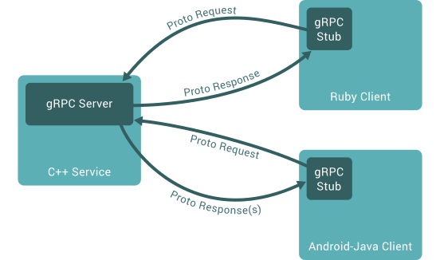
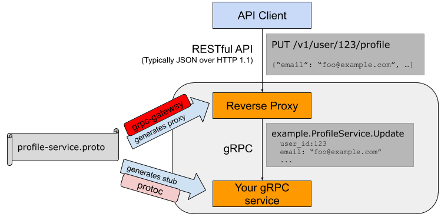

# gRPC 学习笔记

gRPC 是一个开源的高性能的语言无关的平台无关的 RPC 框架。

<!-- more -->



> RPC 远程过程调用，是一种请求响应模型（http）的一种拓展，即抽象出统一的接口，并封装请求响应，使得客户端调用远程过程和调用本地过程的方式一致。

## protocol buffers

服务端与客户端的**接口**以及**消息体**默认是由 protocol buffers 定义的，文本文件后缀为 proto

```protobuf
syntax="proto3";
package xxx; // proto 的包名，且默认会被用作不同语言的包名
import "<外部proto文件>";
option go_package = "xxx"
option java_package = "xxx";
option java_outer_classname = "Xxx"

service HelloService {
  rpc SayHello (HelloRequest) returns (HelloResponse);
  rpc LotsOfResponses(HelloRequest) returns (stream HelloResponse);
  rpc LotsOfRequests(stream HelloRequest) returns (HelloResponse);
  rpc BidiHello(stream HelloRequest) returns (stream HelloResponse);
}

message Name {
  string firstname = 1;
  string lastname = 2;
}

message HelloRequest {
  Name name = 1;
  string greeting = 2;
  repeated string addtions = 3;
}

message HelloResponse {
  Name name = 1;
  string reply = 2;
  repeated string addtions = 3;
  map<string,string> info = 4;
}
```

```sh
protoc --<lang>_out=plugins=grpc:<path-to-dist> <path-to-proto-src>
```


## Go

```go
import "google.golang.org/grpc"
```

```sh
$ go get github.com/golang/protobuf/protoc-gen-go
$ protoc --go_out=plugins=grpc:xxx xxx.proto 
```

### server

```go
import {
    "google.golang.org/grpc"
	pb "xxx"
}

// implement
type xxxServer struct {
    pb.UnimplementedXxxServer
}

func (s *xxxServer) Xxx(ctx context.Context, ...) (..., error) {...}
...

func main() {
    lis, err := net.Listen("tcp", 8080)
    if err != nil {
        log.Fatalf("failed to listen: %v", err)
    }
    s := grpc.NewServer()
    pb.RegisterGreeterServer(s, &xxxServer{})
    if err := s.Serve(lis); err != nil {
        log.Fatalf("failed to serve: %v", err)
    }
}
```

### client

```go
import {
    "google.golang.org/grpc"
	pb "xxx"
}

func main() {
	conn, err := grpc.Dial(address, grpc.WithInsecure(), grpc.WithBlock())
    if err != nil {
        log.Fatalf("did not connect: %v", err)
    }
    defer conn.Close()
    c := pb.NewXxxClient(conn)

    // 构造参数
    
    ctx, cancel := context.WithTimeout(context.Background(), time.Second)
    defer cancel()
    r, err := c.Xxx(ctx, ...)
    if err != nil {
        log.Fatalf("could not greet: %v", err)
    }
    
    // 处理结果
}
```

## Java

**maven**

```xml
<dependencies>
  <dependency>
    <groupId>io.grpc</groupId>
    <artifactId>grpc-netty-shaded</artifactId>
    <version>1.31.1</version>
  </dependency>
  <dependency>
    <groupId>io.grpc</groupId>
    <artifactId>grpc-protobuf</artifactId>
    <version>1.31.1</version>
  </dependency>
  <dependency>
    <groupId>io.grpc</groupId>
    <artifactId>grpc-stub</artifactId>
    <version>1.31.1</version>
  </dependency>
  <dependency> <!-- necessary for Java 9+ -->
    <groupId>org.apache.tomcat</groupId>
    <artifactId>annotations-api</artifactId>
    <version>6.0.53</version>
    <scope>provided</scope>
  </dependency>
  <dependency>
    <groupId>junit</groupId>
    <artifactId>junit</artifactId>
    <version>3.8.1</version>
    <scope>test</scope>
  </dependency>
</dependencies>
```

```xml
<build>
  <extensions>
    <extension>
      <groupId>kr.motd.maven</groupId>
      <artifactId>os-maven-plugin</artifactId>
      <version>1.6.2</version>
    </extension>
  </extensions>
  <plugins>
    <plugin>
      <groupId>org.xolstice.maven.plugins</groupId>
      <artifactId>protobuf-maven-plugin</artifactId>
      <version>0.6.1</version>
      <configuration>
        <protocArtifact>com.google.protobuf:protoc:3.12.0:exe:${os.detected.classifier}</protocArtifact>
        <pluginId>grpc-java</pluginId>
        <pluginArtifact>io.grpc:protoc-gen-grpc-java:1.32.1:exe:${os.detected.classifier}</pluginArtifact>
      </configuration>
      <executions>
        <execution>
          <goals>
            <goal>compile</goal>
            <goal>compile-custom</goal>
          </goals>
        </execution>
      </executions>
    </plugin>
  </plugins>
</build>
```

```sh
$ mvn clean compile
```

**gradle**

```groovy
implementation 'io.grpc:grpc-netty-shaded:1.32.1'
implementation 'io.grpc:grpc-protobuf:1.32.1'
implementation 'io.grpc:grpc-stub:1.32.1'
compileOnly 'org.apache.tomcat:annotations-api:6.0.53' // necessary for Java 9+
```

```groovy
plugins {
    id 'com.google.protobuf' version '0.8.8'
}

protobuf {
  protoc {
    artifact = "com.google.protobuf:protoc:3.12.0"
  }
  plugins {
    grpc {
      artifact = 'io.grpc:protoc-gen-grpc-java:1.32.1'
    }
  }
  generateProtoTasks {
    all()*.plugins {
      grpc {}
    }
  }
}
```

```sh
$ gradle build
```

### server

实现接口

```java
public class XxxImpl extends XxxGrpc.XxxImplBase {
    @Override
    public void xxx(Xxx xxx, StreamObserver<Xxx> responseObserver) {
        Xxx xxx = ...;
        responseObserver.onNext(xxx);
        responseObserver.onCompleted();
    }
}
```

开启服务端

```java
public class XxxServer {
    public static void main(String[] args) {
        ServerBuilder.forPort(port).addService(new XxxImpl()).build().start()
    }
}
```

### client

客户端访问服务端

```java
public class XxxClient {
    public static void main(String[] args) {
        ManagedChannel channel = ManagedChannelBuilder
            .forAddress(host, port)
            .usePlaintext()
            .build();
        XxxGrpc.XxxBlockingStub blockingStub = XxxGrpc.newBlockingStub(channel);
        // XxxGrpc.XxxBlockingStub blockingStub = XxxGrpc.newStub(channel);
        
        // 构造参数
        
        Xxx xxx = blockingStub.xxx(xxx);
        
        // 处理结果
    }
}
```

## grpc-gateway

