Netty 是一款**支持异步 API** 的**事件驱动**的网络应用程序框架，支持快速地开发可维护的高性能的面向协议的服务器和客户端。Netty 的底层是对 Java 原生 NIO 的二次封装，功能更加强大。

<!-- more -->

现如今，我们使用通用的应用程序或者类库来实现互相通讯，但是，有时候一个通用的协议或他的实现并没有很好的满足需求。比如我们无法使用一个通用的 HTTP 服务器来处理大文件、电子邮件以及近实时消息，比如金融信息和多人游戏数据。我们需要一个更底层的通信协议框架来简化自定义通信协议的开发。而这正是 Netty 存在的意义。

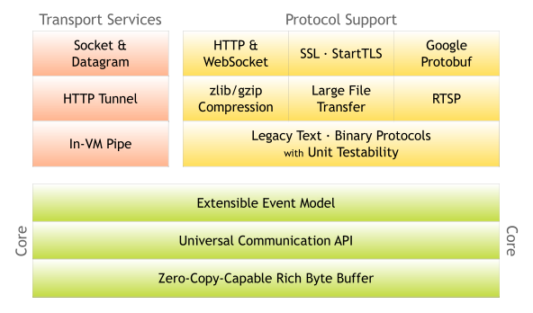

- 支持零拷贝的字节缓存器
- 统一的异步 I/O API
- 可扩展的事件处理模型
- 多种协议支持
- 多种传输服务支持

> Java IO 模型
>
> - BIO：同步且阻塞，小明把水壶放到火上，然后在那傻等水开
> - NIO：同步非阻塞，小明把水壶放到火上，然后去客厅看电视，时不时的去厨房看看水开没有
> - AIO：异步非阻塞，小明把响水水壶放到火上，去客厅看电视，响了再去处理

> Java 原生 NIO 的缺点：
>
> - API 设计不够优秀，Selector、Channel、ByteBuffer
> - 对于底层操作的封装不够，需要关心太多业务之外的代码，比如多线程、重连、半包黏包、网络拥塞等
> - 臭名昭著的 Epoll Bug 即 Selector 空轮询

## 线程模型

### 传统阻塞模型

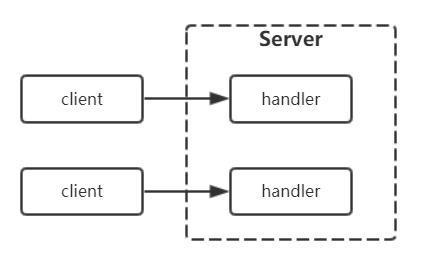

### Reactor 模型

#### 单 Reactor 单线程

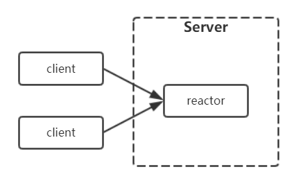

#### 单 Reactor 多线程

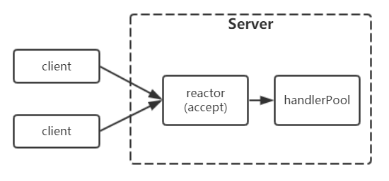

#### 主从 Reactor 多线程

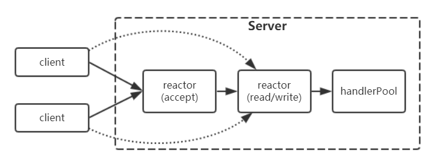

> Reactor 其实就是事件驱动的意思，当有连接请求、读请求、写请求产生时都可以唤醒对应的 Reactor ，并作出处理。

### Netty 采用的线程模型


## Netty 官方示例


## Netty 字节缓存器

特性：

- 容量自适应
- 读写无需切换
- 链式调用
- 引入视图概念
- 支持池化技术

### ByteBuf

由不同的索引分别控制读访问和写访问的字节数组，可以对缓冲区进行随机访问、读写、索引管理、查找、创建视图、拷贝、属性访问等。

- 读索引：readerIndex
- 写索引：writerIndex

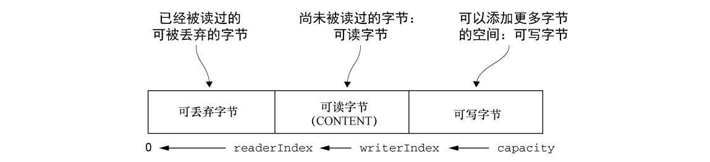

#### 堆模式

数据存在 JVM 的堆内存中。

- 容易分配和释放
- 可以直接访问其中的字节数据
- 不利于与本地硬件进行数据传输，需要建立“中间缓冲区”

#### 直接模式

数据存在 JVM 的堆内存之外的本地系统内存中。

- 不容易分配和释放
- 不受垃圾回收器的控制
- 利于与本地硬件进行数据传输，自身就是一个“中间缓冲区”

> 直接模式，也称为零拷贝模式，是 MMAP （内存映射）的一种应用，即数据不需要再从内核态拷贝到用户态，而是建立一种映射关系，进程通过这个映射直接操纵内核态里的数据。

#### 聚合模式

将多个缓冲区表示为单个合并缓冲区的虚拟表示。

### ByteBufHolder

相当一个官方标准，内部持有一个或多个 ByteBuf ，用于返回 ByteBuf 对象。

### ByteBufAllocator

用于分配各种模式的 ByteBuf 。自身通常需要数据通道来产生。

- 池化实现：PooledByteBufAllocator
- 非池化实现：UnPooledByteBufAllocator

### UnPooled

提供了静态的辅助方法来创建未池化的 ByteBuf 实例。

### ByteBufUtil

ByteBuf 的工具类

## Netty 数据通道

### Channel

代表一个可以进行 I/O 操作（读写连绑）的通道。接口的方法与通道状态、ChannelConfig、I/O操作、ChannelPipeline、EventLoop 等有关。

- 所有与 I/O 操作相关的方法都是异步的，返回一个 ChannelFuture 对象
- 内置一个 parent 通道，这取决于通道的创建过程
- Channel 只是一个通用标准，实际使用时经常需要向下转型成子类对象，以便调用特有的方法。


### ChannelHandler

代表一个通道的处理器，用于对数据执行业务逻辑。

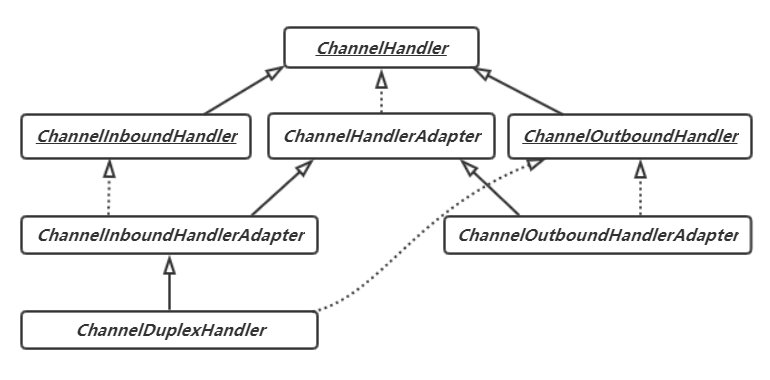

相关行为概述：

- ChannelHandler 包含了添加和删除处理器时会回调的方法
- ChannelInboundHandler 包含了通道状态改变、数据读取、出现异常时会回调的方法
- ChannelOutboundhandler 包含了通道状态改变、数据发送、出现异常时会回调的方法

Netty 使用引用计数来处理池化的 ByteBuf。所以在完全使用完某个 ByteBuf 后，调整其引用计数是很重要的。  

```java
@Override
public void channelRead(ChannelHandlerContext ctx, Object msg) {
    //...
	ReferenceCountUtil.release(msg);
}
```

```java
@Override
public void write(ChannelHandlerContext ctx, Object msg, ChannelPromise promise) {
    //...
	ReferenceCountUtil.release(msg);
	promise.setSuccess();
}
```

### ChannelPipeline 和 ChannelHandlerContext

ChannelPipeline 代表多个 handler 组成的一个处理链，抽象称为管道。每一个 Channel 都对应一个 ChannelPipeline 。每当一个 handler 添加进来后都会被包装成一个 ChannelHandlerContext，并加入到 ChannelPipeline 的双向链表中

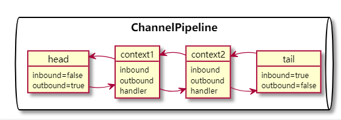

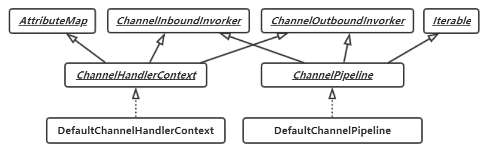

> 有两个特殊的 context 是默认存在的，HEAD、TAIL。所以逻辑上的第一个 handler ，其实是HEAD的下一个，最后一个 handler ，其实是 TAIL 的前一个。

相关行为概述：

- context 和 pipeline 都含有了事件触发后的回调方法，即 Invoker 中的方法
- pipeline 还拥有管理 context 节点的相关方法

> @Sharable 修饰的 handler 可以被添加到多个 pipeline 中，此时要注意相应的并发问题。

### 异常处理

- 入站时，需要重写入站处理器的异常回调方法，并放到处理链靠后的位置上。
- 出站时，相关回调方法都会有一个 promise 参数，可以通过它进行异步通知。

## Netty 事件执行器

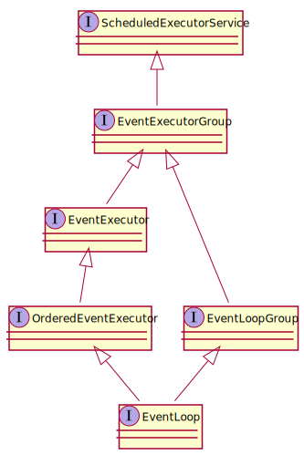

相关行为概述：

- EventExecutorGroup 负责提供 EventExecutor
- EventExecutor 则代表一个事件执行器，其相关方法其实是从 EventExecutorGroup 继承来的
- EventLoopGroup 则负责提供 EventLoop
- EventLoop 代表一个事件循环，负责接收 Channel 并处理相关事件的发生，其相关方法其实也是从 EventLoopGroup 继承来的

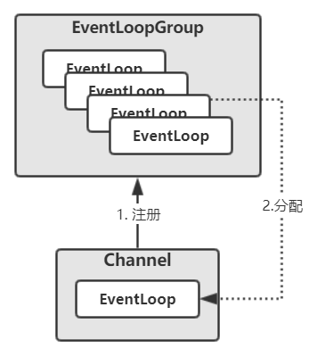

> 一个 EventLoop 可能被分配给多个 Channel

> 在具体实现中，一个 EventLoop 将由一个永远不会变的线程驱动，在这个线程里，Channel 所发生的事件和相应的任务都会被这一个线程所执行，避免了代码同步的开销。
>
> - 事件处理的顺序逻辑有 JDK NIO 实现多路复用
> - 任务处理的顺序逻辑是如果当前线程不是 EventLoop 线程，则在丢到一个任务队列前，会去尝试启动 EventLoop 线程。

## Netty 引导器

引导器负责对网络应用进行配置并将它运行起来。

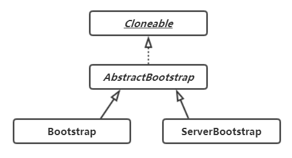

> 实现 Cloneable 的意义：有时可能会需要创建多个具有类似配置或者完全相同配置的 Channel 。

### Bootstrap

用于客户端或者使用了无连接协议的应用程序中。

```java
Bootstrap bs = new Bootstrap();
bs.group(<<group>>) // 设置处理事件的 EventLoopGroup
	.channel(<<channelType>>)  // 指定Channel的实现类,一定要兼容 group
	.handler(<<handler>>);  // 设置处理器，用于构建pipeline
ChannelFuture future = bs.connect(
	new InetSocketAddress(<<host>>, <<port>>)).sync();
futrue.channel().closeFuture().sync();
```

**connect 流程**：


### ServerBootstrap

用于服务器的应用程序中。

```java
ServerBootstrap bs = new ServerBootstrap();
// 设置处理serverChannel事件和被接收的子channel事件的EventLoopGroup
bs.group(<<bossGroup>>,<<workGroup>>)
    .channel(<<serverChannelType>>) // 指定serverChannel的实现类
    .handler(<<handler>>) // ServerChannel的ChannelPipeline中的ChannelHandler
    .childHandler(<<childHandler>>); // 子Channel的ChannelPipeline中的ChannelHandler
ChannelFuture future = bs.bind(<<port>>).sync();
future.channel().closeFuture().sync();
```

**bind 流程**：


## Netty 编解码器

编码器操作出站数据，属于出站处理器，而解码器处理入站数据，属于入站处理器。

### 解码器

#### ByteToMessageDecoder

- `void decode(ChannelHandlerContext ctx, ByteBuf in, List<Object> out)`
- `void decodeLast(ChannelHandlerContext ctx, ByteBuf in, List<Object> out)`

#### MessageToMessageDecoder\<I\>

- `void decode(ChannelHandlerContext ctx, I msg, List<Object> out)`

### 编码器

#### MessageToByteEncoder\<I\>

- `void encode(ChannelHandlerContext ctx, I msg, ByteBuf out)`

#### MessageToMessageEncoder\<I\>

- `encode(ChannelHandlerContext ctx, I msg, List<Object> out)`

### 编解码器

#### ByteToMessageCodec\<I\>

- `void decode(ChannelHandlerContext ctx, ByteBuf in, List<Object> out)`
- `void decodeLast(ChannelHandlerContext ctx, ByteBuf in, List<Object> out)`
- `void encode(ChannelHandlerContext ctx, I msg, ByteBuf out)`

#### MessageToMessageCodec\<INBOUND_IN,OUTBOUND_IN\>

- `void encode(ChannelHandlerContext ctx, OUTBOUND_IN msg, List<Object> out)`
- `void decode(ChannelHandlerContext ctx, INBOUND_IN msg, List<Object> out)`


## ChannelHandler

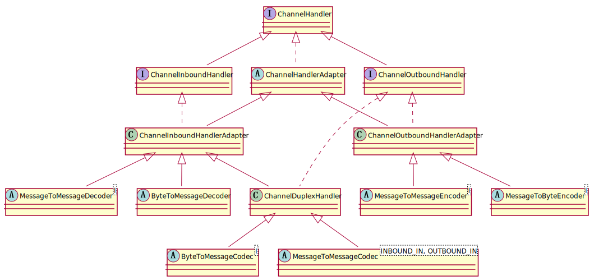

```java
public interface ChannelHandler {
    //...
    void handlerAdded(ChannelHandlerContext ctx) throws Exception;
    void handlerRemoved(ChannelHandlerContext ctx) throws Exception;
    //...
}
```

```java
public abstract class ChannelHandlerAdapter {
    //...
    public boolean isSharable() {
        Class<?> clazz = getClass();
        Map<Class<?>, Boolean> cache = InternalThreadLocalMap.get().handlerSharableCache();
        Boolean sharable = cache.get(clazz);
        if (sharable == null) {
            sharable = clazz.isAnnotationPresent(Sharable.class);
            cache.put(clazz, sharable);
        }
        return sharable;
    }
    //...
}
```

### ChannelInboundHandler

```java
public interface ChannelInboundHandler extends ChannelHandler {
    void channelRegistered(ChannelHandlerContext ctx) throws Exception;
    void channelUnregistered(ChannelHandlerContext ctx) throws Exception;
    void channelActive(ChannelHandlerContext ctx) throws Exception;
    void channelInactive(ChannelHandlerContext ctx) throws Exception;
    void channelRead(ChannelHandlerContext ctx, Object msg) throws Exception;
    void channelReadComplete(ChannelHandlerContext ctx) throws Exception;
    void userEventTriggered(ChannelHandlerContext ctx, Object evt) throws Exception;
    void channelWritabilityChanged(ChannelHandlerContext ctx) throws Exception;
    void exceptionCaught(ChannelHandlerContext ctx, Throwable cause) throws Exception;
}
```

```java
public class ChannelInboundHandlerAdapter ... {
    @Override
    void xxx(ChannelHandlerContext ctx, ...) throws Exception {
        ctx.fireXxx(...);
    }
}
```

#### ChannelInitializer

```java
public abstract class ChannelInitializer<C extends Channel>
    	extends ChannelInboundHandlerAdapter {
    
}
```

#### SimpleChannelInboundHandler

```java
public abstract class SimpleChannelInboundHandler<I> extends ChannelInboundHandlerAdapter {
    // ...
    @Override
    public void channelRead(ChannelHandlerContext ctx, Object msg) throws Exception {
        boolean release = true;
        try {
            if (acceptInboundMessage(msg)) {
                @SuppressWarnings("unchecked")
                I imsg = (I) msg;
                channelRead0(ctx, imsg);
            } else {
                release = false;
                ctx.fireChannelRead(msg);
            }
        } finally {
            if (autoRelease && release) {
                ReferenceCountUtil.release(msg);
            }
        }
    }
    
    protected abstract void channelRead0(ChannelHandlerContext ctx, I msg) throws Exception;
}
```

### ChannelOutboundHandler

```java
public interface ChannelOutboundHandler extends ChannelHandler {
    void bind(ChannelHandlerContext ctx, SocketAddress localAddress, ChannelPromise promise) 
        	throws Exception;
    void connect(
            ChannelHandlerContext ctx, SocketAddress remoteAddress,
            SocketAddress localAddress, ChannelPromise promise) throws Exception;
    void disconnect(ChannelHandlerContext ctx, ChannelPromise promise) throws Exception;
    void close(ChannelHandlerContext ctx, ChannelPromise promise) throws Exception;
    void deregister(ChannelHandlerContext ctx, ChannelPromise promise) throws Exception;
    void read(ChannelHandlerContext ctx) throws Exception;
    void write(ChannelHandlerContext ctx, Object msg, ChannelPromise promise)
        	throws Exception;
    void flush(ChannelHandlerContext ctx) throws Exception;
}
```

```java
public class ChannelOutboundHandlerAdapter ... {
    @Override
    void xxx(ChannelHandlerContext ctx, ...) throws Exception {
        ctx.xxx(...);
    }
}
```

### ChannelDuplexHandler

#### CombinedChannelDuplexHandler

```java
public class CombinedChannelDuplexHandler<I extends ChannelInboundHandler,
										  O extends ChannelOutboundHandler>
        extends ChannelDuplexHandler {
    // ...
    @Override
    public void handlerAdded(ChannelHandlerContext ctx) throws Exception {
        if (inboundHandler == null) {
            throw new IllegalStateException(
                    "init() must be invoked before being added to a " + ChannelPipeline.class.getSimpleName() +
                            " if " +  CombinedChannelDuplexHandler.class.getSimpleName() +
                            " was constructed with the default constructor.");
        }

        outboundCtx = new DelegatingChannelHandlerContext(ctx, outboundHandler);
        inboundCtx = new DelegatingChannelHandlerContext(ctx, inboundHandler) {
            @SuppressWarnings("deprecation")
            @Override
            public ChannelHandlerContext fireExceptionCaught(Throwable cause) {
                if (!outboundCtx.removed) {
                    try {
                        // We directly delegate to the ChannelOutboundHandler as this may override exceptionCaught(...)
                        // as well
                        outboundHandler.exceptionCaught(outboundCtx, cause);
                    } catch (Throwable error) {
                        if (logger.isDebugEnabled()) {
                            logger.debug(
                                    "An exception {}" +
                                    "was thrown by a user handler's exceptionCaught() " +
                                    "method while handling the following exception:",
                                    ThrowableUtil.stackTraceToString(error), cause);
                        } else if (logger.isWarnEnabled()) {
                            logger.warn(
                                    "An exception '{}' [enable DEBUG level for full stacktrace] " +
                                    "was thrown by a user handler's exceptionCaught() " +
                                    "method while handling the following exception:", error, cause);
                        }
                    }
                } else {
                    super.fireExceptionCaught(cause);
                }
                return this;
            }
        };

        // The inboundCtx and outboundCtx were created and set now it's safe to call removeInboundHandler() and
        // removeOutboundHandler().
        handlerAdded = true;

        try {
            inboundHandler.handlerAdded(inboundCtx);
        } finally {
            outboundHandler.handlerAdded(outboundCtx);
        }
    }
}
```

