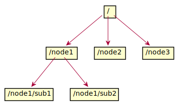
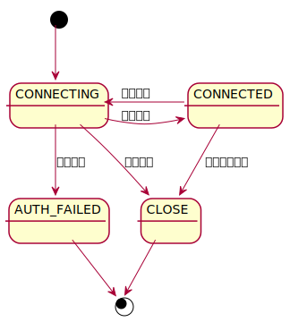
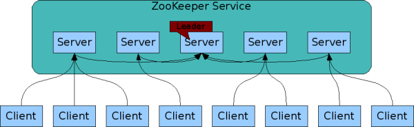

# Zookeeper 学习笔记

ZooKeeper 是一个高性能的开源的用于协调分布式应用的程序，其自身同样支持分布式部署。

## znode



> zookeeper 的数据模型就像是一个文件系统一样，唯一不同的是，每一个节点都可以存储数据，也就是说每一个节点兼有“目录”和“文件”两种角色。只不过数据存储的上限为 1M 。

每一个节点在 zookeeper 中被称为 znode ，支持以下特性：

- 支持临时节点，当创建该节点的连接断开后，临时节点会自动删除。临时节点不允许有子节点
- 支持顺序节点，在创建是会自动附加一个10位十进制数字，从 “0000000000” 开始，这个数字是父节点的 cversion 值
- 支持容器节点，当该节点的最后一个子节点被删除时，该节点会在未来的某一时刻被自动删除。
- 支持限时节点，当该节点在一定时间内没有被修改且没有子节点，则该节点会在未来的某一时刻被自动删除。

每个节点包含以下元数据（stat）：

- czxid：该数据节点被创建时的事务id。
- mzxid：该节点最后一次被更新时的事务id。
- ctime：节点被创建时的时间。
- mtime：节点最后一次被更新时的时间。
- version：这个节点的数据变化的次数。
- cversion：这个节点的子节点 变化次数。
- aversion：这个节点的ACL变化次数。
- ephemeralOwner：如果这个节点是临时节点，表示创建者的会话id。如果不是临时节点，这个值是0。
- dataLength：这个节点的数据长度。
- numChildren：这个节点的子节点个数。

节点支持一下操作：

- *create* : creates a node at a location in the tree
- *delete* : deletes a node
- *exists* : tests if a node exists at a location
- *get data* : reads the data from a node
- *set data* : writes data to a node
- *get children* : retrieves a list of children of a node
- *sync* : waits for data to be propagated

## 会话




## 访问控制

ZooKeeper使用 ACL 来控制访问它的节点。这个 list 的行模式为 `scheme:expression, perm`

最常见的 scheme 是 ip ，例如 `ip:xxx.xxx.xxx.xxx`

支持的 perm 有：

- CREATE：可以创建一个子节点
- READ：可以从一个节点读取数据并展示子节点
- WRITE：可以设置一个节点的数据
- DELETE：可以删除一个子节点
- ADMIN：可以设置权限

## 监听

所有的读操作 getData、getChildren、exists 可以选择设置一个监听器，其具有以下特性：

- 一次性触发：监听器触发后会被服务端自动删除，客户端如果需要可以设置新的监听器
- 可见性：只有注册 watch 之后和触发 watch 之前的节点的改变对于客户端是可见的
- 异步性：通知是异步发送的
- 支持两种监听类型：数据监听和子节点监听。getData()和exists()设置数据监听器。 getChildren()设置子节点监听器。setData()会触发数据监听器。create()会触发数据监听器和子节点监听器。delete() 会触发数据监听器和子节点监听器。

## 集群



### 部署

```properties
tickTime=2000 # 心跳帧
dataDir=/var/lib/zookeeper
clientPort=2181
initLimit=5 # 初始通信超时帧数
syncLimit=2 # 同步通信超时帧数
server.1=zoo1:2888:3888
server.2=zoo2:2888:3888
server.3=zoo3:2888:3888
```

### 选举流程

目前有5台服务器，每台服务器均没有数据，它们的编号分别是1,2,3,4,5,按编号依次启动，它们的选择举过程如下：

1. 服务器1启动，给自己投票，然后发投票信息，由于其它机器还没有启动所以它收不到反馈信息，服务器1的状态一直属于Looking(选举状态)。
2. 服务器2启动，给自己投票，同时与之前启动的服务器1交换结果，由于服务器2的编号大所以服务器2胜出，但此时投票数没有大于半数，所以两个服务器的状态依然是LOOKING。
3. 服务器3启动，给自己投票，同时与之前启动的服务器1,2交换信息，由于服务器3的编号最大所以服务器3胜出，此时投票数正好大于半数，所以服务器3成为领导者，服务器1,2成为小弟。
4. 服务器4启动，给自己投票，同时与之前启动的服务器1,2,3交换信息，尽管服务器4的编号大，但之前服务器3已经胜出，所以服务器4只能成为小弟。
5. 服务器5启动，后面的逻辑同服务器4成为小弟。

### 写流程

1. 客户端发送写数据请求给 Leader/Follower ，如果是 Follower 则该节点会把写请求转发给Leader
2. Leader通过内部的协议进行原子广播，直到一半以上的server节点都成功写入了数据，这次写请求便算是成功
3. 如果是 Follower ，Leader便会通知相应Follower节点写请求成功，然后向客户端返回写入成功响应

### 读流程

任意节点都可以直接处理读请求，可能会读到就数据，可以通过监听机制监听新数据的更新。

### 一致性

顺序一致性

## 命令行

```
命令列表：
        addWatch [-m mode] path # optional mode is one of [PERSISTENT, PERSISTENT_RECURSIVE] - default is PERSISTENT_RECURSIVE
        addauth scheme auth
        close
        config [-c] [-w] [-s]
        connect host:port
        create [-s] [-e] [-c] [-t ttl] path [data] [acl]
        delete [-v version] path
        deleteall path [-b batch size]
        delquota [-n|-b] path
        get [-s] [-w] path
        getAcl [-s] path
        getAllChildrenNumber path
        getEphemerals path
        history
        listquota path
        ls [-s] [-w] [-R] path
        printwatches on|off
        quit
        reconfig [-s] [-v version] [[-file path] | [-members serverID=host:port1:port2;port3[,...]*]] | [-add serverId=host:port1:port2;port3[,...]]* [-remove serverId[,...]*]
        redo cmdno
        removewatches path [-c|-d|-a] [-l]
        set [-s] [-v version] path data
        setAcl [-s] [-v version] [-R] path acl
        setquota -n|-b val path
        stat [-w] path
        sync path
        version
```

## Java Client

```xml
<dependency>
    <groupId>org.apache.zookeeper</groupId>
    <artifactId>zookeeper</artifactId>
    <version>x.x.xx</version>
</dependency>
```

```java

import org.apache.zookeeper.WatchedEvent;
import org.apache.zookeeper.Watcher;
import org.apache.zookeeper.ZooKeeper;
import java.util.concurrent.CountDownLatch;
public class ZookeeperClientDemo {
    private static final String CONNECTION_STRING = "127.0.0.1:2181";
    private static final int SESSION_TIMEOUT = 5000;
    private static CountDownLatch latch = new CountDownLatch(1);
    public static void main(String[] args) throws Exception {
        ZooKeeper zooKeeper = new ZooKeeper(
            CONNECTION_STRING,
            SESSION_TIMEOUT,
            new Watcher() {
            	@Override
            	public void process(WatchedEvent watchedEvent) {
                	if(watchedEvent.getState() == Event.KeeperState.SyncConnected){
                    	latch.countDown();
                	}
            	}
        	}
        );
        latch.await();
        System.out.println(zooKeeper);   
    }
}
```

```java
// 典型方法
String create(String path, byte[] data, List<ACL> acl, CreateMode createMode);
Stat exists(String path, Watcher watcher);
byte[] getData(String path, Watcher watcher, Stat stat);
Stat setData(String path, byte[] data, int version);
List<String> getChildren(String path, Watcher watcher);
void delete(String path, int version);
```

## Go Client

## Curator

待续