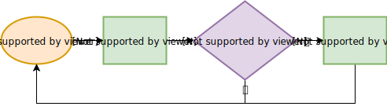
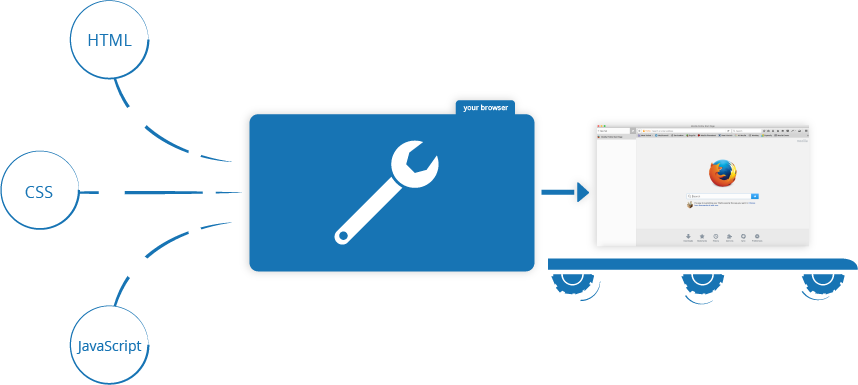

# Javascript 学习笔记

JavaScript 是一种多范式的动态解释型语言，它包含类型、运算符、标准内置（ built-in）对象和方法。

<!-- more -->


## 注释

```javascript
// 单行注释

/*
多行
注释
*/
```

## 类型系统

### undefined

表示一个未初始化的值，也就是还没有被分配的值。

### null

表示一个空值（non-value），必须使用 null 关键字才能访问。

### number

JS 中不区分整型和浮点型，只有 Number

```javascript
console.log(1); // 1
console.log(3 / 2); // 1.5
console.log(0.1 + 0.2); // 0.30000000000000004
```

- NaN
- Infinity
- -Infinity

### string

一串 Unicode 字符序列

### boolean

- `false`、`0`、空字符串（`""`）、`NaN`、`null` 和 `undefined` 被转换为 `false`
- 所有其他值被转换为 `true`

### symbol

“不可见” 的值，具有唯一性

### bigint

### object

“名称-值” 对，名称可以是字符串或者 symbol，值可以是任意类型。

## 对象

```javascript
// {} 创建对象
let o = {
    name: "sunnyroom",
    age: 18,
    greet: function() {
        console.log("hello")
    }
}

// 构造函数创建对象
function Person(name) {
  this.name = name;
  this.greeting = function() {
    alert('Hi! I\'m ' + this.name + '.');
  };
};
var person1 = new Person('Bob');

// Object.create创建对象
let so = {
    age: 18,
    greet: function() {
        console.log("hello");
    }
}
let o = Object.create(so);
o.name = "sunnyroom"

// 对象属性的访问
console.log(o.name)
console.log(o["name"])
```

> 本质上讲，对象都是由构造函数生成的，上面的三种方式中，第一种其实是用 new Object() 生成，第三种其实是在内部构造了一个空的构造函数，并修改了其 prototype 属性，再生成对象。

### 原型链

JS 不是面向对象的，而是面向原型的。每个实例对象都有一个私有属性 `__proto__ ` 指向它的原型对象。层层向上直到一个对象的 `__proto__ ` 为 `null` 这就是原型链。原型链的末尾通常是 `Object.prototype`

#### 原型链的生成

##### 使用语法结构创建的对象

```javascript
var o = {a: 1};

// o 这个对象继承了 Object.prototype 上面的所有属性
// o 自身没有名为 hasOwnProperty 的属性
// hasOwnProperty 是 Object.prototype 的属性
// 因此 o 继承了 Object.prototype 的 hasOwnProperty
// Object.prototype 的原型为 null
// 原型链如下:
// o ---> Object.prototype ---> null

var a = ["yo", "whadup", "?"];

// 数组都继承于 Array.prototype 
// (Array.prototype 中包含 indexOf, forEach 等方法)
// 原型链如下:
// a ---> Array.prototype ---> Object.prototype ---> null

function f(){
  return 2;
}

// 函数都继承于 Function.prototype
// (Function.prototype 中包含 call, bind等方法)
// 原型链如下:
// f ---> Function.prototype ---> Object.prototype ---> null
```

> 本质上是用构造器函数创建对象，详情见下

##### 使用构造器函数创建的对象

利用函数的 `prototype` 属性创建新对象

```javascript
function Graph() {
  this.vertices = [];
  this.edges = [];
}

Graph.prototype = {
  addVertex: function(v){
    this.vertices.push(v);
  }
};

var g = new Graph();
// g 是生成的对象，他的自身属性有 'vertices' 和 'edges'。
// 在 g 被实例化时，g 的原型指向了 Graph.prototype。
```

> 构造器函数的 `prototype` 属性会含有一个 constructor 属性，这个属性就是构造器函数本身

##### 使用 Object.create 创建的对象

这种方式直接将传入的对象作为所指向的原型，与构造器函数的创建方式不同

```javascript
var a = {a: 1}; 
// a ---> Object.prototype ---> null

var b = Object.create(a);
// b ---> a ---> Object.prototype ---> null
console.log(b.a); // 1 (继承而来)

var c = Object.create(b);
// c ---> b ---> a ---> Object.prototype ---> null

var d = Object.create(null);
// d ---> null
console.log(d.hasOwnProperty); // undefined, 因为d没有继承Object.prototype
```

#### 原型链的属性查找

当试图访问一个对象的属性时，它不仅仅在该对象上搜寻，还会搜寻该对象的原型，依次层层向上搜索，直到找到一个名字匹配的属性或到达原型链的末尾。

> 当继承的函数被调用时，this 指向的是当前继承的对象，而不是继承的函数所在的原型对象。

> 要检查对象是否具有自己定义的属性，而不是其原型链上的某个属性，则必须使用所有对象从 `Object.prototype` 继承的 `hasOwnProperty` 方法。

### 内置对象

#### Function

8 种类型都有对应的构造函数类型，并在 prototype 中内置了各种各样的方法属性，这就是为什么 JS 中的字面量可以直接引用特定方法的原因。

#### Object

#### Array

#### Number

#### String


#### Symbol

## 声明

> var 不建议使用

### let


### const


## 运算符

### 算术运算符

| 运算符 | 名称                 |
| :----- | :------------------- |
| `+`    | 加法                 |
| `-`    | 减法                 |
| `*`    | 乘法                 |
| `/`    | 除法                 |
| `%`    | 求余(有时候也叫取模) |
| `**`   | 幂                   |
| `+=`   | 加法赋值             |
|        |                      |


## 流控制


## 错误处理


## 异步

### 宏任务与微任务

JS 是单线程的，为了提供异步特性，就不能通过创建新线程来实现，而是引入一个 “折中” 的方案，宏任务队列和微任务队列，宏任务会产生多个微任务，并在执行结束后再执行所有微任务；通常还存在一些辅助线程，比如定时器触发线程，会产生更多的宏任务。执行流程如下图：



### callbacks

回调函数是异步实现的基础，就是将函数当做参数传入，并在适当的时机被执行。

> 回调函数不一定总是异步执行的。
>
> ```javascript
> function cb() {
>     console.log("callback");
> }
> function f(cbp) {
>     cbp();
> }
> f(cb);
> ```

#### setTimeout

```javascript
let st = setTimeout(function(name) {
    console.log("hello, " + name);
}, 5000, "world") // 5秒后打印hello, world

clearTimeout(st) // 可以在执行前取消
```

#### setInterval

```javascript
let si = setInterval(function(name) {
    console.log("hello, " + name);
}, 5000, "world") // 每5秒打印hello, world

clearInterval(si) // 可以取消
```

> setTimeout 和 setInterval 会在定时器触发线程产生宏任务

### promise

```javascript
// Promise 的使用
new Promise((resolve, reject) => { // 这个函数内部是同步执行的
    // resolve(...)
    // reject(...)
}).then((msg) => { // 这个函数会被当做一个微任务
        console.log(msg)
        return msg
    }, (err) => {
        console.log(err)
        return err
    }
).then((msg) => { // 这个函数会被当做一个微任务
        console.log(msg) // msg 是上一个then中的返回值
        return msg
    }, (err) => {
        console.log(err) // err 是上一个then中的返回值
        return err
    }
).catch((msg) => { // 这个函数会被当做一个微任务
    console.log(msg)
})

// 包装成成功的Promise
let p = Promise.resolve(...);

// 包装成失败的Promise
let p = Promise.reject(...);

// Promise.all
Promise.all([p1,p2,p3]).then(ps => {
    // ps 是p1,p2,p3的成功后的返回值组成的数据
}).catch(e => {
    // e 是第一个失败的Promise的返回值
})

// Promise.race
Promise.race([p1,p2,p3]).then(ps => {
    // ps 是第一个成功的Promise的返回值，且之前p1,p2,p3都没有失败
}).catch(e => {
    // e 是第一个失败的Promise的返回值
})
```

### async/await

async/await 是一个“语法糖”，底层还是 Promise

```javascript
async function f1() {
    // throw ...
    // return ...
}

f1().then((ret) => {
    // ...
}).catch((err) => {
    // ...
})
```


## 浏览器中的 JS

当浏览器访问后端服务时，会得到返回的信息，通常是一堆 HTML CSS JS 数据。

- [HTML](https://developer.mozilla.org/zh-CN/docs/Glossary/HTML)是一种标记语言，用来结构化我们的网页内容并赋予内容含义
- [CSS](https://developer.mozilla.org/zh-CN/docs/Glossary/CSS) 是一种样式规则语言，定义样式，并应用于 HTML 内容
- [JavaScript](https://developer.mozilla.org/zh-CN/docs/Glossary/JavaScript) 是一种脚本语言，控制 HTML CSS 的动态行为



浏览器将按照一定的规则找到入口的 HTML 文件（index.html），并从上往下开始解析，过程中会加载其他的 CSS JS 文件内容。这里主要关注 JS：

### script 标签

#### 内部 JS

可以在 HTML 中直接嵌入 JS

```html
<script>
  // 在此编写 JavaScript 代码
</script>
```

#### 外部 JS

也可以加载外部的 JS 内容

```html
<script src="script.js"></script>
```

#### async

为了提高浏览器解析速度，可以异步加载 script 标签内容，即不会阻塞 HTML 后面标签的解析。

```html
<script src="script.js" async></script>
```

> 如果脚本无需等待页面解析，且无依赖独立运行，那么应使用 `async`。

#### defer

async 会使得脚本的加载顺序不可控，defer 则会在 HTML 解析完成后加载 script 标签，当存在多个 defer 时，也可以保证顺序性。

```html
<script src="script.js" defer></script>
```

> 如果脚本需要等待页面解析，且依赖于其它脚本，调用这些脚本时应使用 `defer`，将关联的脚本按所需顺序置于 HTML 中。

> defer 的一种替代方案：
>
> ```html
> <script>
> document.addEventListener("DOMContentLoaded", function() {
>     // ...
> });
> </script>
> ```

### 浏览器内置对象

- window是载入浏览器的标签，在JavaScript中用[`Window`](https://developer.mozilla.org/zh-CN/docs/Web/API/Window)对象来表示，使用这个对象的可用方法，你可以返回窗口的大小（参见[`Window.innerWidth`](https://developer.mozilla.org/zh-CN/docs/Web/API/Window/innerWidth)和[`Window.innerHeight`](https://developer.mozilla.org/zh-CN/docs/Web/API/Window/innerHeight)），操作载入窗口的文档，存储客户端上文档的特殊数据（例如使用本地数据库或其他存储设备），为当前窗口绑定 event handler，等等。
- navigator表示浏览器存在于web上的状态和标识（即用户代理）。在JavaScript中，用[`Navigator`](https://developer.mozilla.org/zh-CN/docs/Web/API/Navigator)来表示。你可以用这个对象获取一些信息，比如来自用户摄像头的地理信息、用户偏爱的语言、多媒体流等等。
- document（在浏览器中用DOM表示）是载入窗口的实际页面，在JavaScript中用[`Document`](https://developer.mozilla.org/zh-CN/docs/Web/API/Document) 对象表示，你可以用这个对象来返回和操作文档中HTML和CSS上的信息。例如获取DOM中一个元素的引用，修改其文本内容，并应用新的样式，创建新的元素并添加为当前元素的子元素，甚至把他们一起删除。