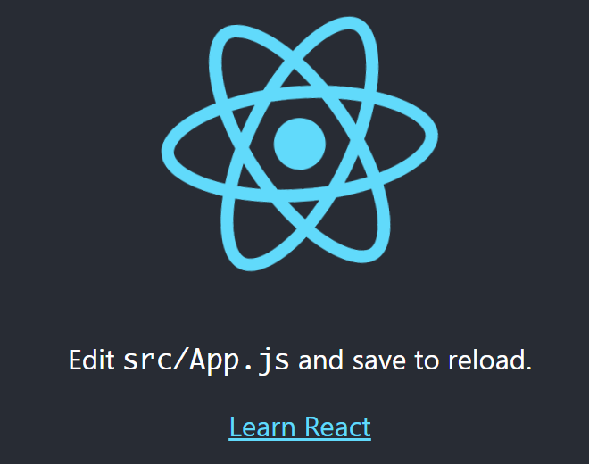
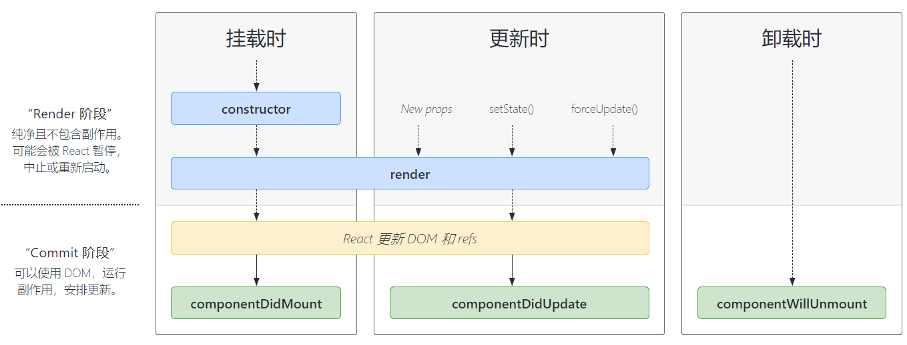
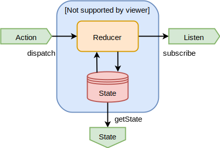

# React 学习笔记

React 是一个用于构建用户界面的 JavaScript 库。

<!-- more -->

- 声明式：JSX 只需声明式地切入变量，当变量改变后，就可以自动进行 dom 操作更新视图
- 组件化：将视图的构建抽象成一个个组件，并进行拼接，模块化，提高了代码的重用性
- 易整合：借着 JS 的函数式编程，很容易和已有的项目进行整合，而不需要大量修改已有项目

## Hello React

```sh
$ yarn global add create-react-app
$ create-react-app demo
$ cd demo
$ yarn start
```



```sh
$ rm -rf public/*
$ vim public/index.html
```

```html
<!DOCTYPE html>
<html>
  <head>
    <title>hello world</title>
  </head>
  <body>
    <div id="root"></div>
  </body>
</html>
```

```sh
$ rm -rf src/*
$ vim src/index.js
```

```javascript
import React from 'react';
import ReactDOM from 'react-dom';

const ele = <div>hello world</div>;

// 渲染react元素
ReactDOM.render(ele, document.getElementById('root'));
```

```sh
$ yarn start
```

## 元素

元素是 React 的最小处理单元，通常由 JSX 定义或组合而成。JSX 是一个 JavaScript 的语法扩展，在编译之后，JSX 表达式会被转为普通 JavaScript 函数调用，即 React.createElement，并且对其取值后得到 React 元素对象。所以 JSX 表达式也可以看做一个 JS 表达式

```javascript
const name = "world"

const element = (
  <h1 className="greeting">
    Hello, {name}!
  </h1>;
);

// or

const element = React.createElement(
  'h1',
  {className: 'greeting'},
  'Hello, '+name
);
```

> 与浏览器的 DOM 元素不同，React 元素是创建开销极小的普通对象。React DOM 会负责更新 DOM 来与 React 元素保持一致。

> React DOM 元素是不可变对象，React DOM 会将元素和它的子元素与它们之前的状态进行比较，并只会进行必要的更新来使 DOM 达到预期的状态。

## 组件

```javascript
class Welcome extends React.Component {
  constructor(props) {
    super(props)
  },
  render() {
    return (
      <div>
        <h1>Hello, {this.props.name}</h1>
      </div>
    )
  }
}
```

## 状态

```javascript
class Welcome extends React.Component {
  constructor(props) {
    super(props);
    // 设置组件自身的state
    this.state = {
      date: new Date()
    };
  },
  render() {
    return (
      <div>
        <h1>Hello, {this.props.name}</h1>
        {/* 使用state */}
        <div>date: {this.state.date}</div>
        {/* 修改state */}
        <button onClick={() => {this.setState({date: new Date()})}}>
          update date
        </button>
      </div>
    )
  }
}
```

## 事件

```javascript
class Welcome extends React.Component {
  constructor(props) {
    super(props);
    this.state = {
      date: new Date()
    };
    // 为回调绑定this
    this.handleClick = this.handleClick.bind(this);
  },
  // 定义回调
  handleClick() {
    this.setState({
      date: new Date()
    });
  },
  render() {
    return (
      <div>
        <h1>Hello, {this.props.name}</h1>
        <div>date: {this.state.date}</div>
        {/* 为事件绑定回调 */}
        <button onClick={this.handleClick}>
          update date
        </button>
      </div>
    )
  }
}
```

## 列表

```javascript
class ListItem extends React.Component {
  constructor(props) {
    super(props);
  },
  render() {
    return <li>{this.props.value}</li>;
  }
}

class Welcome extends React.Component {
  constructor(props) {
    super(props)
  },
  render() {
    const numbers = [1,2,3,4,5];
    const listItems = numbers.map((number) =>
      // key 应该在数组的上下文中被指定
      <ListItem key={number.toString()} value={number} />
    );
    return (
      <div>
        <h1>Hello, {this.props.name}</h1>
        <ul>
          {listItems}
        </ul>
      </div>
    )
  }
}
```

## 表单

表单元素会自身维持一个 “state”，如 `<input>`, `<textarea>` 等，为了使 React 的 state 成为“唯一数据源”，需要做一些处理：

```javascript
class Welcome extends React.Component {
  constructor(props) {
    super(props);
    this.state = {
      // 对应input的内容
      content: ""
    };
  },
  render() {
    return (
      <div>
        <h1>Hello, {this.props.name}</h1>
        <input type="text"
               value={this.state.content}
               onChange={e => {this.setState({content: e.target.value})}} />
      </div>
    )
  }
}
```

## 生命周期



每个组件都包含 “生命周期方法”，你可以重写这些方法，以便于在运行过程中特定的阶段执行这些方法。

## Context

父子组件跨层传值

```javascript
// 创建一个 theme 的 context
const ThemeContext = React.createContext('light');
class App extends React.Component {
  render() {
    // 使用一个 Provider 来将当前的 theme 传递给以下的组件树。
    // 无论多深，任何组件都能读取这个值。
    // 在这个例子中，我们将 “dark” 作为当前的值传递下去。
    return (
      <ThemeContext.Provider value="dark">
        <Toolbar />
      </ThemeContext.Provider>
    );
  }
}

// 中间的组件再也不必指明往下传递 theme 了。
function Toolbar() {
  return (
    <div>
      <ThemedButton />
    </div>
  );
}

// 方式一
class ThemedButton extends React.Component {
  // 指定 contextType 读取当前的 theme context。
  // React 会往上找到最近的 theme Provider，然后使用它的值。
  // 在这个例子中，当前的 theme 值为 “dark”。
  static contextType = ThemeContext;
  render() {
    return <Button theme={this.context} />;
  }
}

// 方式二
class ThemedButton extends React.Component {
  render() {
    return (
      <ThemeContext.Consumer>
        { value => {
          return <Button theme={value} />
        }}
      </ThemeContext.Consumer>
    );
  }
}
```

## 函数组件和 Hooks

从 16 版本开始，提倡更简洁的函数式组件写法替代 class 组件写法，利用各种 Hooks 实现 class 组件的特性。

```javascript
function FunctionComponent(props) {
  return <h1>Hello, {props.name}</h1>;
}
```

### useState

```javascript
const [state, setState] = useState(initialState);
// initialState 也可以是个函数，实现懒计算
// state 获取值，可直接用于react元素
// setState(newState) or setState(oldState => newState) 用于设置新值
```

> 组件重新渲染的时机：
>
> - props 改变
> - state 改变
> - 父组件被重新渲染（注意：父子组件不是指组件嵌套关系）

#### useReducer

useReducer 是 useState 的替代方案，用于声明式修改 state，适用于计算逻辑较为复杂的场景，setState 不利于逻辑复用。

```javascript
const [state, dispatch] = useReducer(reducer, initialArg, init);
// reducer 是 (oldState, action) => newState 的一个函数，实现计算逻辑复用
//     action 是dispatch传递过来的参数
// initialArg 当init不存在时，当做初始state;当init函数存在时，将作为参数懒计算出初始state
// init 是计算初始state的函数
//
// state 获取值
// dispatch 是个函数，接收的参数将作为reducer的action，用于计算新值
```

### useEffect

用于在每次渲染后进行异步的无关渲染的 “副作用” 操作

```javascript
useEffect(() => {
  // 会在每次组件渲染之后异步执行
})

useEffect(() => {
  // 会在每次组件渲染之后异步执行
  return () => {
    // 会在销毁之前执行
    // 注意：组件的重新渲染也会销毁之前的组件，所以这里也会被执行
  }
})

useEffect(() => {
  // 会在每次组件渲染之后,a b c 有所改变才会被异步执行
  return () => {
    // 会在销毁之前执行
    // 注意：重新渲染时，a b c有所改变才会被执行
  }
}, [a, b, c])

useEffect(() => {
  // 会在组件第一次渲染之后异步执行
  return () => {
    // 会在销毁之前执行
  }
}, [])
```

#### useLayoutEffect

useEffect 的同步版本，会阻塞视图渲染。

> 尽量不使用 useLayoutEffect，对于“副作用”，适用场景非常有限

> useLayoutEffect 不能用于服务器端渲染，因为渲染之时不再客户端，无法有效执行副作用

### useContext

```javascript
// const XxxContext = createContext() // 构建Context对象，其中Provider属性是一个组件

// 父组件中得到XxxContext，并输出以下形式的react元素
// <XxxContext.Provider value={...}>
//   ...子组件
// </XxxContext.Provider>

// 子组件中得到XxxContext，通过以下方式便可以得到Provider标签中的值
const value = useContext(XxxContext)
// 当父组件中的值发生变化时，会自动触发子组件的重新渲染
```

### useMemo

```javascript
const computed = useMemo(() => computedValue, [a, b, c])
// a b c 有所改变时，会在渲染时，重新进行复杂计算，得出新值
```

### useCallback

`useCallback(fn, [a,b,...])` 等价于 `useMemo(() => fn, [a,b,...])`

### useRef

```javascript
const ref = useRef(initValue)
// 每次渲染时，ref 引用不变，但是ref.current可变，用于实时获取一些数据
// ref.current 的改变不会触发重新渲染
// 典型场景
//   1 配合useEffect，实现跨渲染周期共享数据
//   2 配合setTimeout，读取实时数据
//   3 绑定dom，并自定义dom操作
```

### 自定义 Hook

以上基础的 Hook 提供了 React 的基础特性，比如 state 、context 等，而自定义 Hook 可以实现 Hook API 的调用逻辑复用，即将一连串的 Hook API 调用逻辑抽象成自定义的 Hook 方法，在多个组件中重复使用。

- 自定义 Hook 方法名一定要以  `use` 开头
- 内部的 Hook 在调用期间，是组件隔离的

### Hooks 原理


## React Router

```sh
$ yarn add react-router-dom
```

```xml
<div>
  <nav>
    <Link to="/">Home</Link>
    <Link to="dashboard">Dashboard</Link>
  </nav>
  <Router>
    <Switch>
      <Route exact path="/">
        <Home />
      </Route>
      <Route path="/dashboard">
        <Dashboard />
      </Route>
    </Switch>
  </Router>
</div>
```

## Reach Router

```sh
$ yarn add @reach/router
```

```xml
<div>
  <nav>
    <Link to="/">Home</Link>
    <Link to="dashboard">Dashboard</Link>
  </nav>
  <Router>
    <Home path="/" />
    <Dashboard path="dashboard" />
  </Router>
</div>
```

## Redux 和 React Redux

### Redux

```sh
$ yarn add redux
```

Redux 是一个状态管理框架，在企业级应用中扮演 “消息总线” 的角色。



```javascript
// construct
const reducer = (state = 0, action) => {
  switch (action.type) {
    case 'INCREMENT': return state + 1;
    case 'DECREMENT': return state - 1;
    default: return state;
  }
};
const store = createStore(reducer);
store.subscribe(() => console.log("state changed"));

// use
store.dispatch({type: 'INCREMENT'});
store.dispatch({type: 'DECREMENT'});
console.log(store.getState());
```

#### Reducer 的模块化

```javascript
// {
//   a: 0,
//   b: 0,
//   c: 0
// }
// 模拟 a+b=c
const aReducer = (state = 0, action) => {
  switch (action.type) {
    case 'A_INCREMENT': return state + 1;
    case 'A_DECREMENT': return state - 1;
    default: return state;
  }
};
const bReducer = (state = 0, action) => {
  switch (action.type) {
    case 'B_INCREMENT': return state + 1;
    case 'B_DECREMENT': return state - 1;
    default: return state;
  }
};
const cReducer = (state = 0, action) => {
  switch (action.type) {
    case 'A_INCREMENT': return state + 1;
    case 'A_DECREMENT': return state - 1;
    case 'B_INCREMENT': return state + 1;
    case 'B_DECREMENT': return state - 1;
    default: return state;
  }
};
const reducer = combineReducers({
  a: aReducer,
  b: bReducer,
  c: cReducer
})
```

#### dispatch 的中间件

```javascript
const MyMiddleware = ({dispatch, getState}) => next => action => {
  // pre
  next(action)
  // post
}

const store = createStore(<reducer>, applyMiddleware(MyMiddleware, ...))
```

### React Redux

```sh
$ yarn add react-redux
```

react-redux 提供了各种必要的函数和 react 组件，封装了 redux 操作。

```javascript
// 根据已有UI组件，加入映射后封装成容器组件
const mapStateToProps = (state, container_props) => ({
  ui_prop1: xxx,
  ui_prop2: xxx
})
const mapDispatchToProps = (dispatch, container_props) => ({
  ui_prop3: () => {
    xxx
  },
  ui_prop4: () => {
    xxx
  }
})
const ContainerComponent = connect(
  mapStateToProps,
  mapDispatchToProps
)(UIComponent)

// 外部再封装一层包含store 的 Provider，这样，Provider 内部的子组件就可以拿到 store
<Provider store={store}>
  ...
  <ContainerComponent ...></ContainerComponent>
  ...
</Provider>
```

> 底层利用了 React 的 Context API ，约定了一个 ReactReduxContext 类型的上下文，来传递 store