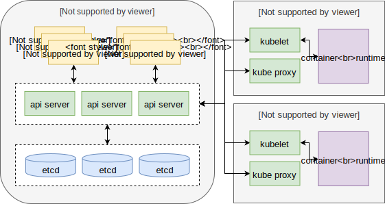

Kubernetes 是时下最流行的开源的集群容器编排工具。

<!-- more -->

- Kubernetes 起源于google 旗下 borg 系统，是其 go 语言的重构版本
- 由 go 语言开发，系统资源消耗少
- 支持集群的弹性伸缩
- 支持容器组的负载均衡

## 组件



- **api server**：负责协调各个组件。以 Pod 的方式运行在 master 节点上，可以多实例运行。

- **etcd**：负责以 k-v 的形式分布式存储 kubernetes 集群资源对象的状态信息。

  键规范为 `/registry/<resource-type>s/<ns-name>/...`

- **scheduler**：负责调度 Pod 到合适的工作节点上。以 Pod 的方式运行在 master 节点上，可以多实例运行，但一个 Pod 只能由一个 scheduler 负责。

- **controller manager**：负责管理各种资源的 controller 子进程，而 controller 则负责使资源状态朝着定义的期望状态收敛。以 Pod 的心事运行在 master 节点上，可以多实例运行，同一时间只有一个实例有效，其他实例备用。

- **kubelet**：负责所有分配过来的任务的执行，比如添加或删除 Pod 等。

- **proxy**：负责代理 kubernetes 集群内部或者外部对 Pod 的访问。以 Pod 的方式运行在工作节点。

- **container runtime**：一个编程接口，负责容器相关的工作。

- ***container network**：负责跨节点的 Pod 通信

- ***dns**：负责支持 Pod 之间以域名解析的方式通信

- ***ingress**：负责将外部的访问请求路由到合适的 Pod 中

- ***heapster**：负责监控工作节点的负载

- ***dashboard**：以可视化的方式管理 kubernetes 集群

## 集群搭建与使用

最佳实践：

- 配置内核参数

  ```properties
  # /etc/sysctl.d/k8s.conf
  net.bridge.bridge-nf-call-ip6tables = 1
  net.bridge.bridge-nf-call-iptables = 1
  net.ipv4.ip_nonlocal_bind = 1
  net.ipv4.ip_forward = 1
  vm.swappiness=0
  # sysctl --system
  ```

- 关闭交换空间

  ```sh
  sudo swapoff -a
  # 也可以修改fstab永久关闭
  ```

- 关闭防火墙

  ```sh
  ufw disable
  ```

- 时间同步

  ```sh
  # sudo apt-get install ntpdate
  ntpdate cn.pool.ntp.org
  ```

### minikube

```sh
# 开启 minikube
minikube start --driver=none/docker/virtualbox \
    --image-repository='registry.aliyuncs.com/google_containers'
# 停止 minikube
minikube stop
# 停止 minikube 并删除相关配置
minikube delete
# 调用内部的 kubectl
minikube kubectl -- xxx
```

### kubeadm


### kubectl

```sh
kubectl explain xxx.xxx.xxx # 查看yaml可能的字段
kubectl create namespace <space-name>
kubectl create -f <yaml-file> -n <space-name>
kubectl get <resource-type>s
kubectl get <resource-type> -l <label-desc>
kubectl delete <reesource-type> <resource-name>
kubectl delete <reesource-type> -l <label-desc>
kubectl logs <pod-name> -c <container-name>
kubectl port-forward <pod-name> <port>:<pod-port> # 本地端口转发至pod
kubectl label <resource-type> <resource-name> <label-key>=<label-value>
kubectl describe <resource-type> <resource-name>
kubectl edit <resource-type> <resource-name>

# 简单运行一个单容器的pod
$ kubectl run nginx --image=nginx
$ kubectl run nginx --image=nginx --port=5701
$ kubectl run nginx --image=nginx --env="xxx=xxx"
$ kubectl run nginx --image=nginx --labels="xxx=xxx,xxx=xxx"
$ kubectl run nginx --image=nginx -- xxx xxx
$ kubectl run nginx --image=nginx --command -- xxx xxx xxx

# 从 yaml 文件中创建资源
$ kubectl create -f xxx.yaml
$ kubectl create -f xxx.yaml --namespace xxx
$ kubectl create po/rc/rs/deployment xxx -o yaml --dry-run > xxx.yaml # 生成yaml

# 资源标签
$ kubectl label po/rs/deployment xxx xxx=xxx
$ kubectl label po/rs/deployment xxx xxx=xxx --overwrite

# 资源注解
$ kubectl annotate po/rs/deployment xxx xxx=xxx
$ kubectl annotate po/rs/deployment xxx xxx=xxx --overwrite

# 导出服务
$ kubectl expose pod/rc/rs/deployment xxx --port=xx --target-port=xx --name=xxx

# 端口转发
$ kubectl port-forard xxx xx:xx

# 回滚
$ kubectl rollout status deployment/xxx
$ kubectl rollout history deployment/xxx
$ kubectl rollout undo deployment/xxx
$ kubectl rollout undu deployment/xxx --to-revision=xx
$ kubectl rollout pause deployment/xxx
$ kubectl rollout resume deployment/xxx

# 删除资源
$ kubectl delete pod/rs/deployment xxx
$ kubectl delete pod/rs/deployment --selector 'xxx,xxx'
$ kubectl delete pod/rs/deployment --namespace xxx

# 查看资源列表
$ kubectl get po/rs/deployment
$ kubectl get po/rs/deployment --selector 'xxx,xxx'
$ kubectl get po/rs/deployment --namespace xxx

# 查看资源详情
$ kubectl describe pod/rc/rs/deployment xxx

# 容器日志
$ kubectl logs xxx --container xxx

# yaml api 查询
$ kubectl explain pod/rc/rs/deployment.xxx.xxx
```

## 资源

### 资源标签

k8s 通过资源标签来进行相关的管理工作

```yaml
metadata:
  labels: # 资源标签
    xxx: xxx
```

#### 标签选择器

##### 字符串表示

- `label_key` 包含
- `'!label_key'` 不包含
- `label_key=label_value`
- `label_key!=label-value`
- `label in (xxx,xxx)`
- `label notin (xxx,xxx)`

> 多个元素用逗号隔开

##### yaml 表示

```yaml
selector:
  matchLabels:
    <label-key>: <label-value>
  matchExpressions:
  - key: <label-key>
    operator: In/NotIn/Exist/NotExist
    values:
    - <label-value>
```

### 资源注解

```yaml
metadata:
  annotations:
    xxx: xxx
```

### Node

```yaml
kubectl label node <node-name> <label-key>=<label-value>

kubectl taint node <node-name> <taint-key>[=<taint-value>]:<taint-type>
kubectl taint node <node-name> <taint-key>[=<taint-value>]:<taint-type>- # 删除
# taint-type:
#   NoSchedule 不调度
#   PreferNoSchedule 尽量不调度
#   NoExecute 不调度，且正在运行的pod也会受影响
```

### Namespace

一种特殊的 kubernetes 对象，用于管理其他对象资源。

```yaml
apiVersion: v1
kind: Namespace
metadata:
  name: xxx
```

```yaml
# 使用
metadata:
  namespace: xxx
```

### ConfigMap

存储键值对，可以被其他对象资源引用，并且达到热更新的效果。

```yaml
apiVersion: v1
kind: ConfigMap
metadata:
  name: <cm-name>
data:
  <key>: <value>
  ...
```

### Secret

对值内容进行编解码处理。

```yaml
apiVersion: v1
kind: Secret
metadata:
  name: <cm-name>
stringData:
  <key>: <value>
  ...
```

### PersistentVolume

持久化卷，相比与“卷”，可以独立于 pod 的生命周期之外。卷也可以引用持久化卷

```yaml
apiVersion: v1
kind: PersistentVolume
metadata:
  name: <pv-name>
spec:
  capacity:
    storage: <size>
  accessModes:
  - ReadWriteOnce # 只能被单个节点挂载
  - ReadOnlyMany # 可以被多个节点挂载
  - ReadWriteMany
  persistentVolumeReclaimPolicy: Retain/Recycle/Delete
  	# Retain 保留
  	# Recycle 清理再次利用
  	# Delete 删除
  # same as volumes
```

### PersistentVolumeClaim

持久化卷声明，用于绑定符合要求的持久化卷。

```yaml
apiVersion: v1
kind: PersistentVolumeClaim
metadata:
  name: <pvc-name>
spec:
  accessModes:
  - ReadWriteOnce
  - ReadOnlyMany
  - ReadWriteMany
  resources:
     requests:
       storage: <size>
```

### Pod

pod是一组并置的容器组， 代表了Kubemetes中的基本构建单元（不允许跨节点）。在一个 pod 中的多个容器共享同一个 Linux 命名空间，但不共享文件系统。

> **为什么选择 pod 作为构建单元，而不是直接使用容器？**
>
> 为了便于通过容器管理其中唯一的进程，如果进程有多个，就容易出现问题，比如终端日志混乱等，不论是 docker 还是 kubernetes 都推荐一个容器一个进程。pod 就是为了实现一个容器一个进程而提出的概念。

> **Pod 网络**
>
> Kubemetes 集群中的所有 pod 都在同一个共享网络地址空间中，底层由额外的插件基于真实链路实现，最常用的是 flannel 和 calico。

```yaml
apiVersion: v1
kind: Pod
metadata:
  name: xxx
spec:
  tolerations:
  - key: <taint-key>
    operator: Equal/Exist
    value: <taint-value>
    effect: <taint-type>
    tolerationSeconds: <seconds> # 可以容忍运行的时长
  nodeSelector: # 根据标签选择节点，已被affinity替代
    <node-label-key>: <node-label-value>
  affinity:
    nodeAffinity:
      requiredDuringScheduling[IgnoredDuringExecution]:
        nodeSelectorTerms:
        - matchExpressions:
          - key: <label-key>
            opreator: In
            values:
            - <label-value>
      preferredDuringScheduling[IgnoredDuringExecution]:
      - weight: <preferred-weight>
        preference:
        - matchExpressions:
          - key: <label-key>
            opreator: In
            values:
            - <label-value>
  containers:
  - name: xxx
    image: xxx
    imagePullPolicy: Always/IfNotPresent/Never
    command: ["xxx","xxx"...]
    args: ["xxx","xxx"...]
    resources:
      requests:
        cpu: <cpu>
        memory: <memory>
      limits:
        cpu: <cpu>
        memory: <memory>
    hostNetwork：true # 是否直接使用宿主机的网络空间
    ports:
    - containerPort: xx
      hostPort: xx
    env:
    - name: <env-key>
      value: <env-value>
    - name: <env-key>
      valueFrom:
        configMapKeyRef: # 从configmap中读取值
          name: <configmap-name>
          key: <configmap-key>
        secretKeyRef:
          name: <secret-name>
          key: <secret-key>
        fieldRef:
          fieldPath: <元数据路径>
          # metadata.name
          # metadata.namespace
          # status.podIP
          # spec.nodeName
          # spec.serviceAccountName
        resourceFieldRef:
          resource: <资源路径>
          # requests.cpu
          # requests.memory
          # limits.cpu
          # limits.memory
          divisor: <divisor>
    envFrom:
    - prefix: <prefix> # 可省略
      ConfigMapRef:
        name: <configmap-name>
    - prefix:
      SecretRef:
        name: <secret-name>
    volumeMounts:
    - name: <volume-name>
      mountPath: <mount-path>
    livenessProbe: # 存活探针
      httpGet: # 可访问且返回值是2xx 3xx 表示存活
        path: /xxx/xxx
        port: xx
      exec: # 返回值是0表示存活
        command: ["xxx","xxx","xxx"...]
      tcpSocket: # tcp连接成功表示存好
        port: <port>
    readinessProbe:
      <同livenessProbe>
  volumes:
  - name: <volume-name>
    emptyDir: {} # 空白卷，用作pod中多容器的共享文件夹
  - name: <volume-name>
    hostPath: # 节点卷
      path: <path or file>
      type: Directory/File
  - name: <volume-name>
    gitRepo: # git 仓库
      repository: <git-address>
      revision: <git-brach>
      directory: <positioin>
  - name: <volume-name>
    configMap: # 以文件的形式存储键值对，支持热更新
      name: <configmap-name>
  - name: <volume-name>
    secret: # 以文件的形式通过编解码存储键值对，支持热更新
      name: <secret-name>
  - name: <volume-name>
    downwardAPI: # 以文件的形式存储pod元数据，支持热更新
      items:
      - path: <volume-path>
        fieldRef:
          fieldPath: <元数据路径>
          # metadata.labels
          # metadata.annotations
          # 同spec.containers.env.valueFrom.fieldRef.fieldPath
      - path: <volume-path>
        resourceFieldRef:
          resource: <资源路径>
          # 同spec.containers.env.valueFrom.resourceFieldRef.resource
          containerName: <container-name>
          divisor: <divisor>
  - name: <volume-name>
    nfs: 
      path: <nfs-path>
      server: <nfs-server-dist>
  - name: <volume-name>
    persistentVolumeClaim:
      claimName: <pvc-name>
  dnsPolicy: Default/ClusterFirst/ClusterFirstWithHostNet
```

### ReplicationController

针对无状态 Pod 可以使用 ReplicationController  来管理，当根据选择器得到的 Pod 数量 少了或多了会自动进行调整。

```yaml
apiVersion: v1
kind: ReplicationController
metadata:
  name: xxx
spec:
  replicas: xx
  selector: # 建议不配置，将自动提取template中的标签信息
    xxx: xxx
  template: # 当需要pod时以此为模板创建
    <pod-template>
```

### ReplicaSet

升级版的 ReplicationController ，主要升级了标签选择机制。

```yaml
apiVersion: apps/v1beta2
kind: ReplicaSet
metadata:
  name: xxx
spec:
  replicas: <replicas-num>
  selector:
    matchLabels:
      <label-key>: <label-value>
    matchExpressions:
    - key: <label-key>
      operator: In/NotIn/Exist/NotExist
      values:
      - <label-value>
  template: # 当需要pod时以此为模板创建
    <pod-template>
```

### Deployment

不论是 ReplicationController 还是 ReplicaSet 都是通过标签来完成副本操作的，而镜像版本信息并没有绑定到标签信息中，升级时需要修改模板中的版本并手动删除所有的 Pod。 为了协调 Pod 版本升级过程，在 ReplicaSet 之上定义的一个新资源，这样，ReplicaSet 管理 Pod ，而 Deployment 管理 ReplicaSet。升级时会创建一个新的 ReplicaSet，并逐步完成 Pod 的新旧更替到新的 ReplicaSet。触发条件也不仅仅是简单的选择器，还有模板信息的变更也会触发升级（而 RC/RS 不会触发）

```yaml
apiVersion: apps/v1beta1
kind: Deployment
metadata:
  name: xxx
spec:
  replicas: xx
  selector:
    # same as ReplicaSet
  strategy:
    type: RollingUpdate
    rollingUpdate:
      maxSurge: 1 # 数量增加上限
      maxUnavailable: 1 # 数量减少上限
  template:
    # pod-template
```

### StatefulSet

针对有状态 Pod ，是 Deployment 的扩展，增添了对 PVC 的管理，引入了“PVC模板”的概念。会自动创建名称为`pvc-ss-num`的pvc，当pod消失时，pvc还在，重新创建的pod还是会绑定到先前序号的pvc上。

```yaml
# 无头服务，没有集群ip，直接对接 pod ip，而不是一组pod ip列表
apiVersion: v1
kind: Service
metadata:
  name: headless-svc
spec:
  ports:
  - port: xx
    name: xxx
  clusterIP: None
  selector:
    xxx: xxx
```

```yaml
apiVersion: apps/v1beta1
kind: StatefulSet
metadata:
  name: xxx
spec:
  serviceName: headless-svc
  replicas: xx
  selector:
    matchLabels:
      xxx: xxx
  template:
    <pod-template>
  volumeClaimTemplates:
  - pvc-template
```

### DaemonSet

保证部署到每个节点。

```yaml
apiVersion: apps/v1beta2
kind: DaemonSet
metadata:
  name: xxx
spec:
  selector:
    # same as ReplicaSet
  template:
    # pod-template
```

### Job

执行完成后不重建新 Pod，但是当节点故障时，它上面的 Job 管理的 Pod 会重建。

```yaml
apiVersion: batch/v1
kind: Job
metadata:
  name: xxx
spec:
  completions: xx # 执行数
  parallelism: xx # 最大并发数
  template:
    # pod template
    # spec.restartPolicy: OnFailure
```

### CronJob

定时的 Job。

```yaml
apiVersion: batch/v1beta1
kind: CronJob
metadata:
  name: <cronjob-name>
spec:
  schedule: "<minute> <hour> <day-in-mouth> <mouth> <week>"
  completions: xx # 执行数
  parallelism: xx # 最大并发数
  jobTemplate:
    # job template
    # spec.template.spec.restartPolicy: OnFailure
```

### Service

为一组功能相同的 Pod 提供单一不变的接入点。

```yaml
apiVersion: v1
kind: Service
metadata:
  name: <sv-name>
spec:
  type: ClusterIP/NodePort/LoadBalancer/ExternalName
  # ClusterIP 只暴露一个只能集群内部访问的IP
  # NodePort ClusterIP的基础上，在每个集群节点上暴露一个可以被外部访问的端口
  # LoadBalance NodePort的基础上，进行负载均衡
  # ExternalName 将外部服务接入到集群中来
  sessionAffinity: None/ClientIP
  clusterIP: None # 用于定义无头服务，dns服务将直接返回该服务管理的pod的ip列表
  ports:
  - port: xx
    targetPort: xx
  selector:
    # same as ReplicaSet
```

### Ingress

由 Ingress 组件（nginx-ingress-controller）接收外界的流量，由 Ingress 资源配置流量的流向。Service 支持 4 层分流，即端口级别的反流，而 Ingress 则提供的 7 层分流，即 http/https 等级别的分流。

```yaml
apiVersion: extensions/v1beta1
kind: Ingress
metadata:
  name: <ingress-name>
spec:
  rules:
  - host: <host-str>
    http/https:
      paths:
      - path: <path>
        backend:
          serviceName: <svc-name>
          servecePort: <svc-port>
```

## 安全控制

### 认证与 RBAC 授权

#### User

```sh
# 生成用户私钥
openssl genrsa -out <user>.key 2048
# 生成证书请求
openssl req -new -key <user>.key -out <user>.csr -subj "/CN=<user>/O=<user-group>"
---
# 生成用户证书
openssl x509 -req -in <user>.csr -CA ca.crt -CAkey ca.key -CAcreateserial \
    -out <user>.crt -days 30
# 生成用户对应的 kubeconfig
kubectl config set-cluster kubernetes \
    --certificate-authority=ca.crt \
    --server=<kube-server> \
    --embed-certs=true \
    --kubeconfig=<user>.kubeconfig
kubectl config set-credentials <user> \
    --client-certificate=<user>.crt \
    --client-key=<user>.key
    --kubeconfig=<user>.kubeconfig
kubectl config set-context kubernetes \
    --cluster=kubernetes \
    --namespace=<user> \
    --user=<user> \
    --kubeconfig=<user>.kubeconfig
# 设置默认上下文
kubectl config use-context kubernetes --kubeconfig=<user>.kubeconfig
```

#### ServiceAccount

```sh
kubectl create sa <sa-name>
```

#### Role 与 RoleBinding

```yaml
apiVersion: rbac.authorization.k8s.io/v1
kind: Role
metadata:
  name: <role-name>
  namespace: <role-ns-name>
rules:
- apiGroups: ["xxx"] # 资源所属组
  resources: ["<resource>s"]
  verbs: ["get/list..."]

---
apiVersion: rbac.authorization.k8s.io/v1
kind: RoleBinding
metadata:
  name: <name>
  namespace: <namespace>
roleRef:
  apiGroup: rbac.authorization.k8s.io
  kind: Role
  name: <role-name>
subjects:
- kind: ServiceAccount
  name: <sa-name>
  namespace: <sa-namespace>
```

#### ClusterRole 与 ClusterRoleBinding

不同的是 cluster role 没有命名空间的限制，并且可以得到集群级别的资源对象的控制，比如 PV

### NetworkPolicy

控制 Pod 之间的通信

```yaml
apiVersion: networking.k8s.io/v1
kind: NetworkPolicy
metadata:
  name: <np-name>
  namespace: <ns-name>
spec:
  podSelector:
    <select pod>
  ingress: # 控制入度
  - from:
    - podSelctor:
        <select pod>
    ports:
    - port: <port>
  egress:
  - to:
    - podSelctor:
        <select pod>
    ports:
    - port: <port>
```

## Helm

是 kuberentes 平台的包管理器

### 概念

- Chart： 就是一个用helm打包好的应用。 包含运行该应用的所有资源的定义或工具。
- Repository：用于存储和分享打包好的应用
- Release：应用在kuberentes中运行的一个实例

### 架构

- Helm Client： 客户端，用于helm的操作
- Helm Library： 服务端，通kuberents api进行交互（相当于 K8S 的一个客户端）

### 常用命令

```sh
helm search hub <chart>
helm repo add <repo-name> <repo-dist>
# helm repo add official https://kubernetes-charts.storage.googleapis.com/
# helm repo add aliyun https://kubernetes.oss-cn-hangzhou.aliyuncs.com/charts/
helm repo update
helm repo list
helm repo remove <repo-name>
helm search <repo-name> <chart>
helm pull <repo-name>/<chart>
tar -zxvf <chart>-<version>.tgz
# chart 目录结构
# .
# |-- Chart.yaml <chart元数据>
# |-- charts <关联charts>
# |-- templates <模板目录>
# |   |-- xxx.yaml
# `-- values.yaml <值覆盖>
helm show all/values <chart/folder>
helm install <release-name> <chart/folder> -n <namespace>
helm status all/values <release-name>
helm upgrade <release-name> <chart/folder> --set <key>=<value>
helm rollback <release-name>
helm list
helm uninstall <release-name> -n <namespace>
```

### 模板

```yaml
# xxx.yaml
...
xxx: {{ Release.Name/Namespace }}
xxx: {{ Values.xxx | default "xxx" | quote }} # 将替换为 values.yaml 文件中的值
```

