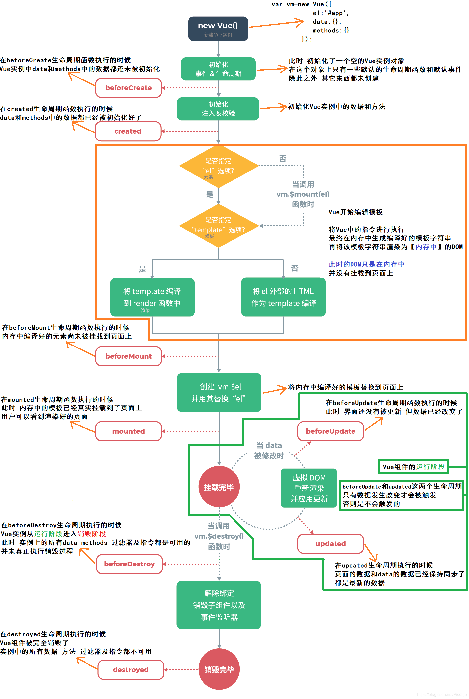

Vue 是一套用于构建用户界面的**响应式**的**模块化**的前端框架。

<!-- more -->

```html
<!DOCTYPE html>
<html>

<head>
	<meta charset="utf-8">
	<title>Vue</title>
	<script src="https://cdn.jsdelivr.net/npm/vue"></script>
</head>

<body>
	<div id="app">
		<h1>{{ title }}</h1>
        <item></item>
	</div>
	<script>
		new Vue({
			el: '#app',
			data: {
				title: 'title'
			},
            components: {
    			'item': {
            		template: '<h3>item</h3>'
        		}
  			}
		})
	</script>
</body>

</html>
```

## Vue 实例

Vue 项目是由一个根 Vue 实例和内嵌的多个 Vue 组件构成。

### 属性

```vue
data: {
	_key: _value
}
```

> 外部可以直接使用 Vue 实例访问属性

### 计算属性

由属性通过计算得出，自带缓存功能，且当所依赖的属性发生变化时会重新计算更新缓存。

```vue
computed: {
	_key: function () {
		...
		return xxx
	},
	_key: {
		get: function () {
			...
			return xxx
		},
		set: function (newValue) {
			...
		}
	}
}
```

### 监视方法

当属性发生变化时回调

```vue
watch: {
	_key: function (oldValue, newValue) {
		...
	}
}
```

### 生命周期方法



```vue
_life_cycle_method: function () {
	...
}
```

### 自定义方法

```vue
methods: {
	_method: function () {
		...
	}
}
```

### 模板

```vue
template: "xxx"
```

为了使得模板和属性交互，衍生出如下语法：

#### 标签值绑定

```html
<xxx>{{ _key }}</xxx>
```

#### 标签属性绑定

```html
<xxx v-bind:xxx="_key"></xxx>
<xxx :xxx="_key"></xxx>
```

> Vue 支持动态属性
>
> ```html
> <xxx :[_key]="_key"></xxx>
> ```

##### 事件属性绑定

```html
<xxx v-on:xxx="_method"></xxx>
<xxx @xxx="_method"></xxx>
```

##### class 属性绑定


##### style 属性绑定


#### 条件渲染

```html
<h1 v-if="_key">_key is true</h1>
<h1 v-else>_key is false</h1>
```

```html
<div v-if="_key === 'A'">A</div>
<div v-else-if="_key === 'B'">B</div>
<div v-else-if="_key === 'C'">C</div>
<div v-else>Not A/B/C</div>
```

#### 遍历渲染

```html
<ul id="example">
  <li v-for="item in items">
    {{ item }}
  </li>
</ul>
```

列表

```html
<ul id="example">
  <li v-for="(item,index) in items">
    {{ index }} - {{ item }}
  </li>
</ul>
```

映射

```html
<ul id="example">
  <li v-for="(item,name) in items">
    {{ name }} - {{ item }}
  </li>
</ul>
```

#### 表单标签双向绑定

```html
<input v-model="_key"></input>
```

## Vue 组件

可以导入外部的 Vue 组件，作为自己的组件，从而可以在模板中使用，组件也可以包含子组件。

> Vue 组件应该具有 Vue 实例一样的数据结构，唯一不同的是没有 `el`

> Vue 组件的 `data` 应该对应一个函数，返回属性表，这样可以在 Vue 实例内部维护独立的副本

全局注册

```typescript
Vue.component('my-component-name', {
  // ... 选项 ...
})
```

局部注册

```typescript
components: {
	'component-a': ComponentA,
	'component-b': ComponentB
}
```

### 属性交互

props 搭建了一个从父组件向子组件的数据流通道

```vue
props: [
	'_key',
	'_key'
]
```

### 自定义事件交互

因为 props 是单向的，但不免有些情景需要子组件影响父组件。

```typescript
this.$emit('_out_event', _param1, _param2)
```

### 槽位

用于处理外部传入的标签内容

```html
<div class="container">
  <header>
    <slot name="header"></slot>
  </header>
  <main>
    <slot></slot>
  </main>
  <footer>
    <slot name="footer"></slot>
  </footer>
</div>
```

```html
<base-layout>
  <template v-slot:header> <!-- 可缩写成 #header -->
    <h1>Here might be a page title</h1>
  </template>

  <p>A paragraph for the main content.</p>
  <p>And another one.</p>

  <template v-slot:footer>
    <p>Here's some contact info</p>
  </template>
</base-layout>

<!-- 还支持动态槽位 -->
<base-layout>
    <template #[_key]>
    	...
    </template>
</base-layout>
```

### 动态组件

```html
<keep-alive>
  <component :is="_key"></component>
</keep-alive>
```

### 异步组件

如果项目规模过大可能产生大的 Vue 实例。可以拆成多个文件组件，并利用一下方法异步加载组件。

```typescript
components: {
    'my-component': () => import('./my-async-component')
}
```

## Vue 过渡动画


## Vue cli


## Vue route

```typescript
router: new VueRouter({
    mode: 'hash/history',
    routes: [ // 优先级与书写顺序有关
    	{
            path: "_path",
            component: _component,
            // () => import('xxx') 路由组件懒加载
            redirect: '_path',
            meta: {...}
            children: [
                {
                    ...
                }
            ]
        }
    ]
})
```

```html
<router-view/>
```

### 动态路由匹配

```typescript
path: "xxx/:_path_param"
```

```
this.$route.params._path_param
```

### 触发路由

```html
<router-link :to="xxx">xxx</router-link>
<router-link :to="xxx" replace>xxx</router-link>
```

```typescript
router.push("xxx")
router.replace("xxx") // 替换 history 记录
router.go(1/-1)
```

### 路由钩子

#### 全局钩子

```typescript
router.beforeEach((to, from, next) => {
	// ...
	// next()
    // next(false) 中断
    // next('xxx')
})

router.afterEach((to, from) => {
	// ...
})

router.beforeResolve((to, from, next) => {
	// ...
})
```

#### 局部钩子

```typescript
beforeEnter: (to, from, next) => {
	// ...
}
```

#### 组件钩子

```typescript
beforeRouteEnter (to, from, next) {
    // 在渲染该组件的对应路由被 confirm 前调用
    // 不！能！获取组件实例 `this`
    // 因为当守卫执行前，组件实例还没被创建
},
beforeRouteUpdate (to, from, next) {
    // 在当前路由改变，但是该组件被复用时调用
    // 举例来说，对于一个带有动态参数的路径 /foo/:id，在 /foo/1 和 /foo/2 之间跳转的时候，
    // 由于会渲染同样的 Foo 组件，因此组件实例会被复用。而这个钩子就会在这个情况下被调用。
    // 可以访问组件实例 `this`
},
beforeRouteLeave (to, from, next) {
    // 导航离开该组件的对应路由时调用
    // 可以访问组件实例 `this`
}
```

#### 完整的导航解析流程

1. 导航被触发。
2. 在失活的组件里调用离开守卫。
3. 调用全局的 `beforeEach` 守卫。
4. 在重用的组件里调用 `beforeRouteUpdate` 守卫 (2.2+)。
5. 在路由配置里调用 `beforeEnter`。
6. 解析异步路由组件。
7. 在被激活的组件里调用 `beforeRouteEnter`。
8. 调用全局的 `beforeResolve` 守卫 (2.5+)。
9. 导航被确认。
10. 调用全局的 `afterEach` 钩子。
11. 触发 DOM 更新。
12. 用创建好的实例调用 `beforeRouteEnter` 守卫中传给 `next` 的回调函数。

## Vuex

跨组件的模块化的数据共享解决方案

```typescript
Vue.use(Vuex)
```

```typescript
const store = new Vuex.Store({
	modules: {
        xxx // 模块内的 state 要通过 store.state.xxx 访问，其他同理
      	// const xxx = {
		//     state: () => ({ ... }),
		//     mutations: { ... },
		//     actions: { ... },
		//     getters: { ... }
		// }
        // getters mutations actions 是全局的
  	},
    state: {
        xxx: xxx
    }
  	getters: {
      	xxx(state) {
    		...
		}
  	},
    mutations: {
        xxx(state, param) { // store.commit('xxx', param)
            ...
        }
    },
    actions: {
        xxx(state, param) { // store.dispatch('xxx', param)
            ...
        }
    }
})
```

map 组件内简写

```typescript
// mapState
computed: {
  	...mapState([
    	'xxx' // store.state.xxx
  	])
}

// mapGetters
computed: {
  	...mapGetters([
    	'xxx' // store.getters.xxx
  	])
}

// mapMutations
methods: {
    ...mapMutations([
        'xxx' // store.commit('xxx')
    ])
}

// mapActions
methods: {
    ...mapActions([
        'xxx' // store.dispatch('xxx')
    ])
}
```

## Axios


